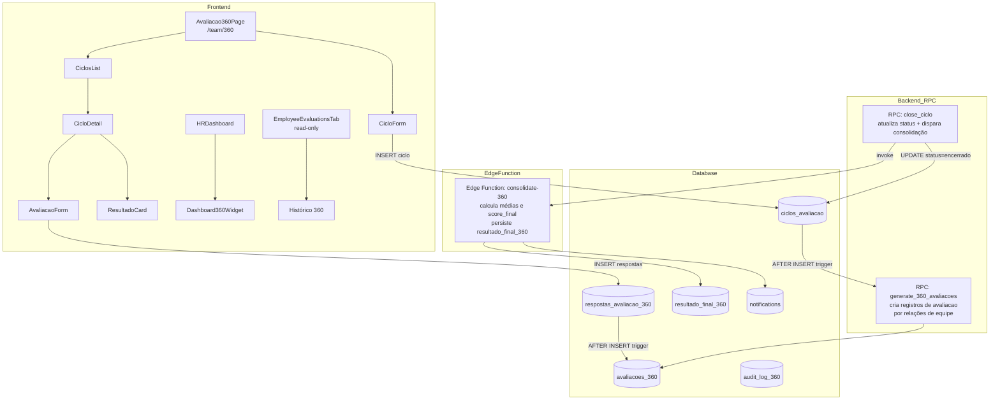

# Design — Módulo de Avaliação 360

## Visão Geral

O módulo de Avaliação 360 substitui o modelo simples de avaliação individual (`employee_evaluations`) por um sistema estruturado de ciclos formais de avaliação a nível de organização. O RH cria ciclos, o sistema vincula automaticamente avaliadores com base nas relações de equipe, colaboradores e gestores respondem avaliações multi-perspectiva (autoavaliação, gestor, pares, liderados), e o sistema consolida os resultados em um score final por colaborador.

A tabela `employee_evaluations` é mantida para compatibilidade retroativa. A aba "Avaliações" no cadastro do colaborador passa a exibir o histórico do novo sistema em modo read-only.

### Objetivos

- Ciclos formais com controle de status (ativo/encerrado)
- Vinculação automática de avaliadores por relações de equipe
- Anonimato garantido por RLS para avaliações entre pares
- Consolidação automática de médias e score final configurável
- Dashboard 360 integrado ao HRDashboard existente
- Notificações de início de ciclo, lembretes e alertas de prazo
- Auditoria completa de todas as operações

### Decisões de Design

1. **Edge Function para consolidação**: O cálculo de médias e score final é executado em uma Edge Function (`consolidate-360`) invocada ao encerrar um ciclo, garantindo atomicidade e evitando lógica complexa no frontend.
2. **Vinculação automática via RPC**: A geração de registros de `avaliacoes` ao criar um ciclo é feita por uma função RPC PostgreSQL (`generate_360_avaliacoes`) que lê as relações de `team_members` e `teams.lead_id` no momento da criação.
3. **Anonimato por RLS**: A identidade do avaliador em avaliações de pares é protegida por política RLS que impede o `avaliado_id` de consultar o `avaliador_id` quando `anonimo = true`.
4. **Pesos configuráveis por ciclo**: Os pesos do score final (`peso_360`, `peso_metas`, `peso_prod`) são armazenados na tabela `ciclos_avaliacao`, permitindo configuração independente por ciclo.
5. **Notificações via tabela `notifications`**: Reutiliza infraestrutura existente de notificações do sistema, sem criar novo canal.

---

## Arquitetura



### Stack

- **Frontend**: React + TypeScript, React Query, shadcn/ui + Tailwind
- **Backend**: Supabase (PostgreSQL + RLS), Edge Functions (Deno/TypeScript)
- **Trigger de vinculação**: Trigger AFTER INSERT em `ciclos_avaliacao` → RPC `generate_360_avaliacoes`
- **Consolidação**: Edge Function `consolidate-360` invocada ao encerrar ciclo
- **Notificações**: INSERT em tabela `notifications` existente

---

## Componentes e Interfaces

### Tabela de Componentes

| Componente | Arquivo | Descrição |
|---|---|---|
| `Avaliacao360Page` | `src/pages/Avaliacao360Page.tsx` | Página principal do módulo 360, acessível via `/team/360` |
| `CiclosList` | `src/components/avaliacao360/CiclosList.tsx` | Lista de ciclos com status, datas e ações |
| `CicloForm` | `src/components/avaliacao360/CicloForm.tsx` | Formulário de criação/edição de ciclo |
| `CicloDetail` | `src/components/avaliacao360/CicloDetail.tsx` | Detalhe do ciclo: lista de avaliações pendentes/concluídas |
| `AvaliacaoForm` | `src/components/avaliacao360/AvaliacaoForm.tsx` | Formulário de resposta de avaliação (6 critérios, notas 1–5) |
| `ResultadoCard` | `src/components/avaliacao360/ResultadoCard.tsx` | Card de resultado consolidado por colaborador |
| `Dashboard360Widget` | `src/components/avaliacao360/Dashboard360Widget.tsx` | Widget integrado ao HRDashboard: ranking, gap autoavaliação vs externo |
| `EmployeeEvaluationsTab` | `src/components/team/EmployeeEvaluationsTab.tsx` | Modificado: exibe histórico 360 read-only + legado employee_evaluations |
| `useAvaliacao360` | `src/hooks/useAvaliacao360.ts` | Hook principal: ciclos, avaliações, respostas, resultados |
| `useAvaliacoesTecnicas` | `src/hooks/useAvaliacoesTecnicas.ts` | Hook para CRUD de avaliações técnicas manuais |
| `AvaliacaoTecnicaDialog` | `src/components/team/AvaliacaoTecnicaDialog.tsx` | Dialog de criação de avaliação técnica (admin/owner) |

### Avaliacao360Page — Estrutura

```
┌─────────────────────────────────────────────────────────┐
│ Avaliação 360                          [+ Novo Ciclo]   │
│                                                         │
│  Ciclos Ativos                                          │
│  ┌──────────────────────────────────────────────────┐   │
│  │ Q1/2025 · 01/01 – 31/03 · ● Ativo               │   │
│  │ 12/20 avaliações concluídas    [Ver] [Encerrar]  │   │
│  └──────────────────────────────────────────────────┘   │
│                                                         │
│  Ciclos Encerrados                                      │
│  ┌──────────────────────────────────────────────────┐   │
│  │ Q4/2024 · 01/10 – 31/12 · ○ Encerrado           │   │
│  │ 20/20 avaliações concluídas    [Ver Resultados]  │   │
│  └──────────────────────────────────────────────────┘   │
└─────────────────────────────────────────────────────────┘
```

### AvaliacaoForm — Interface

```
┌─────────────────────────────────────────────────────────┐
│ Avaliação de: João Silva  (Autoavaliação)               │
│                                                         │
│  Comunicação           ○ 1  ○ 2  ○ 3  ● 4  ○ 5        │
│  Trabalho em Equipe    ○ 1  ○ 2  ● 3  ○ 4  ○ 5        │
│  Proatividade          ○ 1  ○ 2  ○ 3  ○ 4  ● 5        │
│  Responsabilidade      ○ 1  ○ 2  ○ 3  ● 4  ○ 5        │
│  Qualidade de Entrega  ○ 1  ○ 2  ○ 3  ● 4  ○ 5        │
│  Alinhamento Cultural  ○ 1  ○ 2  ○ 3  ○ 4  ● 5        │
│                                                         │
│  Comentário (opcional)                                  │
│  [                                                    ] │
│                                                         │
│                              [Cancelar] [Enviar]        │
└─────────────────────────────────────────────────────────┘
```

### Dashboard360Widget — Interface

```
┌─────────────────────────────────────────────────────────┐
│ Avaliação 360 — Último Ciclo                            │
│                                                         │
│  Ranking por Score Final                                │
│  1. Maria Santos   Score: 4.7  Gap: +0.3               │
│  2. João Silva     Score: 4.2  Gap: -0.5               │
│  3. Ana Costa      Score: 3.9  Gap: +0.1               │
│                                                         │
│  Média por Equipe                                       │
│  Comercial: 4.3   Operacional: 4.0                     │
└─────────────────────────────────────────────────────────┘
```

---

## Modelos de Dados

### Migration 00091 — `ciclos_avaliacao`

```sql
CREATE TABLE IF NOT EXISTS ciclos_avaliacao (
  id              UUID PRIMARY KEY DEFAULT gen_random_uuid(),
  organization_id UUID NOT NULL REFERENCES organizations(id) ON DELETE CASCADE,
  nome            TEXT NOT NULL,
  data_inicio     DATE NOT NULL,
  data_fim        DATE NOT NULL,
  status          TEXT NOT NULL DEFAULT 'ativo' CHECK (status IN ('ativo','encerrado')),
  tipo            TEXT NOT NULL DEFAULT '360' CHECK (tipo IN ('360','checkin')),
  peso_360        DECIMAL(4,2) NOT NULL DEFAULT 0.60,
  peso_metas      DECIMAL(4,2) NOT NULL DEFAULT 0.25,
  peso_prod       DECIMAL(4,2) NOT NULL DEFAULT 0.15,
  created_by      UUID REFERENCES profiles(id) ON DELETE SET NULL,
  created_at      TIMESTAMPTZ NOT NULL DEFAULT now(),
  updated_at      TIMESTAMPTZ NOT NULL DEFAULT now(),
  CONSTRAINT chk_datas CHECK (data_fim >= data_inicio),
  CONSTRAINT chk_pesos CHECK (ABS((peso_360 + peso_metas + peso_prod) - 1.0) < 0.001)
);

ALTER TABLE ciclos_avaliacao ENABLE ROW LEVEL SECURITY;

-- RLS: leitura para todos da organização; escrita apenas admin/owner
CREATE POLICY "ciclos_select" ON ciclos_avaliacao FOR SELECT
  USING (
    EXISTS (
      SELECT 1 FROM profiles p
      WHERE p.id = auth.uid()
        AND p.organization_id = ciclos_avaliacao.organization_id
    )
  );

CREATE POLICY "ciclos_write" ON ciclos_avaliacao FOR ALL
  USING (
    EXISTS (
      SELECT 1 FROM profiles p
      WHERE p.id = auth.uid()
        AND p.organization_id = ciclos_avaliacao.organization_id
        AND p.role IN ('admin','owner')
    )
  );
```

### Migration 00092 — `avaliacoes_360`

```sql
CREATE TABLE IF NOT EXISTS avaliacoes_360 (
  id              UUID PRIMARY KEY DEFAULT gen_random_uuid(),
  ciclo_id        UUID NOT NULL REFERENCES ciclos_avaliacao(id) ON DELETE CASCADE,
  organization_id UUID NOT NULL,
  avaliador_id    UUID NOT NULL REFERENCES profiles(id) ON DELETE CASCADE,
  avaliado_id     UUID NOT NULL REFERENCES profiles(id) ON DELETE CASCADE,
  tipo            TEXT NOT NULL CHECK (tipo IN ('autoavaliacao','gestor','pares','liderado')),
  anonimo         BOOLEAN NOT NULL DEFAULT false,
  status          TEXT NOT NULL DEFAULT 'pendente' CHECK (status IN ('pendente','concluido')),
  data_resposta   TIMESTAMPTZ,
  created_at      TIMESTAMPTZ NOT NULL DEFAULT now(),
  UNIQUE (ciclo_id, avaliador_id, avaliado_id, tipo)
);

ALTER TABLE avaliacoes_360 ENABLE ROW LEVEL SECURITY;

-- SELECT: avaliador vê suas próprias avaliações; avaliado vê avaliações sobre si
--         (mas sem avaliador_id quando anonimo=true — tratado na view/RPC)
--         admin/owner veem tudo da organização
CREATE POLICY "avaliacoes_select" ON avaliacoes_360 FOR SELECT
  USING (
    avaliador_id = auth.uid()
    OR (avaliado_id = auth.uid())
    OR EXISTS (
      SELECT 1 FROM profiles p
      WHERE p.id = auth.uid()
        AND p.organization_id = avaliacoes_360.organization_id
        AND p.role IN ('admin','owner')
    )
  );

-- INSERT/UPDATE: service_role (geração automática) e admin/owner
CREATE POLICY "avaliacoes_write" ON avaliacoes_360 FOR ALL
  USING (
    auth.role() = 'service_role'
    OR EXISTS (
      SELECT 1 FROM profiles p
      WHERE p.id = auth.uid()
        AND p.organization_id = avaliacoes_360.organization_id
        AND p.role IN ('admin','owner')
    )
  );
```

### Migration 00093 — `respostas_avaliacao_360`

```sql
CREATE TABLE IF NOT EXISTS respostas_avaliacao_360 (
  id            UUID PRIMARY KEY DEFAULT gen_random_uuid(),
  avaliacao_id  UUID NOT NULL REFERENCES avaliacoes_360(id) ON DELETE CASCADE,
  criterio      TEXT NOT NULL CHECK (criterio IN (
    'comunicacao','trabalho_em_equipe','proatividade',
    'responsabilidade','qualidade_entrega','alinhamento_cultural'
  )),
  nota          SMALLINT NOT NULL CHECK (nota BETWEEN 1 AND 5),
  comentario    TEXT,
  created_at    TIMESTAMPTZ NOT NULL DEFAULT now(),
  UNIQUE (avaliacao_id, criterio)
);

ALTER TABLE respostas_avaliacao_360 ENABLE ROW LEVEL SECURITY;

-- SELECT: segue as regras de avaliacoes_360 via JOIN
CREATE POLICY "respostas_select" ON respostas_avaliacao_360 FOR SELECT
  USING (
    EXISTS (
      SELECT 1 FROM avaliacoes_360 a
      WHERE a.id = respostas_avaliacao_360.avaliacao_id
        AND (
          a.avaliador_id = auth.uid()
          OR a.avaliado_id = auth.uid()
          OR EXISTS (
            SELECT 1 FROM profiles p
            WHERE p.id = auth.uid()
              AND p.organization_id = a.organization_id
              AND p.role IN ('admin','owner')
          )
        )
    )
  );

-- INSERT: apenas o avaliador dono da avaliação (ou service_role)
CREATE POLICY "respostas_insert" ON respostas_avaliacao_360 FOR INSERT
  WITH CHECK (
    auth.role() = 'service_role'
    OR EXISTS (
      SELECT 1 FROM avaliacoes_360 a
      WHERE a.id = respostas_avaliacao_360.avaliacao_id
        AND a.avaliador_id = auth.uid()
        AND a.status = 'pendente'
    )
  );

-- DELETE/UPDATE: bloqueado para todos (imutabilidade após submissão)
CREATE POLICY "respostas_no_update" ON respostas_avaliacao_360 FOR UPDATE
  USING (false);

CREATE POLICY "respostas_no_delete" ON respostas_avaliacao_360 FOR DELETE
  USING (false);
```

### Migration 00094 — `resultado_final_360`

```sql
CREATE TABLE IF NOT EXISTS resultado_final_360 (
  id                    UUID PRIMARY KEY DEFAULT gen_random_uuid(),
  ciclo_id              UUID NOT NULL REFERENCES ciclos_avaliacao(id) ON DELETE CASCADE,
  organization_id       UUID NOT NULL,
  avaliado_id           UUID NOT NULL REFERENCES profiles(id) ON DELETE CASCADE,
  media_geral           DECIMAL(4,2),
  media_autoavaliacao   DECIMAL(4,2),
  media_pares           DECIMAL(4,2),
  media_gestor          DECIMAL(4,2),
  media_liderado        DECIMAL(4,2),
  score_final           DECIMAL(4,2),
  feedback_final        TEXT,
  feedback_updated_at   TIMESTAMPTZ,
  feedback_updated_by   UUID REFERENCES profiles(id) ON DELETE SET NULL,
  created_at            TIMESTAMPTZ NOT NULL DEFAULT now(),
  updated_at            TIMESTAMPTZ NOT NULL DEFAULT now(),
  UNIQUE (ciclo_id, avaliado_id)
);

ALTER TABLE resultado_final_360 ENABLE ROW LEVEL SECURITY;

-- SELECT: o próprio avaliado, gestores da equipe, admin/owner
CREATE POLICY "resultado_select" ON resultado_final_360 FOR SELECT
  USING (
    avaliado_id = auth.uid()
    OR EXISTS (
      SELECT 1 FROM profiles p
      WHERE p.id = auth.uid()
        AND p.organization_id = resultado_final_360.organization_id
        AND p.role IN ('admin','owner','manager')
    )
  );

-- INSERT/UPDATE: service_role (consolidação) e gestores/admin para feedback_final
CREATE POLICY "resultado_write" ON resultado_final_360 FOR ALL
  USING (
    auth.role() = 'service_role'
    OR EXISTS (
      SELECT 1 FROM profiles p
      WHERE p.id = auth.uid()
        AND p.organization_id = resultado_final_360.organization_id
        AND p.role IN ('admin','owner','manager')
    )
  );
```

### Migration 00095 — `audit_log_360`

```sql
CREATE TABLE IF NOT EXISTS audit_log_360 (
  id            UUID PRIMARY KEY DEFAULT gen_random_uuid(),
  organization_id UUID NOT NULL,
  user_id       UUID REFERENCES profiles(id) ON DELETE SET NULL,
  action        TEXT NOT NULL,
  entity_type   TEXT NOT NULL,
  entity_id     UUID NOT NULL,
  previous_data JSONB,
  new_data      JSONB,
  created_at    TIMESTAMPTZ NOT NULL DEFAULT now()
);

ALTER TABLE audit_log_360 ENABLE ROW LEVEL SECURITY;

CREATE POLICY "audit_log_select" ON audit_log_360 FOR SELECT
  USING (
    EXISTS (
      SELECT 1 FROM profiles p
      WHERE p.id = auth.uid()
        AND p.organization_id = audit_log_360.organization_id
        AND p.role IN ('admin','owner')
    )
  );

CREATE POLICY "audit_log_insert" ON audit_log_360 FOR INSERT
  WITH CHECK (auth.role() = 'service_role' OR auth.uid() IS NOT NULL);
```

### Migration 00096 — `avaliacoes_tecnicas`

```sql
CREATE TABLE IF NOT EXISTS avaliacoes_tecnicas (
  id              UUID PRIMARY KEY DEFAULT gen_random_uuid(),
  organization_id UUID NOT NULL REFERENCES organizations(id) ON DELETE CASCADE,
  colaborador_id  UUID NOT NULL REFERENCES profiles(id) ON DELETE CASCADE,
  avaliador_id    UUID NOT NULL REFERENCES profiles(id) ON DELETE SET NULL,
  titulo          TEXT NOT NULL CHECK (trim(titulo) <> ''),
  data            DATE NOT NULL,
  criterios       JSONB NOT NULL DEFAULT '[]'::jsonb,
  nota_geral      SMALLINT NOT NULL CHECK (nota_geral BETWEEN 1 AND 5),
  observacoes     TEXT,
  created_at      TIMESTAMPTZ NOT NULL DEFAULT now()
);

-- Índices
CREATE INDEX idx_avaliacoes_tecnicas_colaborador ON avaliacoes_tecnicas(colaborador_id);
CREATE INDEX idx_avaliacoes_tecnicas_org ON avaliacoes_tecnicas(organization_id);

ALTER TABLE avaliacoes_tecnicas ENABLE ROW LEVEL SECURITY;

-- SELECT: o próprio colaborador, gestores da equipe, admin/owner da organização
CREATE POLICY "avaliacoes_tecnicas_select" ON avaliacoes_tecnicas FOR SELECT
  USING (
    colaborador_id = auth.uid()
    OR EXISTS (
      SELECT 1 FROM profiles p
      WHERE p.id = auth.uid()
        AND p.organization_id = avaliacoes_tecnicas.organization_id
        AND p.role IN ('admin','owner','manager')
    )
  );

-- INSERT: apenas admin/owner
CREATE POLICY "avaliacoes_tecnicas_insert" ON avaliacoes_tecnicas FOR INSERT
  WITH CHECK (
    EXISTS (
      SELECT 1 FROM profiles p
      WHERE p.id = auth.uid()
        AND p.organization_id = avaliacoes_tecnicas.organization_id
        AND p.role IN ('admin','owner')
    )
  );

-- UPDATE/DELETE: bloqueado para todos (imutabilidade após criação)
CREATE POLICY "avaliacoes_tecnicas_no_update" ON avaliacoes_tecnicas FOR UPDATE
  USING (false);

CREATE POLICY "avaliacoes_tecnicas_no_delete" ON avaliacoes_tecnicas FOR DELETE
  USING (false);
```

**Estrutura do campo `criterios` (JSONB):**
```json
[
  { "nome": "Domínio técnico", "nota": 4, "comentario": "Boa proficiência em TypeScript" },
  { "nome": "Resolução de problemas", "nota": 5, "comentario": null }
]
```

---

### RPC `generate_360_avaliacoes`

```sql
CREATE OR REPLACE FUNCTION generate_360_avaliacoes(p_ciclo_id UUID)
RETURNS void LANGUAGE plpgsql SECURITY DEFINER AS $$
DECLARE
  v_ciclo ciclos_avaliacao%ROWTYPE;
  v_avaliado RECORD;
  v_gestor_id UUID;
  v_par RECORD;
BEGIN
  SELECT * INTO v_ciclo FROM ciclos_avaliacao WHERE id = p_ciclo_id;

  -- Para cada colaborador ativo da organização
  FOR v_avaliado IN
    SELECT p.id FROM profiles p
    WHERE p.organization_id = v_ciclo.organization_id
      AND p.is_active = true
      AND p.role IN ('member','manager')
  LOOP
    -- 1. Autoavaliação
    INSERT INTO avaliacoes_360 (ciclo_id, organization_id, avaliador_id, avaliado_id, tipo, anonimo)
    VALUES (p_ciclo_id, v_ciclo.organization_id, v_avaliado.id, v_avaliado.id, 'autoavaliacao', false)
    ON CONFLICT DO NOTHING;

    -- 2. Gestor avalia o colaborador
    SELECT t.lead_id INTO v_gestor_id
    FROM team_members tm
    JOIN teams t ON t.id = tm.team_id
    WHERE tm.profile_id = v_avaliado.id
      AND t.lead_id IS NOT NULL
      AND t.lead_id != v_avaliado.id
    LIMIT 1;

    IF v_gestor_id IS NOT NULL THEN
      INSERT INTO avaliacoes_360 (ciclo_id, organization_id, avaliador_id, avaliado_id, tipo, anonimo)
      VALUES (p_ciclo_id, v_ciclo.organization_id, v_gestor_id, v_avaliado.id, 'gestor', false)
      ON CONFLICT DO NOTHING;
    END IF;

    -- 3. Pares (demais membros da mesma equipe)
    FOR v_par IN
      SELECT tm2.profile_id
      FROM team_members tm1
      JOIN team_members tm2 ON tm2.team_id = tm1.team_id
      WHERE tm1.profile_id = v_avaliado.id
        AND tm2.profile_id != v_avaliado.id
    LOOP
      INSERT INTO avaliacoes_360 (ciclo_id, organization_id, avaliador_id, avaliado_id, tipo, anonimo)
      VALUES (p_ciclo_id, v_ciclo.organization_id, v_par.profile_id, v_avaliado.id, 'pares', true)
      ON CONFLICT DO NOTHING;
    END LOOP;

    -- Log de aviso se sem equipe
    IF v_gestor_id IS NULL AND NOT EXISTS (
      SELECT 1 FROM team_members WHERE profile_id = v_avaliado.id
    ) THEN
      INSERT INTO audit_log_360 (organization_id, user_id, action, entity_type, entity_id, new_data)
      VALUES (v_ciclo.organization_id, NULL, 'warn_no_team', 'profile', v_avaliado.id,
              jsonb_build_object('ciclo_id', p_ciclo_id, 'message', 'Colaborador sem equipe — apenas autoavaliação criada'));
    END IF;
  END LOOP;
END;
$$;
```

### Trigger de geração automática

```sql
CREATE OR REPLACE FUNCTION trigger_generate_avaliacoes()
RETURNS TRIGGER LANGUAGE plpgsql AS $$
BEGIN
  PERFORM generate_360_avaliacoes(NEW.id);
  RETURN NEW;
END;
$$;

CREATE TRIGGER after_ciclo_insert
  AFTER INSERT ON ciclos_avaliacao
  FOR EACH ROW EXECUTE FUNCTION trigger_generate_avaliacoes();
```

### Edge Function `consolidate-360`

```typescript
// supabase/functions/consolidate-360/index.ts
// Invocada ao encerrar um ciclo via RPC close_ciclo

async function consolidate(cicloId: string, supabase: SupabaseClient) {
  const ciclo = await getCiclo(cicloId);

  // Para cada avaliado com avaliações no ciclo
  const avaliados = await getAvaliados(cicloId);

  for (const avaliado of avaliados) {
    const avaliacoes = await getAvaliacoesConcluidas(cicloId, avaliado.id);

    const mediaAutoavaliacao = avg(avaliacoes.filter(a => a.tipo === 'autoavaliacao'));
    const mediaPares         = avg(avaliacoes.filter(a => a.tipo === 'pares'));
    const mediaGestor        = avg(avaliacoes.filter(a => a.tipo === 'gestor'));
    const mediaLiderado      = avg(avaliacoes.filter(a => a.tipo === 'liderado'));
    const media360           = avg(avaliacoes); // todas as perspectivas

    // Score final: (media_360 * peso_360) + (metas * peso_metas) + (produtividade * peso_prod)
    const metasPct   = await getMetasPct(avaliado.id, ciclo);
    const prodPct    = await getProdutividadePct(avaliado.id, ciclo);
    const scoreFinal = media360 * ciclo.peso_360
                     + metasPct * ciclo.peso_metas
                     + prodPct  * ciclo.peso_prod;

    await upsertResultado({
      ciclo_id: cicloId,
      avaliado_id: avaliado.id,
      media_geral: media360,
      media_autoavaliacao: mediaAutoavaliacao,
      media_pares: mediaPares,
      media_gestor: mediaGestor,
      media_liderado: mediaLiderado,
      score_final: scoreFinal ?? null,
    });

    // Notificar colaborador
    await insertNotification(avaliado.id, 'Seu resultado de avaliação 360 está disponível.');
  }

  // Audit log
  await insertAuditLog(cicloId, 'close_ciclo');
}
```

### Tipos TypeScript — `src/types/avaliacao360.ts`

```typescript
export type CicloStatus = 'ativo' | 'encerrado';
export type CicloTipo   = '360' | 'checkin';
export type AvaliacaoTipo   = 'autoavaliacao' | 'gestor' | 'pares' | 'liderado';
export type AvaliacaoStatus = 'pendente' | 'concluido';
export type Criterio =
  | 'comunicacao' | 'trabalho_em_equipe' | 'proatividade'
  | 'responsabilidade' | 'qualidade_entrega' | 'alinhamento_cultural';

export interface CicloAvaliacao {
  id:              string;
  organization_id: string;
  nome:            string;
  data_inicio:     string;
  data_fim:        string;
  status:          CicloStatus;
  tipo:            CicloTipo;
  peso_360:        number;
  peso_metas:      number;
  peso_prod:       number;
  created_by:      string | null;
  created_at:      string;
}

export interface Avaliacao360 {
  id:              string;
  ciclo_id:        string;
  organization_id: string;
  avaliador_id:    string;
  avaliado_id:     string;
  tipo:            AvaliacaoTipo;
  anonimo:         boolean;
  status:          AvaliacaoStatus;
  data_resposta:   string | null;
}

export interface RespostaAvaliacao {
  id:           string;
  avaliacao_id: string;
  criterio:     Criterio;
  nota:         number;
  comentario:   string | null;
}

export interface ResultadoFinal360 {
  id:                  string;
  ciclo_id:            string;
  organization_id:     string;
  avaliado_id:         string;
  media_geral:         number | null;
  media_autoavaliacao: number | null;
  media_pares:         number | null;
  media_gestor:        number | null;
  media_liderado:      number | null;
  score_final:         number | null;
  feedback_final:      string | null;
  feedback_updated_at: string | null;
  feedback_updated_by: string | null;
}

export interface CriterioTecnico {
  nome:       string;
  nota:       number;
  comentario: string | null;
}

export interface AvaliacaoTecnica {
  id:              string;
  organization_id: string;
  colaborador_id:  string;
  avaliador_id:    string;
  titulo:          string;
  data:            string;
  criterios:       CriterioTecnico[];
  nota_geral:      number;
  observacoes:     string | null;
  created_at:      string;
}
```

### Hook `useAvaliacao360`

```typescript
// src/hooks/useAvaliacao360.ts
export function useCiclos(organizationId: string | undefined)
export function useCreateCiclo()
export function useCloseCiclo()
export function useAvaliacoesPendentes(profileId: string | undefined)
export function useAvaliacoesDoCiclo(cicloId: string | undefined)
export function useSubmitAvaliacao()
export function useResultados(cicloId: string | undefined)
export function useResultadoDoColaborador(avaliado_id: string | undefined)
export function useSaveFeedbackFinal()
```

### Hook `useAvaliacoesTecnicas`

```typescript
// src/hooks/useAvaliacoesTecnicas.ts
export function useAvaliacoesTecnicas(colaboradorId: string | undefined)
// Retorna lista de AvaliacaoTecnica ordenada por data DESC

export function useCreateAvaliacaoTecnica()
// mutationFn: (payload: CreateAvaliacaoTecnicaPayload) => Promise<AvaliacaoTecnica>
// Invalida queryKey ["avaliacoes_tecnicas", colaboradorId] no onSuccess

interface CreateAvaliacaoTecnicaPayload {
  organization_id: string;
  colaborador_id:  string;
  titulo:          string;
  data:            string;
  criterios:       CriterioTecnico[];
  nota_geral:      number;
  observacoes?:    string | null;
}
```

### Componente `AvaliacaoTecnicaDialog`

```
┌─────────────────────────────────────────────────────────┐
│ Nova Avaliação Técnica                                  │
│                                                         │
│  Título *                                               │
│  [                                                    ] │
│                                                         │
│  Data *                                                 │
│  [  dd/mm/aaaa  ]                                       │
│                                                         │
│  Nota Geral (1–5) *                                     │
│  ○ 1  ○ 2  ○ 3  ● 4  ○ 5                              │
│                                                         │
│  Critérios Técnicos                                     │
│  ┌──────────────────────────────────────────────────┐   │
│  │ Nome do critério    Nota (1–5)   Comentário      │   │
│  │ [              ]   [   ]        [             ]  │   │
│  │ [+ Adicionar critério]                           │   │
│  └──────────────────────────────────────────────────┘   │
│                                                         │
│  Observações                                            │
│  [                                                    ] │
│                                                         │
│                          [Cancelar] [Salvar Avaliação]  │
└─────────────────────────────────────────────────────────┘
```

**Regras do componente:**
- Visível apenas para `role IN ('admin', 'owner')` — verificado via `useProfile` do usuário autenticado
- `titulo` obrigatório e não pode ser apenas whitespace
- `nota_geral` obrigatória, inteiro entre 1 e 5
- `criterios` é opcional (array pode ser vazio)
- Cada critério tem `nome` (obrigatório), `nota` (1–5, obrigatório) e `comentario` (opcional)
- Após criação bem-sucedida: fecha o dialog e invalida a query de avaliações técnicas

### Atualização do `EmployeeEvaluationsTab`

O componente deve ser atualizado para incluir uma seção separada de avaliações técnicas:

```
┌─────────────────────────────────────────────────────────┐
│ Avaliações 360                                          │
│  [histórico read-only dos ciclos 360]                   │
│                                                         │
│ ─────────────────────────────────────────────────────── │
│                                                         │
│ Avaliações Técnicas          [+ Avaliação Técnica] *    │
│  [lista de avaliacoes_tecnicas ordenada por data DESC]  │
│                                                         │
│  * botão visível apenas para admin/owner                │
└─────────────────────────────────────────────────────────┘
```

---

## Propriedades de Correção

*Uma propriedade é uma característica ou comportamento que deve ser verdadeiro em todas as execuções válidas de um sistema — essencialmente, uma declaração formal sobre o que o sistema deve fazer. Propriedades servem como ponte entre especificações legíveis por humanos e garantias de correção verificáveis por máquina.*

### Propriedade 1: Round-trip de criação de ciclo

*Para qualquer* conjunto válido de campos de ciclo (`nome`, `data_inicio`, `data_fim`, `tipo`, `pesos`), após criar o ciclo e consultá-lo pelo `id` retornado, todos os campos devem ser iguais aos valores submetidos.

**Valida: Requisitos 1.1**

---

### Propriedade 2: Rejeição de ciclo com datas inválidas

*Para qualquer* par de datas onde `data_inicio > data_fim`, a tentativa de criar um ciclo deve ser rejeitada com erro, e nenhum ciclo deve ser persistido.

**Valida: Requisitos 1.2**

---

### Propriedade 3: Ciclo encerrado bloqueia operações de escrita

*Para qualquer* ciclo com `status = 'encerrado'`, qualquer tentativa de inserir ou atualizar avaliações ou respostas vinculadas a esse ciclo deve ser rejeitada — independentemente do usuário ou dos dados submetidos.

**Valida: Requisitos 1.3, 1.4, 3.6**

---

### Propriedade 4: Isolamento multi-tenant via RLS

*Para qualquer* usuário autenticado pertencente à organização A, todas as consultas às tabelas `ciclos_avaliacao`, `avaliacoes_360`, `respostas_avaliacao_360` e `resultado_final_360` devem retornar exclusivamente registros com `organization_id` igual ao da organização A — nunca registros de outra organização.

**Valida: Requisitos 1.5, 11.1, 11.2, 11.3**

---

### Propriedade 5: Completude da vinculação automática de avaliadores

*Para qualquer* ciclo criado em uma organização com colaboradores em equipes, o conjunto de registros `avaliacoes_360` gerados deve incluir: exatamente uma `autoavaliacao` por colaborador ativo, uma avaliação do tipo `gestor` para cada colaborador que possui um `lead_id` na sua equipe, e avaliações do tipo `pares` para cada par de membros da mesma equipe.

**Valida: Requisitos 2.1, 2.4**

---

### Propriedade 6: Campo `anonimo` correto por tipo de avaliação

*Para qualquer* ciclo criado, todos os registros `avaliacoes_360` com `tipo = 'pares'` devem ter `anonimo = true`, e todos os registros com `tipo IN ('autoavaliacao', 'gestor', 'liderado')` devem ter `anonimo = false`.

**Valida: Requisitos 2.2, 2.3**

---

### Propriedade 7: Validação de notas no intervalo [1, 5]

*Para qualquer* submissão de avaliação onde ao menos uma nota está fora do intervalo `[1, 5]`, a operação deve ser rejeitada com erro identificando o critério inválido, e nenhuma resposta deve ser persistida.

**Valida: Requisitos 3.2, 3.3**

---

### Propriedade 8: Round-trip de submissão de avaliação

*Para qualquer* avaliação com `status = 'pendente'` e respostas válidas para todos os seis critérios, após a submissão bem-sucedida, consultar a avaliação deve retornar `status = 'concluido'` com `data_resposta` preenchida, e as seis respostas devem estar persistidas com as notas submetidas.

**Valida: Requisitos 3.1, 3.4**

---

### Propriedade 9: Imutabilidade de avaliações concluídas

*Para qualquer* avaliação com `status = 'concluido'`, qualquer tentativa de atualizar ou excluir as respostas vinculadas deve ser rejeitada — independentemente do usuário ou dos dados submetidos.

**Valida: Requisitos 3.5, 10.3, 10.4**

---

### Propriedade 10: Anonimato de avaliações de pares para o avaliado

*Para qualquer* usuário autenticado como `avaliado_id` de uma avaliação com `anonimo = true`, a consulta à tabela `avaliacoes_360` não deve retornar o campo `avaliador_id` — o valor deve ser nulo ou omitido na resposta da API.

**Valida: Requisitos 4.1, 4.2**

---

### Propriedade 11: Acesso privilegiado de admin/owner a avaliações anônimas

*Para qualquer* usuário com `role IN ('admin', 'owner')` pertencente à mesma organização, a consulta a avaliações com `anonimo = true` deve retornar o `avaliador_id` completo.

**Valida: Requisitos 4.3**

---

### Propriedade 12: Completude do resultado_final após consolidação

*Para qualquer* ciclo encerrado, cada colaborador com ao menos uma avaliação concluída deve ter exatamente um registro em `resultado_final_360` com `media_geral` calculada como a média aritmética das notas de todas as respostas das avaliações concluídas desse colaborador no ciclo.

**Valida: Requisitos 5.1, 5.2**

---

### Propriedade 13: Fórmula do score_final

*Para qualquer* `resultado_final_360` com `media_geral` calculada, o campo `score_final` deve ser igual a `ROUND((media_360 * peso_360) + (metas * peso_metas) + (produtividade * peso_prod), 2)`, onde os pesos são os valores configurados no ciclo correspondente.

**Valida: Requisitos 5.3**

---

### Propriedade 14: Feedback_final bloqueado em ciclo encerrado

*Para qualquer* ciclo com `status = 'encerrado'`, qualquer tentativa de atualizar o campo `feedback_final` em `resultado_final_360` deve ser rejeitada — independentemente do role do usuário.

**Valida: Requisitos 6.2**

---

### Propriedade 15: Auditoria de operações relevantes

*Para qualquer* operação de criação ou encerramento de ciclo, submissão de avaliação, ou salvamento de `feedback_final`, deve existir ao menos um registro correspondente em `audit_log_360` com `user_id`, `action`, `entity_id` e `created_at` preenchidos.

**Valida: Requisitos 6.3, 10.1, 10.2**

---

### Propriedade 16: Colaborador vê apenas seus próprios resultados

*Para qualquer* usuário autenticado com `role = 'member'`, a consulta a `resultado_final_360` deve retornar exclusivamente registros onde `avaliado_id = auth.uid()`.

**Valida: Requisitos 7.4**

---

### Propriedade 17: Cálculo do gap de autoavaliação

*Para qualquer* `resultado_final_360` com `media_autoavaliacao`, `media_pares` e `media_gestor` calculadas, o gap exibido no dashboard deve ser igual a `media_autoavaliacao - ((media_pares + media_gestor) / 2)`.

**Valida: Requisitos 8.2**

---

### Propriedade 18: Controle de acesso ao dashboard 360

*Para qualquer* usuário com `role IN ('member', 'viewer')`, o acesso ao dashboard 360 deve ser negado — a consulta de resultados consolidados deve retornar conjunto vazio ou erro de autorização.

**Valida: Requisitos 8.3**

---

### Propriedade 19: Escopo de dados do gestor no dashboard

*Para qualquer* usuário com `role = 'manager'`, os resultados retornados pelo dashboard devem conter exclusivamente colaboradores que são membros das equipes onde esse gestor é `lead_id`.

**Valida: Requisitos 8.4**

---

### Propriedade 20: Notificação de início de ciclo para todos os avaliadores

*Para qualquer* ciclo criado, cada avaliador com ao menos uma avaliação `pendente` gerada deve ter exatamente uma notificação de início de ciclo na tabela `notifications`.

**Valida: Requisitos 9.1**

---

### Propriedade 21: Notificação de resultado disponível

*Para qualquer* `resultado_final_360` criado pela consolidação, deve existir uma notificação na tabela `notifications` para o `avaliado_id` correspondente.

**Valida: Requisitos 9.4**

---

### Propriedade 22: Visibilidade do botão de avaliação técnica por role

*Para qualquer* usuário autenticado, o botão "+ Avaliação Técnica" na aba "Avaliações" do colaborador deve ser visível se e somente se o `role` do usuário for `admin` ou `owner` — para qualquer outro role o botão não deve ser renderizado.

**Valida: Requisitos 12.1, 12.7**

---

### Propriedade 23: Round-trip de criação de avaliação técnica

*Para qualquer* conjunto válido de campos (`titulo` não-vazio, `data`, `nota_geral` entre 1 e 5, `criterios`), após criar a avaliação técnica e consultá-la pelo `id` retornado, todos os campos devem ser iguais aos valores submetidos.

**Valida: Requisitos 12.2**

---

### Propriedade 24: Rejeição de nota_geral inválida

*Para qualquer* valor de `nota_geral` fora do intervalo [1, 5], a tentativa de criar uma avaliação técnica deve ser rejeitada com erro, e nenhum registro deve ser persistido em `avaliacoes_tecnicas`.

**Valida: Requisitos 12.3**

---

### Propriedade 25: Rejeição de título em branco

*Para qualquer* string composta inteiramente de whitespace (incluindo string vazia), a tentativa de criar uma avaliação técnica com esse valor como `titulo` deve ser rejeitada, e o estado da lista de avaliações técnicas deve permanecer inalterado.

**Valida: Requisitos 12.4**

---

### Propriedade 26: Ordenação por data decrescente

*Para qualquer* lista de avaliações técnicas de um colaborador retornada pelo sistema, os registros devem estar ordenados por `data` de forma decrescente — ou seja, para quaisquer dois registros consecutivos `a[i]` e `a[i+1]`, deve valer `a[i].data >= a[i+1].data`.

**Valida: Requisitos 12.5**

---

### Propriedade 27: Imutabilidade de avaliações técnicas

*Para qualquer* avaliação técnica persistida em `avaliacoes_tecnicas`, qualquer tentativa de atualizar ou excluir esse registro deve ser rejeitada pelas políticas RLS — independentemente do role do usuário solicitante.

**Valida: Requisitos 12.6**

---

### Propriedade 28: Isolamento multi-tenant para avaliações técnicas

*Para qualquer* usuário autenticado pertencente à organização A, todas as consultas à tabela `avaliacoes_tecnicas` devem retornar exclusivamente registros com `organization_id` igual ao da organização A — nunca registros de outra organização.

**Valida: Requisitos 12.8, 11.1**

---

## Tratamento de Erros

| Cenário | Resposta |
|---|---|
| `data_inicio > data_fim` ao criar ciclo | HTTP 400 / erro de constraint PostgreSQL `chk_datas` |
| Nota fora de [1,5] ao submeter avaliação | HTTP 400 com mensagem identificando o critério inválido |
| Submissão em ciclo encerrado | HTTP 403 / RLS bloqueia INSERT |
| Edição de avaliação concluída | HTTP 403 / política `respostas_no_update` bloqueia |
| Exclusão de avaliação concluída | HTTP 403 / política `respostas_no_delete` bloqueia |
| Acesso a dados de outra organização | HTTP 200 com resultado vazio (RLS filtra silenciosamente) |
| Colaborador sem equipe ao criar ciclo | Apenas autoavaliação criada + log de aviso em `audit_log_360` |
| Consolidação com colaborador sem avaliações concluídas | `resultado_final_360` criado com todas as médias `null` |
| Feedback_final em ciclo encerrado | HTTP 403 / RLS bloqueia UPDATE |
| `nota_geral` fora de [1,5] ao criar avaliação técnica | HTTP 400 / erro de constraint `CHECK (nota_geral BETWEEN 1 AND 5)` |
| `titulo` vazio ou em branco ao criar avaliação técnica | HTTP 400 / erro de constraint `CHECK (trim(titulo) <> '')` |
| Edição ou exclusão de avaliação técnica | HTTP 403 / políticas `avaliacoes_tecnicas_no_update` e `avaliacoes_tecnicas_no_delete` bloqueiam |
| Criação de avaliação técnica por role não autorizado | HTTP 403 / política `avaliacoes_tecnicas_insert` bloqueia |

---

## Estratégia de Testes

### Abordagem Dual

O módulo utiliza testes unitários para exemplos concretos e casos de borda, e testes baseados em propriedades para validar invariantes universais.

**Testes unitários** cobrem:
- Renderização correta do `AvaliacaoForm` com os 6 critérios
- Exibição do histórico read-only na `EmployeeEvaluationsTab`
- Exibição do `feedback_final` quando disponível
- Comportamento do dashboard com dados mockados
- Lembretes de 48h e alertas de prazo vencido (com mock de tempo)

**Testes de propriedade** cobrem as 28 propriedades listadas acima.

### Biblioteca de Property-Based Testing

- **Frontend (TypeScript)**: `fast-check` — já utilizado no projeto (ver `useCommissionEntries.property.test.ts`)
- **Backend (SQL/RLS)**: testes de integração com Supabase local via `supabase test db`

### Configuração dos Testes de Propriedade

- Mínimo de **100 iterações** por propriedade
- Cada teste deve referenciar a propriedade do design com o tag:
  `// Feature: avaliacao-360, Property {N}: {texto da propriedade}`
- Cada propriedade de correção deve ser implementada por **um único** teste de propriedade

### Exemplos de Testes de Propriedade

```typescript
// Feature: avaliacao-360, Property 2: Rejeição de ciclo com datas inválidas
fc.assert(
  fc.asyncProperty(
    fc.date().chain(d1 => fc.date({ min: new Date(d1.getTime() + 86400000) }).map(d2 => [d2, d1])),
    async ([dataInicio, dataFim]) => {
      const result = await createCiclo({ dataInicio, dataFim, nome: 'Teste', tipo: '360' });
      return result.error !== null;
    }
  ),
  { numRuns: 100 }
);

// Feature: avaliacao-360, Property 6: Campo anonimo correto por tipo
fc.assert(
  fc.asyncProperty(
    fc.uuid(), // ciclo_id
    async (cicloId) => {
      const avaliacoes = await getAvaliacoesDoCiclo(cicloId);
      return avaliacoes.every(a =>
        (a.tipo === 'pares' && a.anonimo === true) ||
        (a.tipo !== 'pares' && a.anonimo === false)
      );
    }
  ),
  { numRuns: 100 }
);

// Feature: avaliacao-360, Property 7: Validação de notas no intervalo [1, 5]
fc.assert(
  fc.asyncProperty(
    fc.record({
      comunicacao: fc.oneof(fc.integer({ min: -100, max: 0 }), fc.integer({ min: 6, max: 100 })),
      trabalho_em_equipe: fc.integer({ min: 1, max: 5 }),
      proatividade: fc.integer({ min: 1, max: 5 }),
      responsabilidade: fc.integer({ min: 1, max: 5 }),
      qualidade_entrega: fc.integer({ min: 1, max: 5 }),
      alinhamento_cultural: fc.integer({ min: 1, max: 5 }),
    }),
    async (respostas) => {
      const result = await submitAvaliacao({ avaliacaoId: 'test-id', respostas });
      return result.error !== null; // deve rejeitar
    }
  ),
  { numRuns: 100 }
);
```
