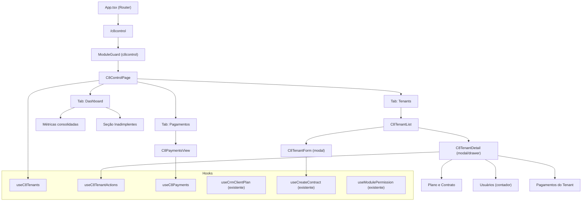
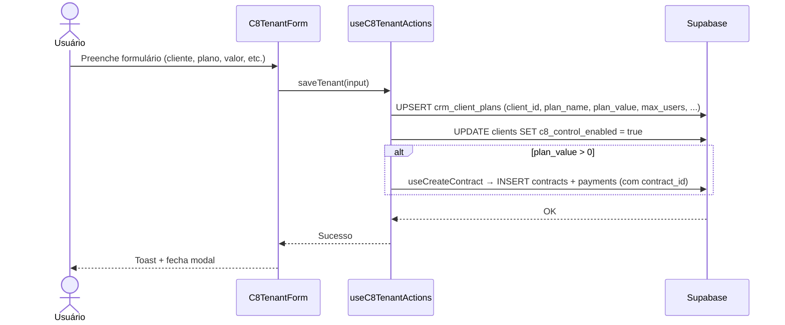
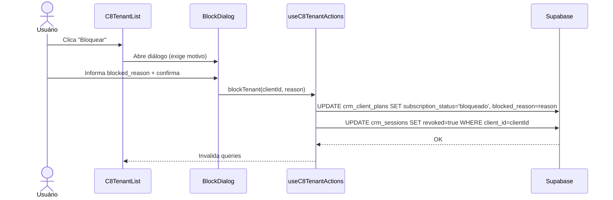

# Design Técnico — C8 Control Gerencial Module

## Visão Geral

O módulo **C8 Control Gerencial** centraliza toda a gestão de tenants do produto CRM externo (C8 Control) em uma seção dedicada no sidebar do Maestr.ia. O objetivo é eliminar a fragmentação atual — onde o controle estava distribuído entre a aba C8 Control do cadastro de clientes, a aba C8 Control do módulo Financeiro e a seção de Produtos por Cliente nas Configurações — e consolidar tudo em um único módulo com controle de acesso granular por cargo.

A feature envolve:
1. Migration de banco para adicionar campos à `crm_client_plans`
2. Nova rota `/c8control` com página principal e subcomponentes
3. Remoção da `C8ControlTab` do cadastro de clientes e do toggle da `SettingsPage`
4. Integração financeira sem duplicação via `useCreateContract`
5. Adição do módulo `c8control` ao sistema de permissões existente


## Arquitetura

### Diagrama de Componentes



### Diagrama de Fluxo — Criação de Tenant



### Diagrama de Fluxo — Bloqueio de Tenant




## Componentes e Interfaces

### Novos Componentes

#### `src/pages/C8ControlPage.tsx`
Página principal do módulo. Renderiza as três tabs e as métricas do dashboard.

```typescript
interface C8ControlPageProps {} // sem props — usa useOrganization() internamente

// Tabs: 'dashboard' | 'tenants' | 'payments'
// Protegida por useModulePermission('c8control')
```

#### `src/components/c8control/C8TenantList.tsx`
Lista de tenants com filtros de status e busca por nome.

```typescript
interface C8TenantListProps {
  organizationId: string;
  canCreate: boolean;
  canEdit: boolean;
  canDelete: boolean;
}
```

#### `src/components/c8control/C8TenantForm.tsx`
Formulário modal de cadastro e edição de tenant.

```typescript
interface C8TenantFormProps {
  organizationId: string;
  tenantId?: string;          // undefined = novo tenant
  onSuccess: () => void;
  onCancel: () => void;
}

interface C8TenantFormValues {
  client_id: string;          // seleção de clients existentes
  plan_name: string;
  plan_value: number;
  max_users: number;          // 1–100
  due_day: number;            // 1–28
  contract_start: string;     // ISO date
  contract_end?: string;      // ISO date, opcional
  primary_user_email?: string;
  notes?: string;
}
```

#### `src/components/c8control/C8TenantDetail.tsx`
Drawer/modal com detalhe completo do tenant: plano, contrato, usuário principal e pagamentos.

```typescript
interface C8TenantDetailProps {
  clientId: string;
  organizationId: string;
  canEdit: boolean;
  canDelete: boolean;
  onClose: () => void;
}
```

#### `src/components/c8control/C8PaymentsView.tsx`
Visão consolidada de pagamentos de todos os tenants com filtros.

```typescript
interface C8PaymentsViewProps {
  organizationId: string;
  canEdit: boolean;
  canDelete: boolean;
}
```

### Novos Hooks

#### `src/hooks/useC8Tenants.ts`
Busca e gerencia a lista de tenants da organização.

```typescript
interface C8Tenant {
  client_id: string;
  client_name: string;
  plan_name: string;
  plan_value: number;
  max_users: number;
  due_day: number;
  subscription_status: SubscriptionStatus;
  contract_start: string | null;
  contract_end: string | null;
  primary_user_email: string | null;
  notes: string | null;
  suspended_at: string | null;
  blocked_reason: string | null;
  active_users_count: number;
  c8_control_enabled: boolean;
}

// Query key: ['c8_tenants', organizationId]
// Fonte: crm_client_plans JOIN clients WHERE c8_control_enabled = true
```

#### `src/hooks/useC8TenantActions.ts`
Mutações de criação, edição, bloqueio, liberação, suspensão e cancelamento.

```typescript
interface UseC8TenantActionsReturn {
  saveTenant: UseMutationResult<void, Error, C8TenantFormValues>;
  blockTenant: UseMutationResult<void, Error, { clientId: string; reason: string }>;
  unblockTenant: UseMutationResult<void, Error, { clientId: string }>;
  suspendTenant: UseMutationResult<void, Error, { clientId: string }>;
  cancelTenant: UseMutationResult<void, Error, { clientId: string }>;
  renewContract: UseMutationResult<void, Error, { clientId: string; newEndDate: string }>;
}
```

#### `src/hooks/useC8Payments.ts`
Busca pagamentos de todos os tenants ou de um tenant específico.

```typescript
interface UseC8PaymentsOptions {
  organizationId: string;
  clientId?: string;          // undefined = todos os tenants
  statusFilter?: string[];
  periodStart?: string;
  periodEnd?: string;
  limit?: number;             // default 24
}
```


### Modificações em Componentes Existentes

#### `src/components/layout/AppSidebar.tsx`
Adicionar item ao array `navItems` e ao mapa `canViewByModule`:

```typescript
// Em navItems:
{ title: "C8 Control", url: "/c8control", icon: Package, module: "c8control" }

// Em canViewByModule:
const { canView: canViewC8Control } = useModulePermission("c8control");
// ...
c8control: canViewC8Control,
```

#### `src/App.tsx`
Adicionar rota dentro do `ModuleGuard`:

```typescript
import { C8ControlPage } from "./pages/C8ControlPage";
// ...
<Route path="/c8control" element={<C8ControlPage />} />
```

#### `src/hooks/usePermissions.ts`
Adicionar `c8control` ao array `MODULES` e ao mapa `ROUTE_TO_MODULE`:

```typescript
// Em MODULES:
{ id: "c8control", label: "C8 Control" }

// Em ROUTE_TO_MODULE:
"/c8control": "c8control"
```

**Atenção:** O tipo `PermissionModule` é derivado do enum `permission_module` do banco de dados. Será necessário adicionar `'c8control'` ao enum via migration antes de usar no TypeScript. Enquanto a migration não for aplicada, tratar como `CLIENT_ONLY_MODULES` (client-side only) para evitar erro 22P02.

#### `src/lib/crmModules.ts`
Atualizar `SubscriptionStatus` para incluir `'suspenso'`:

```typescript
export type SubscriptionStatus = 'ativo' | 'inadimplente' | 'bloqueado' | 'suspenso' | 'cancelado';
```

### Remoções

| Arquivo | Ação | Motivo |
|---|---|---|
| `src/components/clients/C8ControlTab.tsx` | Remover imports em todos os consumidores; manter arquivo ou excluir | Centralizado no módulo gerencial |
| `src/pages/ClientsPage.tsx` | Remover aba C8 Control da lista de tabs | Req. 6.1 |
| `src/pages/SettingsPage.tsx` | Remover seção "Produtos por Cliente" (toggle C8 Control) | Req. 6.3 |

**Arquivos a verificar para remoção de imports de `C8ControlTab`:**
- `src/pages/ClientsPage.tsx`
- `src/components/clients/ContractDetailPage.tsx` (se aplicável)


## Modelos de Dados

### Migration: `crm_client_plans` — Novos Campos

```sql
-- Migration: 00130_c8control_gerencial_module.sql
-- Idempotente: usa IF NOT EXISTS e backfill seguro

-- 1. Adicionar novas colunas
ALTER TABLE crm_client_plans
  ADD COLUMN IF NOT EXISTS blocked_reason      TEXT,
  ADD COLUMN IF NOT EXISTS plan_name           TEXT NOT NULL DEFAULT 'Starter',
  ADD COLUMN IF NOT EXISTS contract_start      DATE,
  ADD COLUMN IF NOT EXISTS contract_end        DATE,
  ADD COLUMN IF NOT EXISTS suspended_at        TIMESTAMPTZ,
  ADD COLUMN IF NOT EXISTS primary_user_email  TEXT,
  ADD COLUMN IF NOT EXISTS notes               TEXT;

-- 2. Backfill: normalizar valores de subscription_status antes de alterar o CHECK
--    (valores legados como 'inadimplente' são mapeados para 'ativo')
UPDATE crm_client_plans
SET subscription_status = 'ativo'
WHERE subscription_status NOT IN ('ativo', 'bloqueado', 'suspenso', 'cancelado');

-- 3. Remover constraint antiga e criar nova (idempotente via DROP/ADD)
ALTER TABLE crm_client_plans
  DROP CONSTRAINT IF EXISTS crm_client_plans_subscription_status_check;

ALTER TABLE crm_client_plans
  ADD CONSTRAINT crm_client_plans_subscription_status_check
  CHECK (subscription_status IN ('ativo', 'bloqueado', 'suspenso', 'cancelado'));

-- 4. Índices para filtros frequentes
CREATE INDEX IF NOT EXISTS idx_crm_client_plans_status
  ON crm_client_plans (organization_id, subscription_status);

CREATE INDEX IF NOT EXISTS idx_crm_client_plans_contract_end
  ON crm_client_plans (contract_end);

-- 5. Garantir coluna c8_control_enabled na tabela clients
ALTER TABLE clients
  ADD COLUMN IF NOT EXISTS c8_control_enabled BOOLEAN NOT NULL DEFAULT false;

-- 6. Adicionar 'c8control' ao enum permission_module (se existir como enum no banco)
-- ATENÇÃO: verificar se permission_module é enum ou TEXT antes de aplicar
-- Se for enum:
DO $$
BEGIN
  IF NOT EXISTS (
    SELECT 1 FROM pg_enum
    WHERE enumlabel = 'c8control'
      AND enumtypid = (SELECT oid FROM pg_type WHERE typname = 'permission_module')
  ) THEN
    ALTER TYPE permission_module ADD VALUE 'c8control';
  END IF;
END $$;
```

### SQL de Limpeza Seguro (Código Legado)

```sql
-- Limpeza segura: remover referências legadas sem perda de dados
-- Executar APENAS após confirmar que o módulo gerencial está em produção

-- Não excluir dados de crm_client_plans, crm_client_users ou crm_sessions
-- Apenas remover o toggle da SettingsPage (feito no código, não no banco)

-- Pagamentos legados (contract_id IS NULL, description LIKE 'Mensalidade C8 Control%')
-- NÃO excluir — exibir como "lançamentos legados" no módulo gerencial (Req. 7.4)
-- Para vincular ao contrato após migração (opcional, executar manualmente):
/*
UPDATE payments p
SET contract_id = c.id
FROM contracts c
WHERE p.client_id = c.client_id
  AND c.service_contracted = 'C8 Control CRM'
  AND c.status = 'ativo'
  AND p.contract_id IS NULL
  AND p.description LIKE 'Mensalidade C8 Control%';
*/
```

### Modelo TypeScript — `CrmClientPlan` Atualizado

```typescript
// src/hooks/useCrmClientPlan.ts — interface atualizada
export interface CrmClientPlan {
  id: string;
  organization_id: string;
  client_id: string;
  plan_value: number;
  plan_name: string;                    // NOVO
  modules: string[];
  max_users: number;
  due_day: number;
  subscription_status: SubscriptionStatus;
  blocked_reason: string | null;        // NOVO
  contract_start: string | null;        // NOVO
  contract_end: string | null;          // NOVO
  suspended_at: string | null;          // NOVO
  primary_user_email: string | null;    // NOVO
  notes: string | null;                 // NOVO
  created_at: string;
  updated_at: string;
}
```

### Relações entre Tabelas

```
clients (id)
  └── crm_client_plans (client_id) — 1:1
  └── contracts (client_id) — 1:N
        └── payments (contract_id) — 1:N  ← fonte única de pagamentos CRM
  └── crm_client_users (client_id) — 1:N
  └── crm_sessions (client_id) — 1:N
```

**Regra de fonte única:** Todo pagamento de mensalidade C8 Control deve ter `contract_id` apontando para o `Contrato_CRM` ativo do tenant (`service_contracted = 'C8 Control CRM'`). Pagamentos sem `contract_id` são considerados legados e exibidos com indicação visual.


## Propriedades de Corretude

*Uma propriedade é uma característica ou comportamento que deve ser verdadeiro em todas as execuções válidas de um sistema — essencialmente, uma declaração formal sobre o que o sistema deve fazer. Propriedades servem como ponte entre especificações legíveis por humanos e garantias de corretude verificáveis por máquina.*

---

### Propriedade 1: Controle de acesso ao módulo por permissão

*Para qualquer* usuário e qualquer configuração de permissão do módulo `c8control`, o item "C8 Control" no sidebar deve ser visível se e somente se `canView = true` para aquele usuário naquele módulo. Da mesma forma, acessar `/c8control` sem `canView = true` deve resultar em redirecionamento.

**Valida: Requisitos 2.1, 2.3**

---

### Propriedade 2: Filtragem de tenants por status e nome

*Para qualquer* lista de tenants e qualquer combinação de filtro de status e termo de busca por nome, todos os tenants retornados devem satisfazer simultaneamente o filtro de status (se aplicado) e conter o termo de busca no nome (se aplicado). Nenhum tenant que não satisfaça os critérios deve aparecer no resultado.

**Valida: Requisitos 2.4, 2.6**

---

### Propriedade 3: Cálculo correto das métricas consolidadas

*Para qualquer* lista de tenants com seus respectivos planos e pagamentos, as métricas calculadas devem ser:
- Total de tenants ativos = count de tenants com `subscription_status = 'ativo'`
- Receita mensal esperada = soma de `plan_value` dos tenants com `subscription_status = 'ativo'`
- Inadimplentes = count de tenants com `pending_amount > 0` e `next_due_date < hoje - 5 dias`

**Valida: Requisitos 2.5, 2.11**

---

### Propriedade 4: Transições de status são consistentes e reversíveis

*Para qualquer* tenant, as transições de status devem preservar as seguintes invariantes:
- Após `blockTenant(reason)`: `subscription_status = 'bloqueado'`, `blocked_reason = reason`, todas as sessões ativas revogadas
- Após `unblockTenant()`: `subscription_status = 'ativo'`, `blocked_reason = null`
- Após `suspendTenant()`: `subscription_status = 'suspenso'`, `suspended_at` preenchido
- Após `cancelTenant()`: `subscription_status = 'cancelado'`, `c8_control_enabled = false`
- O ciclo bloquear → liberar deve restaurar o tenant ao estado `ativo` (round-trip)

**Valida: Requisitos 2.7, 2.8, 2.9, 2.10**

---

### Propriedade 5: UI gates de permissão ocultam ações não autorizadas

*Para qualquer* usuário e qualquer configuração de permissão, os seguintes gates devem ser respeitados:
- Sem `canCreate`: botão "Novo Tenant C8 Control" não deve ser renderizado
- Sem `canEdit`: botões de edição, bloqueio, liberação e suspensão não devem ser renderizados
- Sem `canDelete`: botões de cancelamento de contrato e exclusão de pagamentos não devem ser renderizados

**Valida: Requisitos 2.14, 2.15, 2.16**

---

### Propriedade 6: Unicidade de registro em crm_client_plans por cliente

*Para qualquer* sequência de operações de criação e edição de tenants, deve existir no máximo 1 registro em `crm_client_plans` por `client_id`. Operações subsequentes de "criar tenant" para o mesmo cliente devem atualizar o registro existente (upsert), nunca criar um duplicado.

**Valida: Requisitos 3.3**

---

### Propriedade 7: Criação de Contrato_CRM ao ativar tenant com valor > 0

*Para qualquer* tenant salvo com `plan_value > 0`, deve existir exatamente 1 contrato com `service_contracted = 'C8 Control CRM'` e `status = 'ativo'` para aquele `client_id`. Todos os pagamentos gerados por esse contrato devem ter `contract_id` preenchido com o id desse contrato.

**Valida: Requisitos 3.4, 3.5, 5.2**

---

### Propriedade 8: No máximo 1 Contrato_CRM ativo por tenant

*Para qualquer* tenant, o count de contratos com `service_contracted = 'C8 Control CRM'` e `status = 'ativo'` deve ser sempre ≤ 1. Qualquer operação que tentaria criar um segundo contrato ativo deve oferecer as opções de renovar ou encerrar o anterior.

**Valida: Requisitos 3.6, 7.5**

---

### Propriedade 9: Persistência e recuperação de dados do tenant (round-trip)

*Para qualquer* conjunto de valores de formulário de tenant (plan_name, plan_value, max_users, due_day, contract_start, contract_end, primary_user_email), após salvar e recarregar, os valores recuperados de `crm_client_plans` devem ser iguais aos valores informados. O e-mail do usuário principal deve ser armazenado em `primary_user_email` sem criar registros em `crm_client_users`.

**Valida: Requisitos 3.2, 3.7, 4.3, 4.5**

---

### Propriedade 10: Validação do limite de usuários

*Para qualquer* valor de `max_users` fora do intervalo [1, 100], o sistema deve rejeitar o formulário e não persistir o valor. Para qualquer valor dentro do intervalo, o sistema deve aceitar e persistir corretamente.

**Valida: Requisitos 4.1**

---

### Propriedade 11: Pagamentos de tenant filtrados exclusivamente por contract_id

*Para qualquer* tenant com Contrato_CRM ativo, os pagamentos exibidos no módulo gerencial devem ser exatamente os registros em `payments` com `contract_id = id_do_contrato_crm`, limitados a 24 registros ordenados por `due_date DESC`. Nenhum pagamento de outro contrato ou sem `contract_id` deve aparecer na lista principal (exceto lançamentos legados com indicação visual).

**Valida: Requisitos 2.13, 5.1, 7.2, 7.3**

---

### Propriedade 12: Registro de recebimento atualiza corretamente o pagamento

*Para qualquer* pagamento com `status != 'pago'`, após registrar recebimento com valor `v` e data `d`, o registro em `payments` deve ter `status = 'pago'`, `paid_at = d` e `value = v`. O total recebido no mês deve refletir esse pagamento imediatamente.

**Valida: Requisitos 5.4, 5.5**

---

### Propriedade 13: Bloqueio automático após 30 dias de inadimplência

*Para qualquer* pagamento com `due_date ≤ now() - 30 dias` e `status = 'pendente'`, o tenant correspondente deve ter `subscription_status = 'bloqueado'` após a execução da função agendada. Nenhum tenant com todos os pagamentos em dia deve ser bloqueado por esta regra.

**Valida: Requisitos 5.6**

---

### Propriedade 14: Abas restantes do cadastro de cliente funcionam após remoção da C8ControlTab

*Para qualquer* cliente, após a remoção da `C8ControlTab`, as demais abas do cadastro (Dados, Contratos, KPIs, etc.) devem renderizar sem erros e manter toda a sua funcionalidade. A remoção não deve introduzir erros de renderização ou navegação.

**Valida: Requisitos 6.4**

---

### Propriedade 15: Contrato_CRM visível na aba Contratos do cliente

*Para qualquer* Contrato_CRM criado pelo módulo gerencial, ele deve aparecer na lista de contratos do cliente (query `contracts WHERE client_id = X`) com `service_contracted = 'C8 Control CRM'`. O contrato deve ser visível tanto no módulo gerencial quanto na aba Contratos do cadastro do cliente.

**Valida: Requisitos 7.1**

---

### Propriedade 16: Lançamentos legados exibidos com indicação visual

*Para qualquer* pagamento com `description LIKE 'Mensalidade C8 Control%'` e `contract_id IS NULL`, ele deve ser exibido no módulo gerencial com uma indicação visual de "lançamento legado" e não deve ser excluído ou modificado automaticamente.

**Valida: Requisitos 7.4**

---

### Propriedade 17: Edge Function retorna 403 para tenant suspenso

*Para qualquer* tenant com `subscription_status = 'suspenso'`, a Edge Function `crm-validate-access` com `action: 'validate'` deve retornar HTTP 403 com body `{ reason: 'suspended' }`. O comportamento deve ser análogo ao bloqueio.

**Valida: Requisitos 8.4**


## Tratamento de Erros

### Erros de Migration

| Cenário | Tratamento |
|---|---|
| Coluna já existe | `ADD COLUMN IF NOT EXISTS` — sem erro |
| Valor de `subscription_status` inválido | Backfill para `'ativo'` antes do constraint |
| Enum `permission_module` não suporta `c8control` | Bloco `DO $$ ... $$` idempotente; fallback: tratar como `CLIENT_ONLY_MODULES` no frontend |

### Erros de Negócio

| Cenário | Tratamento |
|---|---|
| Tentativa de criar 2º Contrato_CRM ativo | Modal de confirmação: "Renovar existente" ou "Criar novo (encerra anterior)" |
| Bloquear tenant sem informar motivo | Validação no formulário — botão de confirmação desabilitado |
| Gerar cobrança sem Contrato_CRM ativo | Toast de erro: "Crie um contrato CRM antes de gerar cobranças" |
| `plan_value = 0` ao criar tenant | Não criar contrato; exibir aviso "Tenant criado sem contrato financeiro" |
| `max_users` fora de [1, 100] | Validação no formulário com mensagem de erro inline |
| Cancelar tenant com usuários ativos | Diálogo de confirmação informando o número de usuários que perderão acesso |

### Erros de Permissão

| Cenário | Tratamento |
|---|---|
| Acesso direto a `/c8control` sem `canView` | `ModuleGuard` redireciona para `/` sem mensagem de erro técnico |
| Ação de edição sem `canEdit` | Botão oculto (não apenas desabilitado) — nunca chega ao handler |
| Exclusão de pagamento sem `canDelete` | Botão oculto; se chamada direta à API, retorna 403 via RLS |

### Erros de Rede / Supabase

Todos os hooks usam o padrão `try/catch` com `toast.error()` para erros inesperados. Queries com `useQuery` exibem estado de loading e permitem retry automático via `react-query`.


## Estratégia de Testes

### Abordagem Dual

A estratégia combina testes unitários (exemplos específicos e casos de borda) com testes baseados em propriedades (cobertura universal via geração aleatória de inputs). Os dois são complementares e necessários.

**Testes unitários** focam em:
- Exemplos concretos de renderização de componentes
- Casos de borda (plan_value = 0, max_users = 1, contract_end no passado)
- Pontos de integração entre hooks e componentes
- Verificação de que componentes removidos não aparecem mais

**Testes de propriedade** focam em:
- Invariantes que devem valer para qualquer input válido
- Cobertura ampla via randomização (mínimo 100 iterações por propriedade)
- Verificação de round-trips (criar → buscar → comparar)

### Biblioteca de Property-Based Testing

Usar **fast-check** (já disponível no ecossistema TypeScript/Vitest):

```bash
npm install --save-dev fast-check
```

### Testes Unitários (Exemplos)

```typescript
// C8ControlPage.test.tsx
describe('C8ControlPage', () => {
  it('exibe item C8 Control no sidebar quando canView = true', ...)
  it('não exibe item C8 Control no sidebar quando canView = false', ...)
  it('redireciona para / quando usuário sem permissão acessa /c8control', ...)
  it('exibe as três tabs: Dashboard, Tenants, Pagamentos', ...)
})

// C8TenantForm.test.tsx
describe('C8TenantForm', () => {
  it('contém campos: cliente, plan_name, plan_value, max_users, due_day, contract_start, primary_user_email', ...)
  it('desabilita botão de salvar quando client_id não selecionado', ...)
  it('exibe apenas clientes sem c8_control_enabled no seletor', ...)
})

// C8ControlTab removal
describe('ClientsPage sem C8ControlTab', () => {
  it('não renderiza a aba C8 Control no cadastro do cliente', ...)
  it('demais abas renderizam sem erros', ...)
})

// SettingsPage
describe('SettingsPage sem toggle C8 Control', () => {
  it('não renderiza a seção Produtos por Cliente', ...)
})

// Rota pública
describe('Rota pública CRM login', () => {
  it('rota /public/dashboard/:slug/crm/login continua acessível', ...)
})
```

### Testes de Propriedade

Cada teste de propriedade deve referenciar a propriedade do design com o formato:
`// Feature: c8-control-gerencial-module, Propriedade N: <texto>`

```typescript
// c8control.property.test.ts
import fc from 'fast-check';

// Feature: c8-control-gerencial-module, Propriedade 1: Controle de acesso ao módulo por permissão
test('sidebar oculta C8 Control quando canView = false', () => {
  fc.assert(fc.property(
    fc.record({ canView: fc.boolean() }),
    ({ canView }) => {
      const result = resolveUIGate(canView);
      return result === canView;
    }
  ), { numRuns: 100 });
});

// Feature: c8-control-gerencial-module, Propriedade 2: Filtragem de tenants por status e nome
test('filtro de status retorna apenas tenants com o status correto', () => {
  fc.assert(fc.property(
    fc.array(arbTenant(), { minLength: 0, maxLength: 50 }),
    fc.constantFrom('ativo', 'bloqueado', 'suspenso', 'cancelado'),
    (tenants, status) => {
      const filtered = filterTenantsByStatus(tenants, status);
      return filtered.every(t => t.subscription_status === status);
    }
  ), { numRuns: 100 });
});

// Feature: c8-control-gerencial-module, Propriedade 3: Cálculo correto das métricas consolidadas
test('receita mensal esperada = soma de plan_value dos tenants ativos', () => {
  fc.assert(fc.property(
    fc.array(arbTenant(), { minLength: 0, maxLength: 50 }),
    (tenants) => {
      const metrics = calcMetrics(tenants);
      const expected = tenants
        .filter(t => t.subscription_status === 'ativo')
        .reduce((sum, t) => sum + t.plan_value, 0);
      return Math.abs(metrics.totalExpectedMonthly - expected) < 0.01;
    }
  ), { numRuns: 100 });
});

// Feature: c8-control-gerencial-module, Propriedade 4: Transições de status são consistentes
test('bloquear e liberar tenant restaura status ativo (round-trip)', () => {
  fc.assert(fc.property(
    arbTenantAtivo(),
    fc.string({ minLength: 1 }),
    (tenant, reason) => {
      const blocked = applyBlock(tenant, reason);
      const unblocked = applyUnblock(blocked);
      return unblocked.subscription_status === 'ativo' && unblocked.blocked_reason === null;
    }
  ), { numRuns: 100 });
});

// Feature: c8-control-gerencial-module, Propriedade 6: Unicidade de crm_client_plans por cliente
test('upsert de tenant nunca cria duplicata por client_id', () => {
  fc.assert(fc.property(
    fc.uuid(),
    fc.array(arbTenantFormValues(), { minLength: 1, maxLength: 5 }),
    (clientId, operations) => {
      const store = new Map<string, CrmClientPlan>();
      for (const op of operations) {
        upsertTenantInStore(store, { ...op, client_id: clientId });
      }
      return store.size === 1;
    }
  ), { numRuns: 100 });
});

// Feature: c8-control-gerencial-module, Propriedade 8: No máximo 1 Contrato_CRM ativo por tenant
test('count de contratos CRM ativos por tenant nunca excede 1', () => {
  fc.assert(fc.property(
    fc.uuid(),
    fc.array(arbContractOperation(), { minLength: 1, maxLength: 10 }),
    (clientId, operations) => {
      const contracts = applyContractOperations(clientId, operations);
      const activeCount = contracts.filter(
        c => c.service_contracted === 'C8 Control CRM' && c.status === 'ativo'
      ).length;
      return activeCount <= 1;
    }
  ), { numRuns: 100 });
});

// Feature: c8-control-gerencial-module, Propriedade 10: Validação do limite de usuários
test('max_users fora de [1, 100] é rejeitado', () => {
  fc.assert(fc.property(
    fc.integer({ min: -1000, max: 0 }).chain(v => fc.constant(v))
      .filter(v => v < 1 || v > 100),
    (invalidValue) => {
      const result = validateMaxUsers(invalidValue);
      return result.valid === false;
    }
  ), { numRuns: 100 });
});

// Feature: c8-control-gerencial-module, Propriedade 11: Pagamentos filtrados por contract_id
test('pagamentos exibidos pertencem exclusivamente ao contract_id do Contrato_CRM', () => {
  fc.assert(fc.property(
    fc.uuid(),
    fc.array(arbPayment(), { minLength: 0, maxLength: 50 }),
    (contractId, allPayments) => {
      const filtered = filterPaymentsByContract(allPayments, contractId);
      return filtered.every(p => p.contract_id === contractId);
    }
  ), { numRuns: 100 });
});
```

### Configuração dos Testes de Propriedade

- Mínimo de **100 iterações** por teste (`numRuns: 100`)
- Usar `fc.record()` e `fc.oneof()` para gerar dados realistas
- Separar funções puras (lógica de negócio) dos hooks React para facilitar testes
- Arquivo de testes: `src/components/c8control/__tests__/c8control.property.test.ts`

