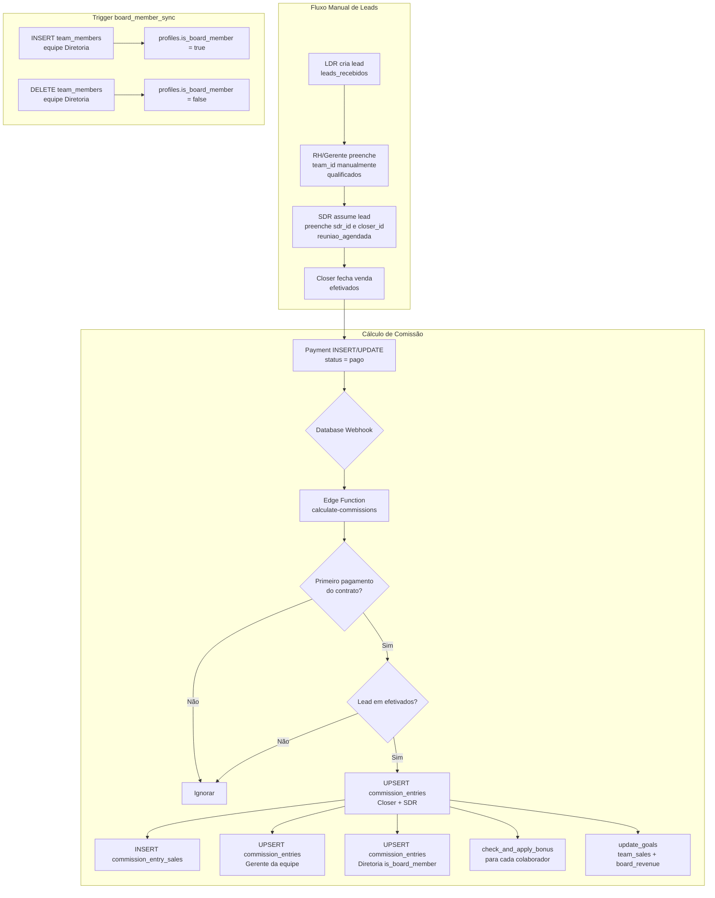

# Design — Sistema de Comissões, Bônus e Módulo RH

## Visão Geral

O sistema de comissões e bônus do Maestr.IA automatiza o cálculo de remuneração variável para Closers, SDRs, gerentes de equipe e membros da diretoria, com base nos pagamentos efetivados de contratos. O fluxo de leads é **100% manual**: não existe round-robin nem distribuição automática. O módulo "Equipe" é renomeado para **"RH"** no sidebar e passa a centralizar cadastro, jornada, férias/ausências, avaliações, metas, comissão/bônus, treinamentos, documentos e score do colaborador.

O cálculo de comissão é disparado por um Database Webhook na tabela `payments` (INSERT/UPDATE) que invoca a Edge Function `calculate-commissions`. As taxas de comissão e bônus são configuradas por colaborador na `CommissionConfigTab`, separada dos dados cadastrais. O campo `commission_percent` do metadata é legado e não deve mais ser gravado.


## Arquitetura

### Diagrama de Fluxo Geral



### Stack

- **Frontend**: React + TypeScript, React Query, shadcn/ui + Tailwind
- **Backend**: Supabase (PostgreSQL + RLS), Edge Functions (Deno/TypeScript)
- **Trigger de cálculo**: Database Webhook em `payments` → Edge Function `calculate-commissions`
- **Storage**: Supabase Storage (bucket `employee-documents`) para documentos de colaboradores


## Componentes e Interfaces

### Tabela de Componentes

| Componente | Arquivo | Descrição |
|---|---|---|
| `CommissionConfigTab` | `src/components/team/CommissionConfigTab.tsx` | Configuração de taxas (commission_rate, bonus_rate_*) + histórico de commission_entries + botão bônus manual |
| `CommissionDetailDialog` | `src/components/team/CommissionDetailDialog.tsx` | Detalhe de uma Commission_Entry com resumo e lista de commission_entry_sales |
| `EmployeeAbsencesTab` | `src/components/team/EmployeeAbsencesTab.tsx` | Férias e ausências do colaborador (employee_absences) |
| `EmployeeEvaluationsTab` | `src/components/team/EmployeeEvaluationsTab.tsx` | Avaliações de desempenho periódicas (employee_evaluations) |
| `EmployeeGoalsTab` | `src/components/team/EmployeeGoalsTab.tsx` | Metas integradas — gerente define individual, RH define equipe |
| `EmployeeTrainingsTab` | `src/components/team/EmployeeTrainingsTab.tsx` | Treinamentos do colaborador (employee_trainings) |
| `EmployeeDocumentsTab` | `src/components/team/EmployeeDocumentsTab.tsx` | Upload e listagem de documentos via Supabase Storage |
| `EmployeeScoreTab` | `src/components/team/EmployeeScoreTab.tsx` | Score composto e histórico de evolução do colaborador |
| `HRDashboard` | `src/components/team/HRDashboard.tsx` | Dashboard RH: total colaboradores, custo de folha, desempenho médio, ranking, alertas |
| `LeadDetailsModal` (editar) | `src/components/kanban/LeadDetailsModal.tsx` | Adicionar campos team_id (manual), sdr_id, closer_id |
| `AppSidebar` (editar) | `src/components/layout/AppSidebar.tsx` | Renomear label "Equipe" → "RH" |
| `EditCollaboratorDialog` (editar) | `src/components/team/EditCollaboratorDialog.tsx` | Adicionar hire_date; remover commission_percent do formulário |

### Abas do EmployeeDetailModal

1. **Dados Pessoais** — `EditCollaboratorDialog` (já existe)
2. **Jornada** — `CollaboratorTimeclockTab` (já existe)
3. **Férias e Ausências** — `EmployeeAbsencesTab` (nova)
4. **Avaliação de Desempenho** — `EmployeeEvaluationsTab` (nova)
5. **Metas** — `EmployeeGoalsTab` (nova)
6. **Comissão e Bônus** — `CommissionConfigTab` (nova)
7. **Treinamentos** — `EmployeeTrainingsTab` (nova)
8. **Documentos** — `EmployeeDocumentsTab` (nova)
9. **Score e Histórico** — `EmployeeScoreTab` (nova)

### CommissionConfigTab — Interface

```
┌─────────────────────────────────────────────────────────┐
│ Configuração de Comissão e Bônus                        │
│                                                         │
│  Taxa de Comissão (%)  [____]                           │
│  Bônus Tier 120% (%)   [____]                           │
│  Bônus Tier 135% (%)   [____]                           │
│  Bônus Tier 150% (%)   [____]                           │
│                                    [Salvar Configuração]│
│                                                         │
│  [+ Adicionar Bônus Manual]  ← visível apenas admin/    │
│                                owner, não-comercial     │
│                                                         │
│  Histórico de Comissões                                 │
│  ┌──────────┬──────────┬────────┬───────────┬────────┐  │
│  │ Mês/Ano  │Comissão  │ Bônus  │ Contratos │ Status │  │
│  ├──────────┼──────────┼────────┼───────────┼────────┤  │
│  │ Jan/2025 │ R$1.200  │ R$300  │     5     │ Pago   │  │
│  └──────────┴──────────┴────────┴───────────┴────────┘  │
└─────────────────────────────────────────────────────────┘
```

### HRDashboard — Interface

```
┌─────────────────────────────────────────────────────────┐
│ Dashboard RH                                            │
│                                                         │
│  [Colaboradores Ativos: 24] [Custo Folha: R$48.000]    │
│  [Desempenho Médio: 8.2]    [Alertas Ativos: 3]        │
│                                                         │
│  Ranking de Performance                                 │
│  1. João Silva    Score: 9.4                            │
│  2. Maria Santos  Score: 8.7                            │
│                                                         │
│  Alertas                                                │
│  ⚠ Férias de Pedro vence em 5 dias (não aprovada)      │
│  ⚠ Meta de equipe Comercial: 3 dias para encerrar      │
└─────────────────────────────────────────────────────────┘
```


## Modelos de Dados

### Migration 00083 — `profiles` (novos campos)

```sql
ALTER TABLE profiles
  ADD COLUMN IF NOT EXISTS commission_rate  DECIMAL(5,2) DEFAULT 0,
  ADD COLUMN IF NOT EXISTS bonus_rate_120   DECIMAL(5,2) DEFAULT 0,
  ADD COLUMN IF NOT EXISTS bonus_rate_135   DECIMAL(5,2) DEFAULT 0,
  ADD COLUMN IF NOT EXISTS bonus_rate_150   DECIMAL(5,2) DEFAULT 0,
  ADD COLUMN IF NOT EXISTS is_board_member  BOOLEAN DEFAULT false;
-- hire_date fica em metadata.hire_date (JSON) — sem coluna nova
-- commission_percent em metadata é legado — não gravar mais
```

### Migration 00084 — `leads` (sem round_robin_index)

```sql
ALTER TABLE leads
  ADD COLUMN IF NOT EXISTS sdr_id    UUID REFERENCES profiles(id) ON DELETE SET NULL,
  ADD COLUMN IF NOT EXISTS closer_id UUID REFERENCES profiles(id) ON DELETE SET NULL,
  ADD COLUMN IF NOT EXISTS team_id   UUID REFERENCES teams(id)    ON DELETE SET NULL;
-- NÃO adicionar round_robin_index em teams
```

### Migration 00085 — `commission_entries`

```sql
CREATE TABLE IF NOT EXISTS commission_entries (
  id                UUID PRIMARY KEY DEFAULT gen_random_uuid(),
  organization_id   UUID NOT NULL REFERENCES organizations(id) ON DELETE CASCADE,
  profile_id        UUID NOT NULL REFERENCES profiles(id) ON DELETE CASCADE,
  month_reference   DATE NOT NULL,
  total_sales_value DECIMAL(12,2) NOT NULL DEFAULT 0,
  contracts_count   INTEGER NOT NULL DEFAULT 0,
  commission_rate   DECIMAL(5,2) NOT NULL DEFAULT 0,
  commission_value  DECIMAL(12,2) NOT NULL DEFAULT 0,
  goal_id           UUID REFERENCES goals(id) ON DELETE SET NULL,
  goal_target       DECIMAL(12,2),
  goal_achieved_pct DECIMAL(6,2),
  bonus_rate        DECIMAL(5,2) DEFAULT 0,
  bonus_value       DECIMAL(12,2) NOT NULL DEFAULT 0,
  is_board_member   BOOLEAN NOT NULL DEFAULT false,
  entry_type        TEXT NOT NULL CHECK (entry_type IN ('automatic','manual')),
  status            TEXT NOT NULL DEFAULT 'pending' CHECK (status IN ('pending','approved','paid')),
  notes             TEXT,
  created_at        TIMESTAMPTZ NOT NULL DEFAULT now(),
  updated_at        TIMESTAMPTZ NOT NULL DEFAULT now(),
  UNIQUE (profile_id, month_reference, entry_type)
);
```

### Migration 00086 — `commission_entry_sales`

```sql
CREATE TABLE IF NOT EXISTS commission_entry_sales (
  id                   UUID PRIMARY KEY DEFAULT gen_random_uuid(),
  commission_entry_id  UUID NOT NULL REFERENCES commission_entries(id) ON DELETE CASCADE,
  contract_id          UUID NOT NULL,
  client_name          TEXT NOT NULL,
  product              TEXT,
  sale_date            DATE,
  first_payment_date   DATE,
  value                DECIMAL(12,2) NOT NULL,
  created_at           TIMESTAMPTZ NOT NULL DEFAULT now()
);
```

### Migration 00087 — `goals` (campo source)

```sql
ALTER TABLE goals
  ADD COLUMN IF NOT EXISTS source TEXT DEFAULT 'manual'
    CHECK (source IN ('manual','team_sales','board_revenue'));
```

### Migration 00088 — `employee_absences`

```sql
CREATE TABLE IF NOT EXISTS employee_absences (
  id              UUID PRIMARY KEY DEFAULT gen_random_uuid(),
  organization_id UUID NOT NULL,
  collaborator_id UUID NOT NULL REFERENCES profiles(id) ON DELETE CASCADE,
  tipo            TEXT NOT NULL CHECK (tipo IN ('ferias','atestado','falta')),
  data_inicio     DATE NOT NULL,
  data_fim        DATE NOT NULL,
  status          TEXT NOT NULL DEFAULT 'pendente' CHECK (status IN ('aprovado','pendente')),
  observacao      TEXT,
  created_at      TIMESTAMPTZ NOT NULL DEFAULT now(),
  CONSTRAINT chk_datas CHECK (data_fim >= data_inicio)
);
```

### Migration 00089 — `employee_evaluations`

```sql
CREATE TABLE IF NOT EXISTS employee_evaluations (
  id              UUID PRIMARY KEY DEFAULT gen_random_uuid(),
  organization_id UUID NOT NULL,
  collaborator_id UUID NOT NULL REFERENCES profiles(id) ON DELETE CASCADE,
  periodo         TEXT NOT NULL,
  produtividade   DECIMAL(4,1) CHECK (produtividade BETWEEN 0 AND 10),
  qualidade       DECIMAL(4,1) CHECK (qualidade BETWEEN 0 AND 10),
  pontualidade    DECIMAL(4,1) CHECK (pontualidade BETWEEN 0 AND 10),
  comportamento   DECIMAL(4,1) CHECK (comportamento BETWEEN 0 AND 10),
  nota_final      DECIMAL(4,1),
  feedback        TEXT,
  created_at      TIMESTAMPTZ NOT NULL DEFAULT now()
);
```

### Migration 00090 — `employee_trainings`

```sql
CREATE TABLE IF NOT EXISTS employee_trainings (
  id               UUID PRIMARY KEY DEFAULT gen_random_uuid(),
  organization_id  UUID NOT NULL,
  collaborator_id  UUID NOT NULL REFERENCES profiles(id) ON DELETE CASCADE,
  nome_treinamento TEXT NOT NULL,
  data             DATE,
  status           TEXT NOT NULL DEFAULT 'pendente' CHECK (status IN ('concluido','pendente')),
  resultado        TEXT,
  created_at       TIMESTAMPTZ NOT NULL DEFAULT now()
);
```

### Trigger `board_member_sync`

```sql
CREATE OR REPLACE FUNCTION sync_board_member()
RETURNS TRIGGER LANGUAGE plpgsql SECURITY DEFINER AS $$
DECLARE
  v_team_name TEXT;
BEGIN
  SELECT name INTO v_team_name FROM teams WHERE id = COALESCE(NEW.team_id, OLD.team_id);

  IF v_team_name = 'Diretoria' THEN
    IF TG_OP = 'INSERT' THEN
      UPDATE profiles SET is_board_member = true WHERE id = NEW.profile_id;
    ELSIF TG_OP = 'DELETE' THEN
      UPDATE profiles SET is_board_member = false WHERE id = OLD.profile_id;
    END IF;
  END IF;

  RETURN COALESCE(NEW, OLD);
END;
$$;

CREATE TRIGGER board_member_sync
  AFTER INSERT OR DELETE ON team_members
  FOR EACH ROW EXECUTE FUNCTION sync_board_member();
```


### Tipos TypeScript

#### `src/types/auth.ts` — Profile (adições)

```typescript
export interface Profile {
  // ... campos existentes ...
  commission_rate:  number;
  bonus_rate_120:   number;
  bonus_rate_135:   number;
  bonus_rate_150:   number;
  is_board_member:  boolean;
}
```

#### `src/types/database.ts` — Lead (adições)

```typescript
export interface Lead {
  // ... campos existentes ...
  sdr_id:    string | null;
  closer_id: string | null;
  team_id:   string | null;
}
```

#### `src/hooks/useGoalsCRUD.ts` — Goal (adição)

```typescript
export type GoalSource = 'manual' | 'team_sales' | 'board_revenue';

export interface Goal {
  // ... campos existentes ...
  source: GoalSource;
}
```

#### Novos tipos — `src/types/commission.ts`

```typescript
export type CommissionEntryStatus = 'pending' | 'approved' | 'paid';
export type CommissionEntryType   = 'automatic' | 'manual';

export interface CommissionEntry {
  id:                string;
  organization_id:   string;
  profile_id:        string;
  month_reference:   string;       // YYYY-MM-01
  total_sales_value: number;
  contracts_count:   number;
  commission_rate:   number;
  commission_value:  number;
  goal_id:           string | null;
  goal_target:       number | null;
  goal_achieved_pct: number | null;
  bonus_rate:        number;
  bonus_value:       number;
  is_board_member:   boolean;
  entry_type:        CommissionEntryType;
  status:            CommissionEntryStatus;
  notes:             string | null;
  created_at:        string;
  updated_at:        string;
}

export interface CommissionEntrySale {
  id:                  string;
  commission_entry_id: string;
  contract_id:         string;
  client_name:         string;
  product:             string | null;
  sale_date:           string | null;
  first_payment_date:  string | null;
  value:               number;
  created_at:          string;
}
```

#### Novos tipos — `src/types/hr.ts`

```typescript
export type AbsenceTipo   = 'ferias' | 'atestado' | 'falta';
export type AbsenceStatus = 'aprovado' | 'pendente';

export interface EmployeeAbsence {
  id:              string;
  organization_id: string;
  collaborator_id: string;
  tipo:            AbsenceTipo;
  data_inicio:     string;
  data_fim:        string;
  status:          AbsenceStatus;
  observacao:      string | null;
  created_at:      string;
}

export interface EmployeeEvaluation {
  id:              string;
  organization_id: string;
  collaborator_id: string;
  periodo:         string;
  produtividade:   number;
  qualidade:       number;
  pontualidade:    number;
  comportamento:   number;
  nota_final:      number;
  feedback:        string | null;
  created_at:      string;
}

export type TrainingStatus = 'concluido' | 'pendente';

export interface EmployeeTraining {
  id:               string;
  organization_id:  string;
  collaborator_id:  string;
  nome_treinamento: string;
  data:             string | null;
  status:           TrainingStatus;
  resultado:        string | null;
  created_at:       string;
}
```

#### Novos hooks

- `src/hooks/useCommissionEntries.ts` — CRUD de `commission_entries` e `commission_entry_sales`
- `src/hooks/useEmployeeAbsences.ts` — CRUD de `employee_absences`
- `src/hooks/useEmployeeEvaluations.ts` — CRUD de `employee_evaluations`
- `src/hooks/useEmployeeTrainings.ts` — CRUD de `employee_trainings`


## Edge Function `calculate-commissions`

### Trigger

Database Webhook em `payments` (INSERT e UPDATE) → `POST /functions/v1/calculate-commissions`

### Pseudocódigo

```
async function calculateCommissions(payload: WebhookPayload):
  payment = payload.record

  // 1. Filtros iniciais
  IF payment.status != 'pago' → return (ignorar)

  // 2. Verificar se é o primeiro pagamento do contrato
  count = COUNT(payments WHERE contract_id = payment.contract_id AND status = 'pago')
  IF count > 1 → return (não é o primeiro pagamento)

  // 3. Buscar contrato e lead
  contract = SELECT * FROM contracts WHERE id = payment.contract_id
  lead     = SELECT * FROM leads WHERE id = contract.lead_id

  // 4. Verificar etapa do lead
  IF lead.etapa_kanban != 'efetivados' → return (ignorar)

  month_reference = DATE_TRUNC('month', payment.paid_at)  // YYYY-MM-01

  // 5. Closer
  IF lead.closer_id IS NOT NULL:
    closer = SELECT commission_rate FROM profiles WHERE id = lead.closer_id
    entry  = UPSERT commission_entries (profile_id=closer_id, month_reference, entry_type='automatic')
             SET total_sales_value += contract.first_payment_value,
                 contracts_count   += 1,
                 commission_rate    = closer.commission_rate,
                 commission_value   = ROUND(total_sales_value * commission_rate / 100, 2)
    INSERT commission_entry_sales (commission_entry_id=entry.id, contract_id, client_name, ...)
    check_and_apply_bonus(closer_id, month_reference, organization_id)

  // 6. SDR
  IF lead.sdr_id IS NOT NULL:
    sdr   = SELECT commission_rate FROM profiles WHERE id = lead.sdr_id
    entry = UPSERT commission_entries (profile_id=sdr_id, month_reference, entry_type='automatic')
            SET total_sales_value += contract.first_payment_value,
                contracts_count   += 1,
                commission_rate    = sdr.commission_rate,
                commission_value   = ROUND(total_sales_value * commission_rate / 100, 2)
    INSERT commission_entry_sales (commission_entry_id=entry.id, contract_id, client_name, ...)
    check_and_apply_bonus(sdr_id, month_reference, organization_id)

  // 7. Gerente da equipe
  IF lead.team_id IS NOT NULL:
    team = SELECT lead_id FROM teams WHERE id = lead.team_id
    IF team.lead_id IS NOT NULL:
      manager = SELECT commission_rate FROM profiles WHERE id = team.lead_id
      total   = SUM(contracts.first_payment_value)
                FROM contracts
                JOIN leads ON leads.id = contracts.lead_id
                JOIN payments ON payments.contract_id = contracts.id
                WHERE leads.team_id = lead.team_id
                  AND payments.status = 'pago'
                  AND DATE_TRUNC('month', payments.paid_at) = month_reference
                  AND payments.id IN (first payments per contract)
      UPSERT commission_entries (profile_id=team.lead_id, month_reference, entry_type='automatic')
             SET total_sales_value = total,
                 commission_value  = ROUND(total * manager.commission_rate / 100, 2)
      check_and_apply_bonus(team.lead_id, month_reference, organization_id)

  // 8. Diretoria
  board_total = SUM(payments.amount)
                FROM payments
                WHERE organization_id = payment.organization_id
                  AND status = 'pago'
                  AND DATE_TRUNC('month', paid_at) = month_reference

  FOR EACH profile WHERE organization_id = payment.organization_id AND is_board_member = true:
    UPSERT commission_entries (profile_id=profile.id, month_reference, entry_type='automatic', is_board_member=true)
           SET total_sales_value = board_total,
               commission_value  = ROUND(board_total * profile.commission_rate / 100, 2)
    check_and_apply_bonus(profile.id, month_reference, organization_id)

  // 9. Atualizar metas automáticas
  update_goals_team_sales(lead.team_id, month_reference)
  update_goals_board_revenue(organization_id, month_reference)


function check_and_apply_bonus(profile_id, month_reference, organization_id):
  profile = SELECT bonus_rate_120, bonus_rate_135, bonus_rate_150 FROM profiles WHERE id = profile_id
  entry   = SELECT * FROM commission_entries
            WHERE profile_id = profile_id AND month_reference = month_reference

  goal = SELECT * FROM goals
         WHERE (assigned_to = profile_id OR team_id IN (SELECT team_id FROM team_members WHERE profile_id = profile_id))
           AND period_start <= month_reference AND period_end >= month_reference
           AND source IN ('manual','team_sales','board_revenue')
         LIMIT 1

  IF goal IS NULL:
    bonus_value = 0; bonus_rate = 0; goal_id = null
  ELSE:
    pct = goal.current_value / goal.target_value
    IF pct >= 1.50:
      bonus_rate  = profile.bonus_rate_150
    ELIF pct >= 1.35:
      bonus_rate  = profile.bonus_rate_135
    ELIF pct >= 1.20:
      bonus_rate  = profile.bonus_rate_120
    ELSE:
      bonus_rate  = 0

    bonus_value       = ROUND(entry.total_sales_value * bonus_rate / 100, 2)
    goal_achieved_pct = ROUND(pct * 100, 2)

  UPDATE commission_entries
    SET bonus_rate        = bonus_rate,
        bonus_value       = bonus_value,
        goal_id           = goal?.id,
        goal_target       = goal?.target_value,
        goal_achieved_pct = goal_achieved_pct
    WHERE id = entry.id


function update_goals_team_sales(team_id, month_reference):
  FOR EACH goal WHERE source = 'team_sales' AND team_id = team_id
    AND period_start <= month_reference AND period_end >= last_day(month_reference):
    new_value = SUM(contracts.first_payment_value)
                FROM contracts JOIN leads ON leads.id = contracts.lead_id
                JOIN payments ON payments.contract_id = contracts.id
                WHERE leads.team_id = team_id
                  AND payments.status = 'pago'
                  AND payments.paid_at BETWEEN goal.period_start AND goal.period_end
                  AND payments.id IN (first payments per contract)
    UPDATE goals SET current_value = new_value WHERE id = goal.id


function update_goals_board_revenue(organization_id, month_reference):
  FOR EACH goal WHERE source = 'board_revenue' AND organization_id = organization_id:
    new_value = SUM(payments.amount)
                FROM payments
                WHERE organization_id = organization_id
                  AND status = 'pago'
                  AND paid_at BETWEEN goal.period_start AND goal.period_end
    UPDATE goals SET current_value = new_value WHERE id = goal.id
```


## Políticas RLS

### `commission_entries`

```sql
-- SELECT: próprio colaborador, gerente da equipe, admin/owner
CREATE POLICY "commission_entries_select" ON commission_entries FOR SELECT
  USING (
    profile_id = auth.uid()
    OR EXISTS (
      SELECT 1 FROM teams t
      JOIN team_members tm ON tm.team_id = t.id
      WHERE tm.profile_id = commission_entries.profile_id
        AND t.lead_id = auth.uid()
    )
    OR EXISTS (
      SELECT 1 FROM profiles p
      WHERE p.id = auth.uid()
        AND p.role IN ('admin','owner')
        AND p.organization_id = commission_entries.organization_id
    )
  );

-- INSERT/UPDATE: apenas service_role (Edge Function)
CREATE POLICY "commission_entries_write" ON commission_entries
  FOR ALL USING (auth.role() = 'service_role');
```

### `commission_entry_sales`

```sql
-- SELECT: segue as mesmas regras de commission_entries via JOIN
CREATE POLICY "commission_entry_sales_select" ON commission_entry_sales FOR SELECT
  USING (
    EXISTS (
      SELECT 1 FROM commission_entries ce
      WHERE ce.id = commission_entry_sales.commission_entry_id
        AND (
          ce.profile_id = auth.uid()
          OR EXISTS (SELECT 1 FROM teams t JOIN team_members tm ON tm.team_id = t.id
                     WHERE tm.profile_id = ce.profile_id AND t.lead_id = auth.uid())
          OR EXISTS (SELECT 1 FROM profiles p WHERE p.id = auth.uid()
                     AND p.role IN ('admin','owner') AND p.organization_id = ce.organization_id)
        )
    )
  );

-- INSERT: apenas service_role
CREATE POLICY "commission_entry_sales_write" ON commission_entry_sales
  FOR ALL USING (auth.role() = 'service_role');
```

### `employee_absences`

```sql
-- SELECT/INSERT/UPDATE: admin/owner e gerente da equipe do colaborador
CREATE POLICY "employee_absences_rw" ON employee_absences FOR ALL
  USING (
    EXISTS (
      SELECT 1 FROM profiles p
      WHERE p.id = auth.uid()
        AND p.organization_id = employee_absences.organization_id
        AND (
          p.role IN ('admin','owner')
          OR EXISTS (
            SELECT 1 FROM teams t JOIN team_members tm ON tm.team_id = t.id
            WHERE tm.profile_id = employee_absences.collaborator_id
              AND t.lead_id = auth.uid()
          )
        )
    )
  );
```

### `employee_evaluations`

```sql
-- SELECT/INSERT/UPDATE: admin/owner e gerente da equipe
CREATE POLICY "employee_evaluations_rw" ON employee_evaluations FOR ALL
  USING (
    EXISTS (
      SELECT 1 FROM profiles p
      WHERE p.id = auth.uid()
        AND p.organization_id = employee_evaluations.organization_id
        AND (
          p.role IN ('admin','owner')
          OR EXISTS (
            SELECT 1 FROM teams t JOIN team_members tm ON tm.team_id = t.id
            WHERE tm.profile_id = employee_evaluations.collaborator_id
              AND t.lead_id = auth.uid()
          )
        )
    )
  );
```

### `employee_trainings`

```sql
-- SELECT/INSERT/UPDATE: apenas admin/owner
CREATE POLICY "employee_trainings_rw" ON employee_trainings FOR ALL
  USING (
    EXISTS (
      SELECT 1 FROM profiles p
      WHERE p.id = auth.uid()
        AND p.organization_id = employee_trainings.organization_id
        AND p.role IN ('admin','owner')
    )
  );
```

### `goals` — INSERT via módulo RH

```sql
-- Gerentes podem inserir goals apenas para membros da sua equipe
-- Admin/owner podem inserir para qualquer equipe da organização
-- (política existente de goals deve ser estendida para incluir managers)
```


## Propriedades de Correção

*Uma propriedade é uma característica ou comportamento que deve ser verdadeiro em todas as execuções válidas de um sistema — essencialmente, uma declaração formal sobre o que o sistema deve fazer. Propriedades servem como ponte entre especificações legíveis por humanos e garantias de correção verificáveis por máquina.*

### Propriedade 1: Persistência de team_id, sdr_id e closer_id

*Para qualquer* lead e qualquer combinação válida de `team_id`, `sdr_id` e `closer_id`, após salvar o lead, consultar o banco deve retornar exatamente os mesmos valores que foram gravados.

**Valida: Requisitos 1.3, 2.2, 2.3**

---

### Propriedade 2: Commission_Entry criada para Closer e SDR no primeiro pagamento pago

*Para qualquer* pagamento com `status = 'pago'` que seja o primeiro pagamento de um contrato cujo lead está em `efetivados`, se `closer_id` estiver preenchido deve existir uma `commission_entry` para o closer; se `sdr_id` estiver preenchido deve existir uma `commission_entry` para o SDR. Se ambos forem nulos, nenhuma entry deve ser criada para esses papéis.

**Valida: Requisitos 3.1, 3.2, 3.5, 3.6**

---

### Propriedade 3: Fórmula de comissão automática

*Para qualquer* `commission_entry` com `entry_type = 'automatic'`, o campo `commission_value` deve ser igual a `ROUND(total_sales_value * commission_rate / 100, 2)`.

**Valida: Requisitos 3.3, 20.2**

---

### Propriedade 4: Consistência de vendas vinculadas

*Para qualquer* `commission_entry`, a soma dos campos `value` de todos os `commission_entry_sales` vinculados deve ser igual ao campo `total_sales_value` da entry: `SUM(commission_entry_sales.value) == commission_entries.total_sales_value`.

**Valida: Requisito 20.1**

---

### Propriedade 5: total_sales_value do gerente reflete total da equipe no mês

*Para qualquer* gerente de equipe e qualquer mês de referência, o campo `total_sales_value` da `commission_entry` do gerente deve ser igual à soma dos `first_payment_value` de todos os contratos cujos leads têm o `team_id` da equipe gerenciada e cujos primeiros pagamentos têm `paid_at` no mês de referência.

**Valida: Requisitos 4.1, 4.2**

---

### Propriedade 6: total_sales_value da diretoria reflete faturamento total da organização

*Para qualquer* membro da diretoria (`is_board_member = true`) e qualquer mês de referência, o campo `total_sales_value` da `commission_entry` deve ser igual à soma de todos os `payments` com `status = 'pago'` e `paid_at` no mês de referência da organização.

**Valida: Requisitos 5.1, 5.2, 5.3**

---

### Propriedade 7: Round-trip de is_board_member via trigger board_member_sync

*Para qualquer* perfil, adicionar o perfil à equipe "Diretoria" deve resultar em `is_board_member = true`; remover o perfil da equipe "Diretoria" deve resultar em `is_board_member = false`. O ciclo completo de adicionar e remover deve restaurar `is_board_member = false`.

**Valida: Requisitos 5.4, 5.5**

---

### Propriedade 8: Seleção correta do tier de bônus

*Para qualquer* `commission_entry` com `goal_id` preenchido e `goal.target_value > 0`, o `bonus_value` deve ser calculado conforme o tier correto:
- `current_value < 1.20 * target_value` → `bonus_value = 0`
- `1.20 * target_value <= current_value < 1.35 * target_value` → `bonus_value = ROUND(total_sales_value * bonus_rate_120 / 100, 2)`
- `1.35 * target_value <= current_value < 1.50 * target_value` → `bonus_value = ROUND(total_sales_value * bonus_rate_135 / 100, 2)`
- `current_value >= 1.50 * target_value` → `bonus_value = ROUND(total_sales_value * bonus_rate_150 / 100, 2)`

**Valida: Requisitos 6.2, 6.3, 6.4, 6.5, 6.6**

---

### Propriedade 9: Atualização de metas automáticas reflete pagamentos do período

*Para qualquer* goal com `source = 'team_sales'` ou `source = 'board_revenue'`, após processar um pagamento pago, o campo `current_value` deve ser igual à soma exata dos pagamentos pagos dentro do `period_start` e `period_end` da goal.

**Valida: Requisitos 7.1, 7.2, 7.3, 7.4**

---

### Propriedade 10: Bônus manual tem entry_type correto e commission_value zero

*Para qualquer* `commission_entry` criada via bônus manual, `entry_type` deve ser `'manual'` e `commission_value` deve ser `0`.

**Valida: Requisito 8.3**

---

### Propriedade 11: Persistência de taxas na CommissionConfigTab

*Para qualquer* conjunto de valores válidos de `commission_rate`, `bonus_rate_120`, `bonus_rate_135` e `bonus_rate_150` salvos na `CommissionConfigTab`, consultar o perfil no banco deve retornar exatamente os mesmos valores.

**Valida: Requisito 9.3**

---

### Propriedade 12: Rejeição de taxas negativas

*Para qualquer* valor negativo informado em `commission_rate`, `bonus_rate_120`, `bonus_rate_135` ou `bonus_rate_150`, o sistema deve rejeitar o salvamento e não persistir o valor inválido.

**Valida: Requisito 9.4**

---

### Propriedade 13: Cálculo de goal_achieved_pct

*Para qualquer* `commission_entry` com `goal_id` não nulo e `goal_target > 0`, o campo `goal_achieved_pct` deve ser igual a `ROUND((goal.current_value / goal_target) * 100, 2)`.

**Valida: Requisito 20.3**

---

### Propriedade 14: nota_final de avaliação é média aritmética dos critérios

*Para qualquer* `employee_evaluation`, o campo `nota_final` deve ser igual a `(produtividade + qualidade + pontualidade + comportamento) / 4`, arredondado para 1 casa decimal.

**Valida: Requisito 12.2**

---

### Propriedade 15: Consistência de datas em ausências

*Para qualquer* registro de `employee_absence`, `data_fim` deve ser maior ou igual a `data_inicio`. Qualquer tentativa de criar ou atualizar um registro com `data_fim < data_inicio` deve ser rejeitada.

**Valida: Requisito 11.6**


## Tratamento de Erros

### Edge Function `calculate-commissions`

| Cenário | Comportamento |
|---|---|
| `payment.status != 'pago'` | Retorna 200 sem processar (ignorar silenciosamente) |
| Não é o primeiro pagamento do contrato | Retorna 200 sem processar |
| Lead não está em `efetivados` | Retorna 200 sem processar |
| `closer_id` ou `sdr_id` nulo | Omite a criação da entry correspondente; registra no metadata do contrato |
| `team.lead_id` nulo | Omite a entry do gerente; registra no log de processamento |
| Erro de banco de dados (UPSERT) | Retorna 500 com mensagem de erro; o webhook pode retentar |
| Contrato ou lead não encontrado | Retorna 400 com mensagem descritiva |
| Organização sem membros de diretoria | Omite o bloco de diretoria silenciosamente |

### Frontend

| Cenário | Comportamento |
|---|---|
| Taxas negativas na CommissionConfigTab | Exibe mensagem de validação inline; bloqueia o submit |
| `data_fim < data_inicio` em ausências | Exibe mensagem de validação; bloqueia o submit |
| Critério de avaliação fora de 0–10 | Exibe mensagem de validação; bloqueia o submit |
| Erro ao salvar (Supabase) | Toast de erro com mensagem descritiva via `sonner` |
| Lista vazia de commission_entries | Exibe estado vazio com mensagem informativa |
| Upload de documento falha | Toast de erro; arquivo não é vinculado ao colaborador |

### Trigger `board_member_sync`

| Cenário | Comportamento |
|---|---|
| Equipe com nome diferente de "Diretoria" | Trigger não altera `is_board_member` |
| Perfil já tem `is_board_member = true` ao ser adicionado | UPDATE é idempotente |
| Perfil já tem `is_board_member = false` ao ser removido | UPDATE é idempotente |


## Estratégia de Testes

### Abordagem Dual

Os testes são divididos em duas camadas complementares:

- **Testes unitários**: verificam exemplos específicos, casos de borda e condições de erro
- **Testes de propriedade (PBT)**: verificam propriedades universais com entradas geradas aleatoriamente

Biblioteca de PBT: **fast-check** (TypeScript). Cada teste de propriedade deve executar no mínimo **100 iterações**.

### Testes Unitários

Focados em:
- Exemplos concretos de cálculo de comissão (ex: R$10.000 × 5% = R$500,00)
- Integração entre `CommissionConfigTab` e `useCommissionEntries`
- Renderização correta de `CommissionDetailDialog` com dados mockados
- Comportamento de campos desabilitados no `LeadDetailsModal` quando `team_id` é nulo
- Fluxo de upload de documentos no `EmployeeDocumentsTab`
- Cálculo de alertas no `HRDashboard` (férias vencendo, metas próximas do prazo)
- Validação de formulários (taxas negativas, datas inválidas, notas fora do intervalo)

### Testes de Propriedade (fast-check)

Cada propriedade abaixo corresponde a uma das Propriedades de Correção definidas neste documento.

```typescript
// Tag format: Feature: commission-bonus-system, Property N: <texto>

// Propriedade 1: Persistência de team_id, sdr_id e closer_id
// Feature: commission-bonus-system, Property 1: lead fields round-trip
fc.assert(fc.asyncProperty(
  fc.record({ team_id: fc.uuid(), sdr_id: fc.uuid(), closer_id: fc.uuid() }),
  async ({ team_id, sdr_id, closer_id }) => {
    await saveLead({ team_id, sdr_id, closer_id });
    const saved = await getLead(leadId);
    return saved.team_id === team_id && saved.sdr_id === sdr_id && saved.closer_id === closer_id;
  }
), { numRuns: 100 });

// Propriedade 3: Fórmula de comissão automática
// Feature: commission-bonus-system, Property 3: commission formula
fc.assert(fc.property(
  fc.float({ min: 0, max: 1_000_000 }),
  fc.float({ min: 0, max: 100 }),
  (totalSalesValue, commissionRate) => {
    const expected = Math.round(totalSalesValue * commissionRate / 100 * 100) / 100;
    const entry = buildAutomaticEntry({ total_sales_value: totalSalesValue, commission_rate: commissionRate });
    return entry.commission_value === expected;
  }
), { numRuns: 100 });

// Propriedade 4: Consistência de vendas vinculadas
// Feature: commission-bonus-system, Property 4: sales sum consistency
fc.assert(fc.property(
  fc.array(fc.float({ min: 0, max: 100_000 }), { minLength: 1, maxLength: 20 }),
  (saleValues) => {
    const entry = buildEntryWithSales(saleValues);
    const sum = entry.sales.reduce((acc, s) => acc + s.value, 0);
    return Math.abs(sum - entry.total_sales_value) < 0.01;
  }
), { numRuns: 100 });

// Propriedade 7: Round-trip de is_board_member
// Feature: commission-bonus-system, Property 7: board member sync round-trip
fc.assert(fc.asyncProperty(
  fc.uuid(),
  async (profileId) => {
    await addToDirectoriaTeam(profileId);
    const after = await getProfile(profileId);
    if (!after.is_board_member) return false;
    await removeFromDirectoriaTeam(profileId);
    const final = await getProfile(profileId);
    return !final.is_board_member;
  }
), { numRuns: 100 });

// Propriedade 8: Seleção correta do tier de bônus
// Feature: commission-bonus-system, Property 8: bonus tier selection
fc.assert(fc.property(
  fc.float({ min: 0, max: 200_000 }),  // current_value
  fc.float({ min: 1, max: 100_000 }),  // target_value
  fc.float({ min: 0, max: 50 }),       // bonus_rate_120
  fc.float({ min: 0, max: 50 }),       // bonus_rate_135
  fc.float({ min: 0, max: 50 }),       // bonus_rate_150
  fc.float({ min: 0, max: 100_000 }),  // total_sales_value
  (currentValue, targetValue, r120, r135, r150, totalSales) => {
    const pct = currentValue / targetValue;
    const bonus = calculateBonus({ currentValue, targetValue, r120, r135, r150, totalSales });
    if (pct >= 1.50) return Math.abs(bonus - Math.round(totalSales * r150 / 100 * 100) / 100) < 0.01;
    if (pct >= 1.35) return Math.abs(bonus - Math.round(totalSales * r135 / 100 * 100) / 100) < 0.01;
    if (pct >= 1.20) return Math.abs(bonus - Math.round(totalSales * r120 / 100 * 100) / 100) < 0.01;
    return bonus === 0;
  }
), { numRuns: 100 });

// Propriedade 12: Rejeição de taxas negativas
// Feature: commission-bonus-system, Property 12: negative rate rejection
fc.assert(fc.property(
  fc.float({ max: -0.01 }),
  (negativeRate) => {
    const result = validateCommissionRate(negativeRate);
    return result.valid === false;
  }
), { numRuns: 100 });

// Propriedade 13: Cálculo de goal_achieved_pct
// Feature: commission-bonus-system, Property 13: goal achieved pct formula
fc.assert(fc.property(
  fc.float({ min: 0, max: 200_000 }),  // current_value
  fc.float({ min: 0.01, max: 100_000 }), // target_value (> 0)
  (currentValue, targetValue) => {
    const expected = Math.round((currentValue / targetValue) * 100 * 100) / 100;
    const entry = buildEntryWithGoal({ current_value: currentValue, target_value: targetValue });
    return Math.abs(entry.goal_achieved_pct - expected) < 0.01;
  }
), { numRuns: 100 });

// Propriedade 14: nota_final de avaliação
// Feature: commission-bonus-system, Property 14: evaluation nota_final formula
fc.assert(fc.property(
  fc.float({ min: 0, max: 10 }),
  fc.float({ min: 0, max: 10 }),
  fc.float({ min: 0, max: 10 }),
  fc.float({ min: 0, max: 10 }),
  (produtividade, qualidade, pontualidade, comportamento) => {
    const expected = Math.round(((produtividade + qualidade + pontualidade + comportamento) / 4) * 10) / 10;
    const evaluation = buildEvaluation({ produtividade, qualidade, pontualidade, comportamento });
    return Math.abs(evaluation.nota_final - expected) < 0.05;
  }
), { numRuns: 100 });

// Propriedade 15: Consistência de datas em ausências
// Feature: commission-bonus-system, Property 15: absence date consistency
fc.assert(fc.property(
  fc.date(),
  fc.date(),
  (date1, date2) => {
    const [inicio, fim] = date1 <= date2 ? [date1, date2] : [date2, date1];
    const invalidResult = validateAbsenceDates({ data_inicio: fim, data_fim: inicio });
    const validResult   = validateAbsenceDates({ data_inicio: inicio, data_fim: fim });
    return invalidResult.valid === false && validResult.valid === true;
  }
), { numRuns: 100 });
```

### Configuração de Testes

```typescript
// vitest.config.ts — sem modo watch para CI
// Executar com: vitest --run
```

Cada teste de propriedade deve ser colocado em arquivos `*.property.test.ts` dentro de `src/components/team/__tests__/` e `src/hooks/__tests__/`, seguindo o padrão já adotado no projeto (ver `TimeclockGuard.property.test.tsx`).
