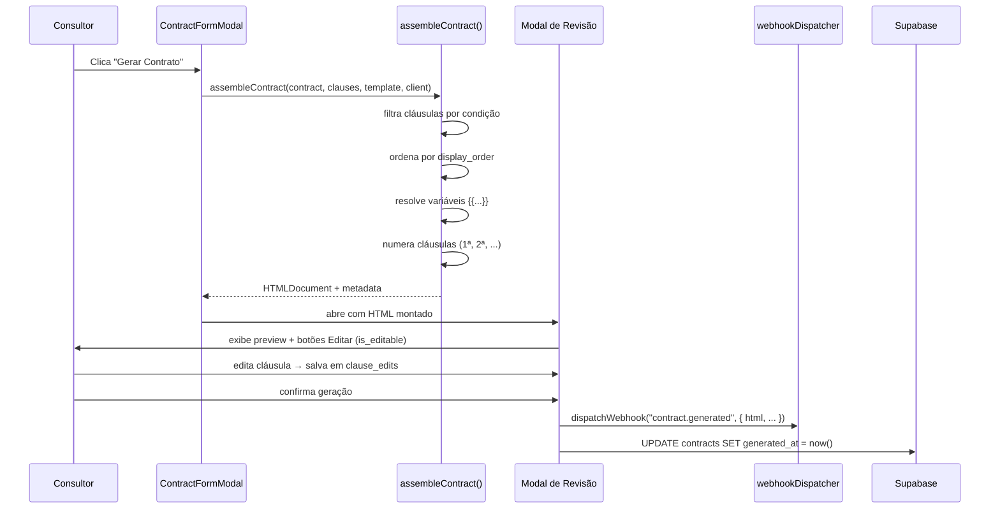

# Design Document — Contract System

## Overview

Este documento descreve o redesign completo do sistema de contratos do CRM. O sistema atual conta com um formulário simples (`service_contracted` texto livre) e templates com conteúdo em texto plano. O novo sistema é composto por três blocos integrados:

- **Bloco 1 — Configurações**: Catálogo de Serviços, Biblioteca de Cláusulas e Editor de Templates estruturado
- **Bloco 2 — Formulário de Contrato**: seletor múltiplo de serviços com sub-serviços, setup/implantação e prazo mínimo
- **Bloco 3 — Geração de Documentos**: montagem automática com condições, Modal de Revisão e despacho via webhook/n8n

### Decisões de Design Principais

| Decisão | Escolha | Rationale |
|---|---|---|
| Rich text editor | **TipTap v2** | Extensível, headless, suporte nativo a custom nodes (variáveis como chips), sem licença paga para recursos básicos, compatível com shadcn/ui |
| Formato de armazenamento de conteúdo | **JSON (TipTap JSONContent)** | Portável, versionável, conversível para HTML no momento da renderização sem perda de fidelidade |
| Variáveis no editor | **TipTap Mention extension customizado** | Permite drag-and-drop de chips de variável com renderização destacada, inserção por cursor ou por fallback ao final |
| Reordenação de serviços/cláusulas | **@dnd-kit/sortable** | Já presente no ecossistema shadcn/ui; acessível, performático, sem overhead de Framer Motion |
| Geração de HTML final | **Função pura `renderContractHtml`** | Determinística, testável isoladamente, chamada tanto no Modal de Revisão quanto no payload do webhook |
| Lançamentos financeiros unificados | **Lógica no frontend (`useContracts`)** | Consistente com o padrão existente; calcula setup + recorrente inline antes do insert em `payments` |
| Multi-tenancy | **RLS `organization_id = get_user_organization_id()`** | Padrão já em vigor no projeto; novas tabelas seguem o mesmo padrão |

---

## Architecture

O sistema segue a arquitetura já estabelecida no projeto: React SPA com Supabase como BaaS, sem servidor intermediário próprio. Os três blocos se organizam em camadas:

```
┌─────────────────────────────────────────────────────┐
│                   UI Layer (React)                  │
│  ContractSettingsTab  │  ContractFormModal  │  ReviewModal  │
├─────────────────────────────────────────────────────┤
│              Custom Hooks (TanStack Query)           │
│  useServiceCatalog │ useContractClauses │ useContracts │
├─────────────────────────────────────────────────────┤
│          Business Logic (Pure Functions)             │
│  assembleContract │ renderContractHtml │ resolveVariables │ calcPayments  │
├─────────────────────────────────────────────────────┤
│                  Supabase (BaaS)                     │
│  service_catalog │ contract_clauses │ contract_templates │ contracts │ payments  │
└─────────────────────────────────────────────────────┘
```

### Fluxo de Geração de Documento



---

## Components and Interfaces

### Bloco 1 — ContractSettingsTab (refactoring)

O `ContractSettingsTab` existente passa a ter três abas internas:

```
ContractSettingsTab
├── ServiceCatalogTab         (novo)
│   ├── ServiceList (sortable por @dnd-kit)
│   ├── ServiceFormDialog
│   └── SubServiceFields
├── ClausesLibraryTab         (novo)
│   ├── ClauseList (sortable por @dnd-kit)
│   ├── ClauseFormDialog
│   └── ClauseEditor (TipTap + VariablesPanel)
└── TemplatesTab              (refactored do atual)
    ├── TemplateList
    ├── TemplateFormDialog
    └── TemplateStructureEditor
```

### Bloco 2 — ContractFormModal (refactoring do formulário atual)

```
ContractFormModal
├── ServicesSelectorSection   (substitui service_contracted)
│   ├── ServiceMultiSelect
│   └── SubServiceFields (por serviço selecionado)
├── SetupSection              (novo toggle + campos)
│   ├── SetupToggle
│   ├── SetupValueField
│   ├── SetupInstallmentsField
│   ├── SetupParcelPreview    (cálculo em tempo real)
│   └── SetupPaymentFields
├── MinDurationField          (novo campo independente)
└── [campos existentes: título, datas, valor recorrente, etc.]
```

### Bloco 3 — Geração e Revisão

```
ContractDetailPage (existente)
└── Tab "Contrato"
    └── GenerateContractButton (novo)
        └── ReviewModal (novo)
            ├── HTMLPreviewPane
            ├── EditableClauseInlineEditor
            └── ConfirmGenerateButton
```

### Novos Hooks

| Hook | Responsabilidade |
|---|---|
| `useServiceCatalog(orgId)` | CRUD + ordenação de serviços e sub-serviços |
| `useContractClauses(orgId)` | CRUD + reordenação de cláusulas |
| `useContractAssembly(contractId)` | orquestra `assembleContract()` + estado do Modal de Revisão |

---

## Data Models

### Novas Tabelas

#### `service_catalog`

```sql
CREATE TABLE service_catalog (
  id              UUID PRIMARY KEY DEFAULT gen_random_uuid(),
  organization_id UUID NOT NULL REFERENCES organizations(id) ON DELETE CASCADE,
  name            TEXT NOT NULL CHECK (char_length(name) BETWEEN 1 AND 150),
  category        TEXT NOT NULL CHECK (char_length(category) BETWEEN 1 AND 100),
  sub_services    JSONB NOT NULL DEFAULT '[]',
  display_order   INTEGER NOT NULL DEFAULT 0,
  created_at      TIMESTAMPTZ NOT NULL DEFAULT now(),
  updated_at      TIMESTAMPTZ NOT NULL DEFAULT now(),
  UNIQUE (organization_id, name)
);
```

Estrutura do campo `sub_services` (JSONB array):
```typescript
interface SubService {
  id: string;          // uuid gerado no frontend
  name: string;        // nome do sub-serviço
  type: 'number' | 'text' | 'boolean' | 'select';
  options?: string[];  // obrigatório quando type === 'select', máx 50 itens
}
```

#### `contract_clauses`

```sql
CREATE TABLE contract_clauses (
  id              UUID PRIMARY KEY DEFAULT gen_random_uuid(),
  organization_id UUID NOT NULL REFERENCES organizations(id) ON DELETE CASCADE,
  title           TEXT NOT NULL,
  content         JSONB NOT NULL,           -- TipTap JSONContent
  display_order   INTEGER NOT NULL DEFAULT 0,
  condition_type  TEXT NOT NULL DEFAULT 'always'
                  CHECK (condition_type IN (
                    'always', 'has_setup', 'has_min_duration',
                    'has_service', 'has_setup_installments'
                  )),
  condition_value TEXT,
  is_editable     BOOLEAN NOT NULL DEFAULT false,
  service_id      UUID REFERENCES service_catalog(id) ON DELETE SET NULL,
  created_at      TIMESTAMPTZ NOT NULL DEFAULT now(),
  updated_at      TIMESTAMPTZ NOT NULL DEFAULT now()
);
```

#### Coluna adicionada a `contract_templates`

```sql
ALTER TABLE contract_templates ADD COLUMN structure JSONB DEFAULT NULL;
```

Estrutura do campo `structure` (JSONB):
```typescript
interface TemplateStructure {
  header: string;           // HTML estático do cabeçalho (logotipo, dados da empresa)
  parties_block: string;    // HTML com placeholders {{cliente}}, {{empresa}}, etc.
  clauses_block: string;    // marcador especial: "{{CLAUSES}}" onde as cláusulas são injetadas
  signature_block: string;  // HTML do bloco de assinaturas
  footer: string;           // HTML do rodapé
}
```

### Campos adicionados a `contracts.metadata` (JSONB)

```typescript
interface ContractMetadataExtension {
  // Bloco 2 — Serviços
  services: Array<{
    service_id: string;
    service_name: string;
    sub_service_values: Record<string, string | number | boolean>;
  }>;

  // Bloco 2 — Setup
  setup_value?: number;
  setup_installments?: number;
  setup_parcel_value?: number;
  setup_fees?: number;
  setup_first_due_date?: string;    // ISO date
  setup_payment_method?: string;

  // Bloco 3 — Snapshot de edições inline
  clause_edits?: Record<string, string>;   // { [clause_id]: html_editado }
  unresolved_variables?: string[];         // variáveis sem valor no momento da geração

  // Campos existentes preservados
  contract_type?: string;
  notes?: string;
  recurring_payment_method?: string;
}
```

### Coluna adicionada a `contracts`

```sql
ALTER TABLE contracts ADD COLUMN min_duration_months INTEGER NOT NULL DEFAULT 0;
```

### TypeScript Types (novos)

```typescript
// src/types/contracts.ts

export interface ServiceCatalogItem {
  id: string;
  organization_id: string;
  name: string;
  category: string;
  sub_services: SubService[];
  display_order: number;
  created_at: string;
  updated_at: string;
}

export interface SubService {
  id: string;
  name: string;
  type: 'number' | 'text' | 'boolean' | 'select';
  options?: string[];
}

export interface ContractClause {
  id: string;
  organization_id: string;
  title: string;
  content: JSONContent;   // TipTap
  display_order: number;
  condition_type: 'always' | 'has_setup' | 'has_min_duration' | 'has_service' | 'has_setup_installments';
  condition_value: string | null;
  is_editable: boolean;
  service_id: string | null;
  created_at: string;
  updated_at: string;
}

export interface ContractTemplateStructure {
  header: string;
  parties_block: string;
  clauses_block: string;    // deve conter "{{CLAUSES}}"
  signature_block: string;
  footer: string;
}

// Extensão do ContractTemplate existente em src/types/proposals.ts
export interface ContractTemplateV2 extends ContractTemplate {
  structure: ContractTemplateStructure | null;
}

export interface SelectedService {
  service_id: string;
  service_name: string;
  sub_service_values: Record<string, string | number | boolean>;
}

export interface ContractAssemblyResult {
  html: string;
  resolvedVariables: Record<string, string>;
  unresolvedVariables: string[];
  clauseCount: number;
}
```

---

## Correctness Properties

*A property is a characteristic or behavior that should hold true across all valid executions of a system — essentially, a formal statement about what the system should do. Properties serve as the bridge between human-readable specifications and machine-verifiable correctness guarantees.*

### Property 1: Round-trip de sub-serviços (JSONB)

*Para qualquer* conjunto de sub-serviços com tipos e valores válidos (`number`, `text`, `boolean`, `select`), serializar em JSONB e desserializar deve produzir estrutura equivalente.

**Validates: Requirements 1.4, 11.1**

---

### Property 2: Unicidade de nome de serviço por organização

*Para qualquer* par de serviços `s1` e `s2` pertencentes à mesma organização, se ambos forem persistidos com sucesso, então `s1.name ≠ s2.name`.

**Validates: Requirements 1.1, 1.3**

---

### Property 3: Filtro de serviços por categoria é subset

*Para qualquer* lista de serviços `S` e qualquer categoria `C`, `|filtrar(S, C)| ≤ |S|` — filtrar por categoria nunca aumenta o conjunto.

**Validates: Requirements 1.8**

---

### Property 4: Sequência de display_order sem lacunas

*Para qualquer* sequência de operações de criação, exclusão e reordenação de cláusulas de uma organização, os valores de `display_order` resultantes formam exatamente `{0, 1, ..., n-1}` sem repetições nem lacunas.

**Validates: Requirements 2.3, 2.4**

---

### Property 5: Idempotência de reordenação de cláusulas

*Para qualquer* lista de cláusulas e qualquer permutação de ordem `P`, aplicar `P` duas vezes consecutivas produz o mesmo estado que aplicar `P` uma vez.

**Validates: Requirements 2.3**

---

### Property 6: Filtragem correta de cláusulas por condição

*Para qualquer* contrato com conjunto de condições `C` e qualquer cláusula `cl`, a presença de `cl` no documento montado é determinada exclusivamente por `avaliar_condicao(cl.condition_type, cl.condition_value, C)` — nenhuma cláusula com condição falsa é incluída e nenhuma com condição verdadeira é omitida.

**Validates: Requirements 2.5, 2.6, 2.7, 2.8, 9.2**

---

### Property 7: Determinismo de normalização de variável dinâmica

*Para qualquer* nome de serviço `s`, chamar `normalizeServiceVariable(s)` sempre produz o mesmo identificador — a função é pura e sem efeitos colaterais.

**Validates: Requirements 3.3**

---

### Property 8: Substituição total de variáveis no HTML final

*Para qualquer* contrato e cliente com campos preenchidos, o HTML gerado por `renderContractHtml` não contém nenhuma ocorrência do padrão `\{\{[a-z_]{1,50}\}\}` no conteúdo textual.

**Validates: Requirements 3.5, 9.4**

---

### Property 9: Round-trip de estrutura de template (JSONB)

*Para qualquer* objeto `TemplateStructure` válido, salvar e carregar o template deve retornar estrutura equivalente: `load(save(structure)) ≡ structure`.

**Validates: Requirements 4.1**

---

### Property 10: Unicidade do template padrão

*Para qualquer* organização e após qualquer operação de definição de padrão, `|{ t ∈ contract_templates | t.organization_id = org ∧ t.is_default = true }| ≤ 1`.

**Validates: Requirements 4.3, 4.4**

---

### Property 11: Round-trip de serviços selecionados no contrato

*Para qualquer* array `services` válido em `metadata.services`, `load(save(services)) ≡ services` — salvar e carregar preserva todos os campos e valores dos sub-serviços.

**Validates: Requirements 5.4**

---

### Property 12: Escopo cresce monotonicamente com serviços

*Para qualquer* conjunto de serviços `S` e qualquer serviço adicional `s_novo`, `len(buildScopeString(S ∪ {s_novo})) ≥ len(buildScopeString(S))` — adicionar um serviço nunca reduz a string de escopo.

**Validates: Requirements 5.5**

---

### Property 13: Invariante de cálculo de parcela de setup

*Para quaisquer* valores `total > 0`, `parcelas ∈ [1, 12]`, `juros ∈ [0, 100]`, a função `calcSetupParcel(total, parcelas, juros)` produz `round((total * (1 + juros/100)) / parcelas, 2)`.

**Validates: Requirements 6.4**

---

### Property 14: Invariante de compatibilidade prazo mínimo × setup

*Para qualquer* contrato salvo com `setup_installments > 1`, `min_duration_months ≥ setup_installments` — esta invariante é verificável após o salvamento por qualquer query direta.

**Validates: Requirements 6.6, 7.1, 7.4**

---

### Property 15: Reversibilidade do toggle de setup

*Para qualquer* estado do formulário, ativar o toggle de setup e depois desativá-lo produz estado equivalente ao formulário sem setup — todos os campos de setup retornam a seus valores padrão.

**Validates: Requirements 6.3**

---

### Property 16: Unicidade de lançamento por mês por contrato

*Para qualquer* contrato ativo com `duration_months = D`, a função `generatePayments(contract)` produz exatamente `D` lançamentos, cada um com `due_date` distinto.

**Validates: Requirements 8.1, 8.2**

---

### Property 17: Soma financeira total dos lançamentos

*Para quaisquer* `recurring_value ≥ 0`, `duration_months ≥ 1`, `setup_value ≥ 0`, `setup_installments ∈ [0, 12]`, `setup_fees ∈ [0, 100]`:

`sum(generatePayments(...).map(p => p.value)) = (recurring_value × duration_months) + round(setup_value × (1 + setup_fees/100), 2)`

**Validates: Requirements 8.3, 8.4, 8.5**

---

### Property 18: Idempotência de geração de lançamentos

*Para qualquer* contrato sem lançamentos pagos, executar `generatePayments` duas vezes consecutivas sem modificar os dados do contrato produz o mesmo conjunto de lançamentos (sem duplicatas e com os mesmos valores).

**Validates: Requirements 8.8**

---

### Property 19: Determinismo de montagem do documento

*Para qualquer* contrato com dados inalterados, chamar `assembleContract(contract, clauses, template, client)` múltiplas vezes produz o mesmo HTML — a função é pura e determinística.

**Validates: Requirements 9.2, 9.3**

---

### Property 20: Preservação de edições inline no HTML final

*Para qualquer* conjunto de edições `clause_edits`, o HTML final produzido por `applyClauseEdits(html, clause_edits)` contém exatamente o conteúdo de `clause_edits[id]` para cada `id` presente nas edições, em vez do conteúdo original da cláusula.

**Validates: Requirements 9.6**

---

### Property 21: Isolamento multi-tenant

*Para qualquer* par de organizações distintas `org_A ≠ org_B`, a interseção entre os registros retornados por queries autenticadas de cada organização é vazia: `query(user_A, table) ∩ query(user_B, table) = ∅` para `service_catalog`, `contract_clauses` e `contract_templates`.

**Validates: Requirements 10.1, 10.2**

---

## Error Handling

### Catálogo de Serviços

| Erro | Causa | Resposta |
|---|---|---|
| Nome duplicado | `UNIQUE(org_id, name)` violado | toast.error "Já existe um serviço com esse nome nesta organização." |
| Nome/categoria vazio | validação Zod no frontend | mensagem inline no campo |
| Exclusão de serviço em contrato ativo | verificação antes do DELETE | Dialog confirmação com lista de contratos afetados |
| Sub-serviço `select` sem opções | validação Zod | mensagem inline "Adicione ao menos uma opção." |

### Biblioteca de Cláusulas

| Erro | Causa | Resposta |
|---|---|---|
| `has_service` sem service_id | validação Zod | mensagem inline "Selecione o serviço vinculado." |
| Conteúdo vazio | validação no `ClauseEditor` | botão Salvar desabilitado |
| Reordenação parcial | transação falha no Supabase | rollback implícito, toast.error, lista recarregada |

### Templates

| Erro | Causa | Resposta |
|---|---|---|
| Nenhum template padrão | `is_default = NULL` | bloqueio da geração com mensagem orientando configuração |
| Template sem `structure` | `structure = NULL` | bloqueio com mensagem específica (Req 9.8) |
| Exclusão com contratos ativos | verificação antes do DELETE | Dialog com contagem de contratos afetados |

### Formulário de Contrato

| Erro | Causa | Resposta |
|---|---|---|
| Zero serviços selecionados | validação Zod | "Selecione ao menos um serviço para o contrato." |
| Serviço inválido (removido do catálogo) | serviço não encontrado ao carregar | alerta destacado no item + bloqueio do salvamento |
| `min_duration < setup_installments` | validação cruzada Zod | aviso inline + bloqueio na submissão |
| Setup com parcelas sem data de 1º vencimento | validação Zod | mensagem inline no campo |

### Geração de Documentos

| Erro | Causa | Resposta |
|---|---|---|
| Webhook falhou | `dispatchWebhook` retornou erro | toast.warning (fire-and-forget, `generated_at` já registrado) |
| Variáveis não resolvidas | campos do cliente incompletos | toast.warning listando variáveis; geração prossegue com `""` |
| Template não configurado | `structure = NULL` | modal bloqueado com mensagem (Req 9.8) |

---

## Testing Strategy

### Visão Geral

O sistema combina **testes unitários** para exemplos e casos-limite com **testes baseados em propriedades** para as lógicas universais identificadas acima. Funções puras (`assembleContract`, `resolveVariables`, `generatePayments`, `normalizeServiceVariable`, `calcSetupParcel`, `buildScopeString`, `applyClauseEdits`) são o alvo principal dos testes de propriedades.

### Biblioteca de Property-Based Testing

**[fast-check](https://github.com/dubzzz/fast-check)** — escolha para TypeScript/JavaScript.

- Suporte a geradores arbitrários tipados
- Integração nativa com Vitest (já no projeto)
- Mínimo de 100 iterações por propriedade (`numRuns: 100`)
- Sem dependência de serviços externos (funções puras)

### Organização dos Testes

```
src/
└── lib/
    └── contracts/
        ├── __tests__/
        │   ├── assembleContract.test.ts    (unit + property)
        │   ├── resolveVariables.test.ts    (unit + property)
        │   ├── generatePayments.test.ts    (unit + property)
        │   ├── normalizeVariable.test.ts   (unit + property)
        │   └── calcSetupParcel.test.ts     (unit + property)
        ├── assembleContract.ts
        ├── resolveVariables.ts
        ├── generatePayments.ts
        ├── normalizeVariable.ts
        └── calcSetupParcel.ts
```

### Testes de Propriedades (fast-check)

Cada property-based test referencia a propriedade do design document com o formato de tag:

```typescript
// Feature: contract-system, Property 13: calcSetupParcel
fc.assert(
  fc.property(
    fc.float({ min: 0.01, max: 1_000_000 }),
    fc.integer({ min: 1, max: 12 }),
    fc.float({ min: 0, max: 100 }),
    (total, parcelas, juros) => {
      const result = calcSetupParcel(total, parcelas, juros);
      const expected = Math.round((total * (1 + juros / 100)) / parcelas * 100) / 100;
      return Math.abs(result - expected) < 0.01;
    }
  ),
  { numRuns: 100 }
);
```

### Testes Unitários (Exemplos e Casos-Limite)

- Geração com 0 serviços → rejeição
- Cláusula `has_setup` com toggle desativado → omitida
- Cláusula `has_service` com serviço presente → incluída
- Template sem `structure` → erro específico
- `min_duration < setup_installments` → bloqueio
- Variável não resolvida → registrada em `unresolved_variables`
- Serviço excluído → `service_id = NULL` na cláusula (ON DELETE SET NULL)

### Testes de Integração

- RLS: usuário de `org_A` não vê dados de `org_B` (1-2 exemplos representativos com Supabase local)
- Migration não-destrutiva: count de contratos antes = count após (smoke test)
- Template padrão: no máximo 1 template com `is_default = true` por organização (verificação direta)

### Abordagem para Componentes React

- **Snapshot tests** para `ServiceFormDialog`, `ClauseFormDialog`, `ReviewModal` (Vitest + @testing-library/react)
- **Testes de interação** para o toggle de setup (ativar → campos aparecem → desativar → campos somem)
- **Não são usados testes de propriedade** para componentes visuais — snapshot + interaction tests são mais adequados

### Configuração

```typescript
// vitest.config.ts (existente) — nenhuma mudança necessária
// fast-check: npm install -D fast-check
// Cada suite: { numRuns: 100 } no fc.assert
```
