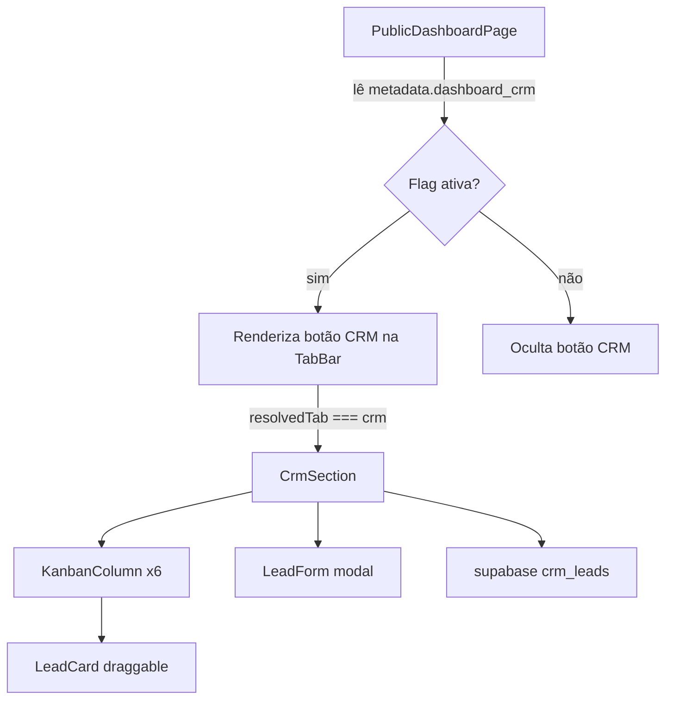

# Design Document: CRM Dashboard Tab

## Overview

Adicionar uma terceira aba "CRM" ao dashboard público (`/dashboard/:slug`), controlada pela flag `metadata.dashboard_crm` no registro do cliente no Supabase. A aba exibirá o kanban de leads já existente em `CrmPage.tsx`, extraído para um componente reutilizável `CrmSection` em `src/components/crm/`.

O padrão já estabelecido pelas abas "Performance" e "Atendimento" será seguido rigorosamente: flag booleana no metadata, botão com ícone e cor próprios, `resolvedTab` que garante aba ativa sempre válida, e título dinâmico do dashboard.

## Architecture

A feature é puramente frontend — não requer novas tabelas, RPCs ou migrações no Supabase. A tabela `crm_leads` já existe e é usada por `CrmPage.tsx`.



**Fluxo de dados:**
1. `PublicDashboardPage` carrega dados do cliente via RPC `get_client_by_slug`
2. Lê `dashboard_crm` do `metadata` e persiste no `localStorage`
3. Calcula `resolvedTab` e `dashboardTitle` com base nas 3 flags
4. Quando `resolvedTab === "crm"`, renderiza `<CrmSection clientId={clientData.id} />`
5. `CrmSection` gerencia seu próprio estado de leads via Supabase

## Components and Interfaces

### Novos componentes

**`src/components/crm/CrmSection.tsx`**

Componente principal da aba CRM. Encapsula toda a lógica do kanban dentro do contexto do dashboard.

```typescript
interface CrmSectionProps {
  clientId: string;
}

export function CrmSection({ clientId }: CrmSectionProps): JSX.Element
```

Internamente reutiliza os subcomponentes extraídos de `CrmPage.tsx`:
- `KanbanColumn` — coluna droppable com lista de cards
- `LeadCard` — card draggable com ações de editar/excluir
- `LeadForm` — modal de criação/edição de lead

Os subcomponentes `KanbanColumn`, `LeadCard` e `LeadForm` serão movidos de `CrmPage.tsx` para `src/components/crm/` e re-exportados. `CrmPage.tsx` passará a importá-los de lá.

### Modificações em `PublicDashboardPage.tsx`

1. **Tipo do `activeTab`**: `"performance" | "atendimento"` → `"performance" | "atendimento" | "crm"`
2. **Nova flag**: `const dashCrm: boolean = clientData?.metadata?.dashboard_crm ?? false`
3. **`dashboardTitle`**: adicionar caso `dashboard_crm` único → `"Dashboard CRM"`; lógica "Completo" quando 2+ flags ativas
4. **`resolvedTab`**: expandir lógica para 3 flags, garantindo que sempre aponte para uma aba habilitada
5. **TabBar**: adicionar botão CRM com `KanbanSquare` icon e `bg-violet-600` quando ativo
6. **Conteúdo**: adicionar bloco `{resolvedTab === "crm" && <CrmSection clientId={clientData.id} />}`
7. **RPC merge**: incluir `dashboard_crm: fresh.dashboard_crm ?? false` no objeto `merged`

### Interface de tipos compartilhados

```typescript
// src/components/crm/types.ts
export type LeadStatus = "novo" | "contato" | "proposta" | "negociacao" | "fechado" | "perdido";

export interface Lead {
  id: string;
  name: string;
  phone: string | null;
  email: string | null;
  address: string | null;
  proposal_value: number | null;
  notes: string | null;
  status: LeadStatus;
  created_at: string;
}

export const COLUMNS: { id: LeadStatus; label: string; color: string }[] = [
  { id: "novo",       label: "Novo",       color: "border-t-slate-400"   },
  { id: "contato",    label: "Contato",    color: "border-t-blue-400"    },
  { id: "proposta",   label: "Proposta",   color: "border-t-yellow-400"  },
  { id: "negociacao", label: "Negociação", color: "border-t-orange-400"  },
  { id: "fechado",    label: "Fechado",    color: "border-t-emerald-400" },
  { id: "perdido",    label: "Perdido",    color: "border-t-red-400"     },
];
```

## Data Models

### Supabase — tabela `clients` (sem alteração de schema)

O campo `metadata` é JSONB e já existe. Apenas um novo campo booleano é lido:

```json
{
  "metadata": {
    "dashboard_performance": true,
    "dashboard_atendimento": false,
    "dashboard_crm": true,
    "dashboard_password": "..."
  }
}
```

A RPC `get_client_by_slug` já retorna `dashboard_crm` se o campo existir no registro. Nenhuma migração é necessária — o campo é lido diretamente do JSONB.

### localStorage

```typescript
// Estrutura do objeto persistido (adição do campo dashboard_crm)
interface StoredClientData {
  id: string;
  name: string;
  company: string;
  dashboard_slug: string;
  favicon_url: string | null;
  metadata: {
    dashboard_performance: boolean;
    dashboard_atendimento: boolean;
    dashboard_crm: boolean;       // novo campo
    dashboard_password?: string;
  };
}
```

### Supabase — tabela `crm_leads` (sem alteração)

```typescript
// Já existente, sem mudanças
interface CrmLead {
  id: string;
  name: string;
  phone: string | null;
  email: string | null;
  address: string | null;
  proposal_value: number | null;
  notes: string | null;
  status: LeadStatus;
  created_at: string;
}
```

## Correctness Properties

*A property is a characteristic or behavior that should hold true across all valid executions of a system — essentially, a formal statement about what the system should do. Properties serve as the bridge between human-readable specifications and machine-verifiable correctness guarantees.*

### Property 1: Visibilidade da aba CRM reflete a flag

*For any* objeto de metadata do cliente, o botão da aba CRM deve estar presente no DOM se e somente se `metadata.dashboard_crm === true`.

**Validates: Requirements 1.2, 1.3, 1.4**

### Property 2: Barra de abas visível iff 2+ flags ativas

*For any* combinação das três flags (`dashboard_performance`, `dashboard_atendimento`, `dashboard_crm`), a barra de abas deve ser renderizada se e somente se pelo menos duas flags forem `true`.

**Validates: Requirements 2.1, 2.2, 2.4**

### Property 3: resolvedTab sempre aponta para aba habilitada

*For any* combinação de flags (com pelo menos uma ativa) e qualquer valor de `activeTab`, `resolvedTab` deve ser sempre um dos valores `"performance" | "atendimento" | "crm"` correspondente a uma flag ativa.

**Validates: Requirements 2.3**

### Property 4: Título do dashboard determinado pelas flags ativas

*For any* combinação das três flags, o título exibido deve ser:
- `"Dashboard de Performance"` quando apenas `dashboard_performance` é `true`
- `"Dashboard de Atendimento"` quando apenas `dashboard_atendimento` é `true`
- `"Dashboard CRM"` quando apenas `dashboard_crm` é `true`
- `"Dashboard Completo"` quando duas ou mais flags são `true`

**Validates: Requirements 5.1, 5.2, 5.3, 5.4**

### Property 5: Round trip de criação de lead

*For any* dados válidos de lead (nome não vazio), criar o lead via `CrmSection` e em seguida buscar os leads da tabela `crm_leads` deve retornar um conjunto que contém o lead criado com os mesmos dados.

**Validates: Requirements 4.3, 4.4**

### Property 6: Drag & drop atualiza status do lead

*For any* lead e qualquer coluna de destino diferente da coluna atual, realizar o drag & drop deve resultar no campo `status` do lead sendo igual ao `id` da coluna de destino.

**Validates: Requirements 4.5**

## Error Handling

| Cenário | Comportamento |
|---|---|
| `metadata.dashboard_crm` ausente | Tratado como `false`; aba CRM não exibida |
| Falha no `SELECT` de `crm_leads` | `toast.error("Erro ao carregar leads")` |
| Falha no `INSERT` de lead | `toast.error("Erro ao criar lead")` |
| Falha no `UPDATE` de lead | `toast.error("Erro ao atualizar")` |
| Falha no `DELETE` de lead | `toast.error("Erro ao excluir")` |
| Falha no `UPDATE` de status (drag) | Status revertido no estado local; `toast.error` |
| Nome do lead vazio no formulário | `toast.error("Nome obrigatório")`; submit bloqueado |
| `clientId` undefined em `CrmSection` | Query desabilitada (`enabled: !!clientId`) |

## Testing Strategy

### Abordagem dual

A estratégia combina testes unitários para exemplos concretos e testes de propriedade para invariantes universais.

**Testes unitários** — focados em:
- Renderização correta do botão CRM quando a flag está ativa/inativa
- Renderização das 6 colunas do kanban
- Comportamento do formulário com nome vazio
- Integração do botão CRM com `activeTab`

**Testes de propriedade** — usando [fast-check](https://github.com/dubzzz/fast-check) (TypeScript):
- Cada propriedade deve rodar mínimo 100 iterações
- Cada teste deve referenciar a propriedade do design com o tag:
  `// Feature: crm-dashboard-tab, Property N: <texto>`

### Mapeamento propriedades → testes

**Property 1** — Gerar objetos `metadata` arbitrários com `dashboard_crm` booleano (incluindo `undefined`). Renderizar o componente de tab bar e verificar presença/ausência do botão "CRM".
```
// Feature: crm-dashboard-tab, Property 1: CRM tab visibility reflects flag
fc.property(fc.record({ dashboard_crm: fc.oneof(fc.boolean(), fc.constant(undefined)) }), ...)
```

**Property 2** — Gerar todas as combinações de 3 flags booleanas. Verificar que a tab bar renderiza iff `activeCount >= 2`.
```
// Feature: crm-dashboard-tab, Property 2: Tab bar visible iff 2+ flags active
fc.property(fc.record({ p: fc.boolean(), a: fc.boolean(), c: fc.boolean() }), ...)
```

**Property 3** — Gerar combinações de flags (pelo menos uma ativa) e valores arbitrários de `activeTab`. Verificar que `resolvedTab` é sempre uma aba habilitada.
```
// Feature: crm-dashboard-tab, Property 3: resolvedTab always points to enabled tab
fc.property(fc.record({...flags}), fc.constantFrom("performance","atendimento","crm"), ...)
```

**Property 4** — Gerar todas as 8 combinações de 3 flags booleanas. Verificar que `computeDashboardTitle(flags)` retorna o título correto para cada combinação.
```
// Feature: crm-dashboard-tab, Property 4: Dashboard title determined by active flags
fc.property(fc.record({ p: fc.boolean(), a: fc.boolean(), c: fc.boolean() }), ...)
```

**Property 5** — Usar mocks do Supabase. Gerar leads com nome não vazio. Criar lead, buscar lista, verificar que o lead está presente com os dados corretos.
```
// Feature: crm-dashboard-tab, Property 5: Lead creation round trip
fc.property(fc.record({ name: fc.string({ minLength: 1 }), ... }), ...)
```

**Property 6** — Gerar leads com status inicial e coluna de destino diferente. Simular drag end event. Verificar que o status do lead no estado local e na chamada ao Supabase é o da coluna de destino.
```
// Feature: crm-dashboard-tab, Property 6: Drag & drop updates lead status
fc.property(fc.record({ lead: arbitraryLead, targetCol: fc.constantFrom(...COLUMNS) }), ...)
```

### Testes unitários (exemplos)

- `CrmSection` renderiza 6 colunas com labels corretos
- Clicar no botão CRM define `activeTab === "crm"` e renderiza `CrmSection`
- Formulário com nome vazio chama `toast.error` e não chama `supabase.insert`
- `localStorage` após RPC contém campo `dashboard_crm`
