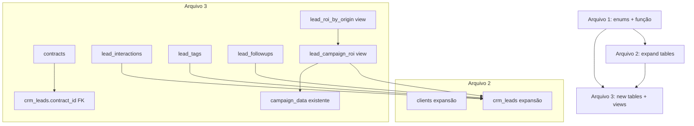
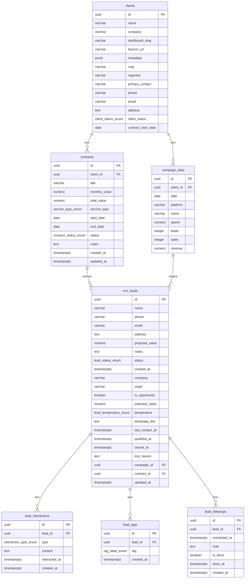

# Design Document — CRM Database Schema

## Overview

Este design cobre as migrations SQL para o Supabase (PostgreSQL) que expandem e completam o schema do CRM. O projeto já possui tabelas básicas funcionais (`clients`, `crm_leads`, `campaign_data`, `daily_metrics`, `client_kpis`, `client_kpi_history`, `client_conversation_kpis`, `client_agent_kpis`). As migrations adicionam enums tipados, expandem tabelas existentes com novos campos, criam quatro novas tabelas relacionais e duas views analíticas.

A estratégia de migration é **não-destrutiva**: todos os `ALTER TABLE` usam `ADD COLUMN IF NOT EXISTS`, todos os enums usam `CREATE TYPE IF NOT EXISTS`, e a função utilitária usa `CREATE OR REPLACE FUNCTION`. Isso garante idempotência — executar as migrations duas vezes não causa erros.

Os arquivos seguem a convenção do Supabase CLI: `supabase/migrations/<timestamp>_<nome>.sql`, executados em ordem crescente de timestamp.

---

## Architecture

### Divisão em 3 arquivos de migration

```
supabase/migrations/
  20260324000001_crm_enums_and_functions.sql   ← Fase 1: tipos e funções
  20260324000002_expand_existing_tables.sql    ← Fase 2: ALTER TABLE + índices
  20260324000003_new_tables_and_views.sql      ← Fase 3: novas tabelas + views
```

A ordem garante que dependências sejam satisfeitas:
- Enums devem existir antes de serem referenciados em colunas
- `contracts` deve existir antes de `crm_leads.contract_id` (FK)
- Views dependem de todas as tabelas base

### Diagrama de dependências



### Diagrama ER completo



---

## Components and Interfaces

### Arquivo 1 — `20260324000001_crm_enums_and_functions.sql`

Responsabilidade: declarar todos os tipos enum e a função trigger reutilizável.

**Enums criados:**

| Enum | Valores |
|------|---------|
| `client_status_enum` | `ativo`, `inativo`, `prospect` |
| `contract_status_enum` | `ativo`, `pausado`, `encerrado` |
| `service_type_enum` | `trafego_pago`, `branding`, `site`, `social_media`, `consultoria`, `outro` |
| `lead_status_enum` | `novo`, `contato`, `qualificado`, `proposta`, `negociacao`, `fechado`, `perdido` |
| `lead_temperature_enum` | `frio`, `morno`, `quente` |
| `interaction_type_enum` | `ligacao`, `whatsapp`, `email`, `reuniao`, `anotacao` |
| `tag_label_enum` | `interessado`, `cliente`, `alto_valor`, `indicacao`, `urgente` |

**Função:**

```sql
CREATE OR REPLACE FUNCTION trigger_set_updated_at()
RETURNS TRIGGER AS $$
BEGIN
  NEW.updated_at = now();
  RETURN NEW;
END;
$$ LANGUAGE plpgsql;
```

### Arquivo 2 — `20260324000002_expand_existing_tables.sql`

Responsabilidade: expandir `clients` e `crm_leads` com novos campos, converter `status` de TEXT para enum, adicionar triggers e índices.

**Seções:**
1. `ALTER TABLE clients ADD COLUMN IF NOT EXISTS ...` (8 campos)
2. `ALTER TABLE crm_leads ADD COLUMN IF NOT EXISTS ...` (13 campos)
3. Conversão de `crm_leads.status` TEXT → `lead_status_enum`
4. Triggers `set_updated_at` em `clients` e `crm_leads`
5. Índices em `clients` (client_status, segment)
6. Índices em `crm_leads` (status, temperature, origin, campaign_id)

**Estratégia de conversão de tipo:**

Como `crm_leads.status` é TEXT e precisa virar `lead_status_enum`, a migration usa:
```sql
ALTER TABLE crm_leads
  ALTER COLUMN status TYPE lead_status_enum
  USING status::lead_status_enum;
```
Isso funciona porque os valores existentes (`novo`, `contato`, etc.) são literais válidos do enum.

### Arquivo 3 — `20260324000003_new_tables_and_views.sql`

Responsabilidade: criar as 4 novas tabelas e as 2 views analíticas.

**Ordem de criação dentro do arquivo:**
1. `contracts` (depende de `clients` e enums)
2. FK `crm_leads.campaign_id` e `crm_leads.contract_id` (adicionadas aqui pois `contracts` só existe agora)
3. `lead_interactions`
4. `lead_tags`
5. `lead_followups`
6. View `lead_campaign_roi`
7. View `lead_roi_by_origin`

> Nota: as colunas `campaign_id` e `contract_id` são adicionadas em `crm_leads` no Arquivo 2 (sem FK), e as constraints FK são adicionadas no Arquivo 3 após as tabelas referenciadas existirem.

---

## Data Models

### `clients` (campos adicionados)

| Campo | Tipo | Constraint | Default |
|-------|------|-----------|---------|
| `cnpj` | `VARCHAR(18)` | — | — |
| `segment` | `VARCHAR(100)` | — | — |
| `primary_contact` | `VARCHAR(150)` | — | — |
| `phone` | `VARCHAR(30)` | — | — |
| `email` | `VARCHAR(255)` | — | — |
| `address` | `TEXT` | — | — |
| `client_status` | `client_status_enum` | — | `'prospect'` |
| `contract_start_date` | `DATE` | — | — |

Índices: `idx_clients_status` em `client_status`, `idx_clients_segment` em `segment`.

---

### `contracts` (nova)

| Campo | Tipo | Constraint | Default |
|-------|------|-----------|---------|
| `id` | `UUID` | PK | `gen_random_uuid()` |
| `client_id` | `UUID` | FK → `clients.id` ON DELETE CASCADE, NOT NULL | — |
| `title` | `VARCHAR(255)` | NOT NULL | — |
| `monthly_value` | `NUMERIC(12,2)` | — | — |
| `total_value` | `NUMERIC(12,2)` | — | — |
| `service_type` | `service_type_enum` | NOT NULL | — |
| `start_date` | `DATE` | NOT NULL | — |
| `end_date` | `DATE` | CHECK `end_date >= start_date` | — |
| `status` | `contract_status_enum` | — | `'ativo'` |
| `notes` | `TEXT` | — | — |
| `created_at` | `TIMESTAMPTZ` | — | `now()` |
| `updated_at` | `TIMESTAMPTZ` | — | `now()` |

Índices: `idx_contracts_client_id`, `idx_contracts_status`.
Trigger: `set_updated_at` BEFORE UPDATE.

---

### `crm_leads` (campos adicionados)

| Campo | Tipo | Constraint | Default |
|-------|------|-----------|---------|
| `company` | `VARCHAR(150)` | — | — |
| `origin` | `VARCHAR(100)` | — | — |
| `is_opportunity` | `BOOLEAN` | — | `false` |
| `potential_value` | `NUMERIC(12,2)` | — | — |
| `temperature` | `lead_temperature_enum` | — | `'frio'` |
| `whatsapp_link` | `TEXT` | — | — |
| `last_contact_at` | `TIMESTAMPTZ` | — | — |
| `qualified_at` | `TIMESTAMPTZ` | — | — |
| `closed_at` | `TIMESTAMPTZ` | — | — |
| `lost_reason` | `TEXT` | — | — |
| `campaign_id` | `UUID` | FK → `campaign_data.id` (adicionada no Arquivo 3) | — |
| `contract_id` | `UUID` | FK → `contracts.id` (adicionada no Arquivo 3) | — |
| `updated_at` | `TIMESTAMPTZ` | — | `now()` |
| `status` | `lead_status_enum` | conversão de TEXT | — |

Índices: `idx_crm_leads_status`, `idx_crm_leads_temperature`, `idx_crm_leads_origin`, `idx_crm_leads_campaign_id`.
Trigger: `set_updated_at` BEFORE UPDATE.

---

### `lead_interactions` (nova)

| Campo | Tipo | Constraint | Default |
|-------|------|-----------|---------|
| `id` | `UUID` | PK | `gen_random_uuid()` |
| `lead_id` | `UUID` | FK → `crm_leads.id` ON DELETE CASCADE, NOT NULL | — |
| `type` | `interaction_type_enum` | NOT NULL | — |
| `content` | `TEXT` | NOT NULL | — |
| `interacted_at` | `TIMESTAMPTZ` | — | `now()` |
| `created_at` | `TIMESTAMPTZ` | — | `now()` |

Índices: `idx_lead_interactions_lead_id`, `idx_lead_interactions_interacted_at`.

---

### `lead_tags` (nova)

| Campo | Tipo | Constraint | Default |
|-------|------|-----------|---------|
| `id` | `UUID` | PK | `gen_random_uuid()` |
| `lead_id` | `UUID` | FK → `crm_leads.id` ON DELETE CASCADE, NOT NULL | — |
| `tag` | `tag_label_enum` | NOT NULL | — |
| `created_at` | `TIMESTAMPTZ` | — | `now()` |

Constraints: `UNIQUE(lead_id, tag)`.
Índices: `idx_lead_tags_lead_id`, `idx_lead_tags_tag`.

---

### `lead_followups` (nova)

| Campo | Tipo | Constraint | Default |
|-------|------|-----------|---------|
| `id` | `UUID` | PK | `gen_random_uuid()` |
| `lead_id` | `UUID` | FK → `crm_leads.id` ON DELETE CASCADE, NOT NULL | — |
| `scheduled_at` | `TIMESTAMPTZ` | NOT NULL | — |
| `note` | `TEXT` | — | — |
| `is_done` | `BOOLEAN` | — | `false` |
| `done_at` | `TIMESTAMPTZ` | CHECK `done_at IS NULL OR is_done = true` | — |
| `created_at` | `TIMESTAMPTZ` | — | `now()` |

Índices: `idx_lead_followups_lead_id`, `idx_lead_followups_scheduled_at`, `idx_lead_followups_is_done`.

---

### View `lead_campaign_roi`

```sql
CREATE OR REPLACE VIEW lead_campaign_roi AS
SELECT
  l.id            AS lead_id,
  l.name          AS lead_name,
  l.origin        AS lead_origin,
  l.status        AS lead_status,
  l.potential_value,
  c.id            AS campaign_id,
  c.name          AS campaign_name,
  c.platform,
  c.spend         AS campaign_spend,
  c.leads         AS campaign_leads,
  l.client_id     -- via crm_leads se existir, ou via campaign_data
FROM crm_leads l
LEFT JOIN campaign_data c ON l.campaign_id = c.id;
```

> `LEFT JOIN` garante que leads sem campanha vinculada apareçam com campos de campanha como NULL (Req 7.3).

---

### View `lead_roi_by_origin`

```sql
CREATE OR REPLACE VIEW lead_roi_by_origin AS
SELECT
  lead_origin,
  COUNT(*)                                                    AS total_leads,
  COUNT(*) FILTER (WHERE lead_status = 'fechado')             AS closed_leads,
  SUM(potential_value) FILTER (WHERE lead_status = 'fechado') AS total_potential_value,
  SUM(campaign_spend)                                         AS total_campaign_spend,
  SUM(potential_value) FILTER (WHERE lead_status = 'fechado')
    / NULLIF(SUM(campaign_spend), 0)                          AS roi_ratio
FROM lead_campaign_roi
GROUP BY lead_origin;
```

---


## Correctness Properties

*A property is a characteristic or behavior that should hold true across all valid executions of a system — essentially, a formal statement about what the system should do. Properties serve as the bridge between human-readable specifications and machine-verifiable correctness guarantees.*

### Property 1: Idempotência das migrations

*Para qualquer* arquivo de migration do conjunto `{20260324000001, 20260324000002, 20260324000003}`, executá-lo duas vezes consecutivas deve produzir o mesmo estado final do banco sem lançar nenhum erro.

**Validates: Requirements 1.3, 9.3, 8.2, 8.4**

---

### Property 2: Cascade delete de lead apaga todos os registros filhos

*Para qualquer* lead com N interações, M tags e K follow-ups (N, M, K ≥ 0), deletar esse lead deve resultar em zero registros nas tabelas `lead_interactions`, `lead_tags` e `lead_followups` com aquele `lead_id`.

**Validates: Requirements 4.3, 5.3, 6.2**

---

### Property 3: Trigger `updated_at` atualiza automaticamente

*Para qualquer* linha nas tabelas `contracts` ou `crm_leads`, realizar um UPDATE em qualquer campo deve resultar em `updated_at` sendo maior ou igual ao valor anterior de `updated_at`.

**Validates: Requirements 2.7, 3.9**

---

### Property 4: Constraint de data do contrato rejeita end_date anterior a start_date

*Para qualquer* par de datas `(start_date, end_date)` onde `end_date < start_date`, tentar inserir ou atualizar um contrato com esse par deve ser rejeitado pelo banco com erro de constraint CHECK.

**Validates: Requirements 2.8**

---

### Property 5: Unicidade de tag por lead

*Para qualquer* lead e *qualquer* valor de `tag_label_enum`, tentar inserir a mesma tag duas vezes para o mesmo lead deve ser rejeitado pelo banco com erro de violação de constraint UNIQUE.

**Validates: Requirements 5.4**

---

### Property 6: `done_at` preenchido implica `is_done = true`

*Para qualquer* follow-up onde `done_at` é um valor não-nulo, tentar inserir ou atualizar com `is_done = false` deve ser rejeitado pelo banco com erro de constraint CHECK.

**Validates: Requirements 6.6**

---

### Property 7: View `lead_campaign_roi` preserva leads sem campanha (LEFT JOIN)

*Para qualquer* lead onde `campaign_id` é NULL, consultar a view `lead_campaign_roi` deve retornar esse lead com os campos `campaign_id`, `campaign_name`, `platform`, `campaign_spend` e `campaign_leads` como NULL.

**Validates: Requirements 7.3**

---

### Property 8: View `lead_roi_by_origin` conta apenas leads fechados

*Para qualquer* conjunto de leads com origens e status variados, o campo `closed_leads` na view `lead_roi_by_origin` deve ser igual ao número de leads com `status = 'fechado'` para aquela origem, e `total_potential_value` deve somar apenas os `potential_value` desses leads fechados.

**Validates: Requirements 7.4, 7.5**

---

## Error Handling

### Erros esperados e tratamento

| Situação | Comportamento esperado |
|----------|----------------------|
| Migration executada duas vezes | Sem erro — `IF NOT EXISTS` e `CREATE OR REPLACE` garantem idempotência |
| `crm_leads.status` com valor inválido para o enum | `ALTER COLUMN ... USING status::lead_status_enum` falha com `invalid input value for enum` — requer limpeza prévia dos dados |
| FK violada (ex: `client_id` inexistente em `contracts`) | PostgreSQL lança `foreign_key_violation` (SQLSTATE 23503) |
| Constraint CHECK violada (`end_date < start_date`) | PostgreSQL lança `check_violation` (SQLSTATE 23514) |
| UNIQUE violada (`lead_id + tag` duplicado) | PostgreSQL lança `unique_violation` (SQLSTATE 23505) |
| Constraint CHECK violada (`done_at` sem `is_done`) | PostgreSQL lança `check_violation` (SQLSTATE 23514) |
| Enum inexistente ao executar Arquivo 2 antes do Arquivo 1 | PostgreSQL lança `undefined_object` — migrations devem ser executadas em ordem |

### Pré-condição crítica: conversão de `status`

Antes de executar o Arquivo 2, todos os valores existentes em `crm_leads.status` devem ser literais válidos do `lead_status_enum`. Se houver valores inválidos (ex: `"Em andamento"`), a migration falhará. A migration deve incluir um bloco de limpeza opcional:

```sql
-- Opcional: normalizar valores legados antes da conversão
UPDATE crm_leads SET status = 'novo' WHERE status NOT IN (
  'novo','contato','qualificado','proposta','negociacao','fechado','perdido'
);
```

---

## Testing Strategy

### Abordagem dual: testes unitários + testes de propriedade

Os testes de migration são executados contra um banco PostgreSQL de teste (pode ser um Supabase local via `supabase start` ou um container Docker com `postgres:15`).

**Biblioteca de property-based testing:** [fast-check](https://github.com/dubzzz/fast-check) (TypeScript/JavaScript)

**Configuração mínima:** 100 iterações por propriedade (`numRuns: 100`).

---

### Testes unitários (exemplos específicos)

Focam em verificar que o schema foi criado corretamente após as migrations:

- Verificar existência de todos os enums em `pg_type`
- Verificar existência de todas as colunas em `information_schema.columns`
- Verificar existência de todos os índices em `pg_indexes`
- Verificar existência das views em `information_schema.views`
- Verificar que `crm_leads.status` tem tipo `lead_status_enum` (não TEXT)
- Inserir um contrato válido e verificar que `updated_at` é preenchido
- Inserir um lead sem `campaign_id` e verificar que aparece na view com campos NULL

---

### Testes de propriedade (fast-check)

Cada teste de propriedade usa geradores aleatórios para cobrir o espaço de inputs.

**Tag format:** `Feature: crm-database-schema, Property {N}: {texto}`

```typescript
// Property 1: Idempotência das migrations
// Feature: crm-database-schema, Property 1: Migration idempotency
it('executar migrations duas vezes não causa erro', async () => {
  await fc.assert(
    fc.asyncProperty(fc.constantFrom(migration1, migration2, migration3), async (sql) => {
      await db.query(sql); // primeira execução
      await expect(db.query(sql)).resolves.not.toThrow(); // segunda execução
    }),
    { numRuns: 100 }
  );
});

// Property 2: Cascade delete
// Feature: crm-database-schema, Property 2: Cascade delete on lead deletion
it('deletar lead apaga interações, tags e follow-ups', async () => {
  await fc.assert(
    fc.asyncProperty(
      fc.record({ nInteractions: fc.nat(10), nTags: fc.nat(5), nFollowups: fc.nat(5) }),
      async ({ nInteractions, nTags, nFollowups }) => {
        const leadId = await createRandomLead();
        await createInteractions(leadId, nInteractions);
        await createTags(leadId, nTags);
        await createFollowups(leadId, nFollowups);
        await db.query('DELETE FROM crm_leads WHERE id = $1', [leadId]);
        const counts = await getCounts(leadId); // interactions + tags + followups
        return counts.every(c => c === 0);
      }
    ),
    { numRuns: 100 }
  );
});

// Property 3: updated_at trigger
// Feature: crm-database-schema, Property 3: updated_at auto-update
it('UPDATE em contracts/crm_leads atualiza updated_at', async () => {
  await fc.assert(
    fc.asyncProperty(
      fc.constantFrom('contracts', 'crm_leads'),
      fc.string({ minLength: 1, maxLength: 50 }),
      async (table, newNote) => {
        const { id, updated_at: before } = await createRow(table);
        await sleep(1); // garante diferença de timestamp
        await db.query(`UPDATE ${table} SET notes = $1 WHERE id = $2`, [newNote, id]);
        const { updated_at: after } = await getRow(table, id);
        return new Date(after) >= new Date(before);
      }
    ),
    { numRuns: 100 }
  );
});

// Property 4: Contract date constraint
// Feature: crm-database-schema, Property 4: Contract date constraint rejects end_date before start_date
it('contrato com end_date < start_date é rejeitado', async () => {
  await fc.assert(
    fc.asyncProperty(
      fc.date({ min: new Date('2020-01-01'), max: new Date('2030-12-31') }),
      fc.integer({ min: 1, max: 365 }),
      async (startDate, daysBack) => {
        const endDate = new Date(startDate);
        endDate.setDate(endDate.getDate() - daysBack);
        await expect(insertContract({ start_date: startDate, end_date: endDate }))
          .rejects.toMatchObject({ code: '23514' });
        return true;
      }
    ),
    { numRuns: 100 }
  );
});

// Property 5: Unique tag per lead
// Feature: crm-database-schema, Property 5: Unique tag per lead
it('inserir a mesma tag duas vezes no mesmo lead é rejeitado', async () => {
  await fc.assert(
    fc.asyncProperty(
      fc.constantFrom('interessado','cliente','alto_valor','indicacao','urgente'),
      async (tag) => {
        const leadId = await createRandomLead();
        await insertTag(leadId, tag);
        await expect(insertTag(leadId, tag)).rejects.toMatchObject({ code: '23505' });
        return true;
      }
    ),
    { numRuns: 100 }
  );
});

// Property 6: done_at implies is_done
// Feature: crm-database-schema, Property 6: done_at filled implies is_done = true
it('done_at preenchido com is_done=false é rejeitado', async () => {
  await fc.assert(
    fc.asyncProperty(
      fc.date({ min: new Date('2020-01-01'), max: new Date('2030-12-31') }),
      async (doneAt) => {
        const leadId = await createRandomLead();
        await expect(insertFollowup({ lead_id: leadId, done_at: doneAt, is_done: false }))
          .rejects.toMatchObject({ code: '23514' });
        return true;
      }
    ),
    { numRuns: 100 }
  );
});

// Property 7: LEFT JOIN preserves leads without campaign
// Feature: crm-database-schema, Property 7: lead_campaign_roi LEFT JOIN preserves leads without campaign
it('leads sem campaign_id aparecem na view com campos de campanha NULL', async () => {
  await fc.assert(
    fc.asyncProperty(
      fc.record({ name: fc.string({ minLength: 1 }), origin: fc.option(fc.string()) }),
      async ({ name, origin }) => {
        const leadId = await insertLead({ name, origin, campaign_id: null });
        const row = await db.query(
          'SELECT * FROM lead_campaign_roi WHERE lead_id = $1', [leadId]
        );
        return row.campaign_id === null && row.campaign_name === null;
      }
    ),
    { numRuns: 100 }
  );
});

// Property 8: ROI view counts only closed leads
// Feature: crm-database-schema, Property 8: lead_roi_by_origin counts only closed leads
it('lead_roi_by_origin conta apenas leads com status=fechado', async () => {
  await fc.assert(
    fc.asyncProperty(
      fc.array(fc.record({
        origin: fc.constantFrom('google','facebook','indicacao','organico'),
        status: fc.constantFrom('novo','contato','qualificado','proposta','negociacao','fechado','perdido'),
        potential_value: fc.float({ min: 0, max: 100000 }),
      }), { minLength: 1, maxLength: 20 }),
      async (leads) => {
        const ids = await insertLeads(leads);
        const roiRows = await db.query('SELECT * FROM lead_roi_by_origin');
        for (const origin of [...new Set(leads.map(l => l.origin))]) {
          const expected = leads.filter(l => l.origin === origin && l.status === 'fechado').length;
          const actual = roiRows.find(r => r.lead_origin === origin)?.closed_leads ?? 0;
          if (expected !== Number(actual)) return false;
        }
        await cleanupLeads(ids);
        return true;
      }
    ),
    { numRuns: 100 }
  );
});
```

### Configuração do ambiente de teste

```bash
# Iniciar Supabase local
supabase start

# Executar migrations
supabase db reset

# Rodar testes (single run, sem watch mode)
npx vitest --run src/tests/migrations/
```

Cada teste de propriedade deve ser executado com `numRuns: 100` no mínimo. Para CI, recomenda-se `numRuns: 50` para manter tempo de execução razoável.
