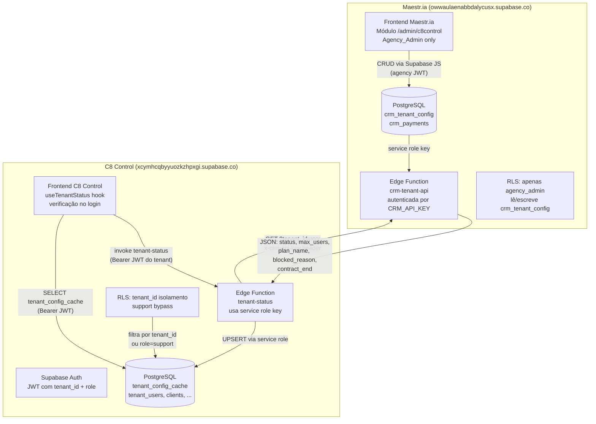
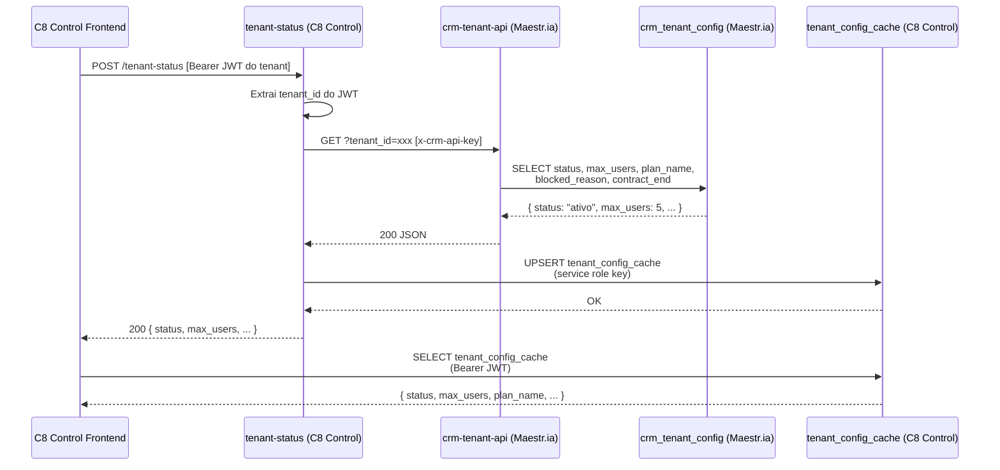
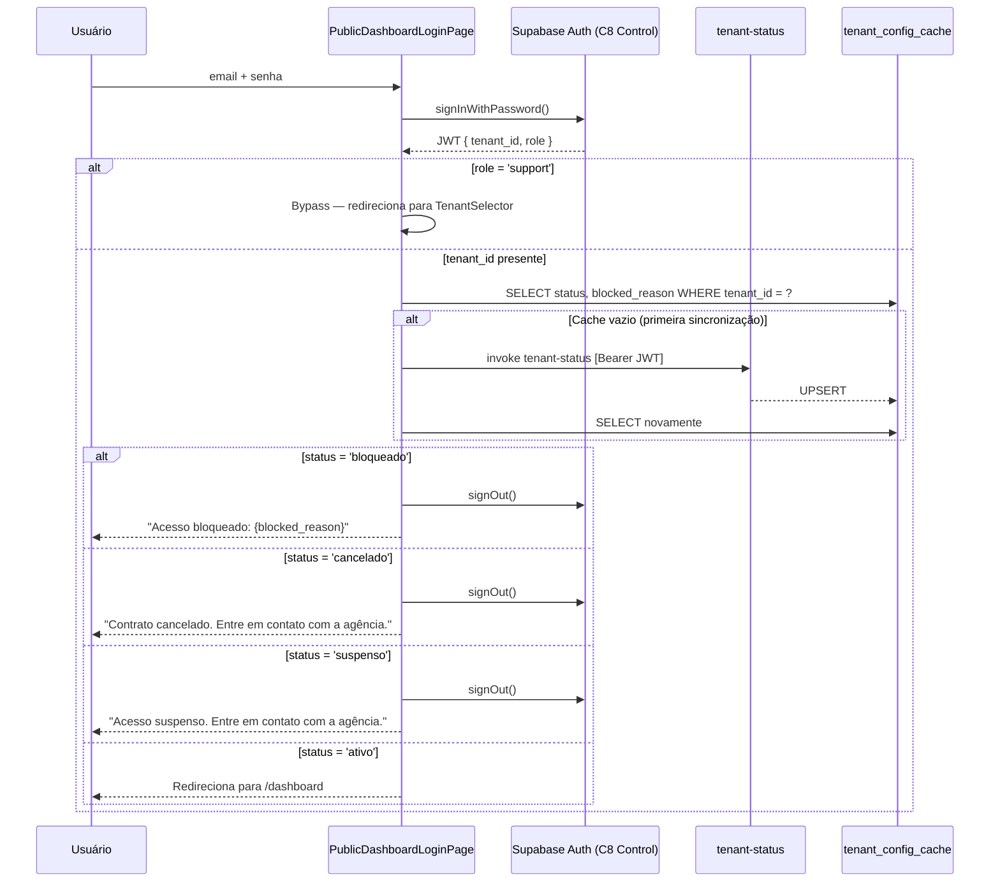
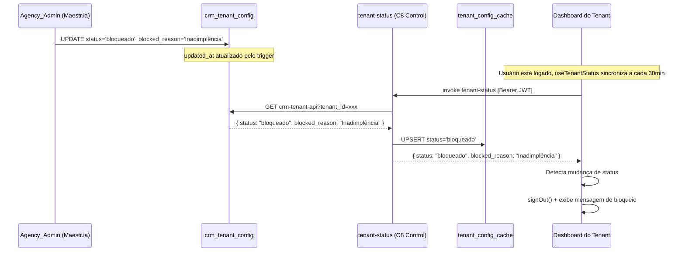

# Design Document: Integração Maestr.ia ↔ C8 Control

## Overview

Este documento descreve a arquitetura técnica da integração entre o **Maestr.ia** (sistema de gestão da agência, Supabase `owwaulaenabbdalycusx.supabase.co`) e o **C8 Control** (CRM multi-tenant dos clientes, Supabase `xcymhcqbyyuozkzhpxgi.supabase.co`).

**Princípio central:** separação de responsabilidades com comunicação unidirecional.

- O Maestr.ia é a **fonte de verdade** para status de tenant, planos, limites e controle financeiro.
- O C8 Control é responsável por autenticação, dados e configurações individuais de cada tenant.
- A comunicação é **estritamente unidirecional**: Maestr.ia publica → C8 Control consome. O C8 Control nunca escreve no Maestr.ia.
- A `CRM_API_KEY` nunca é exposta ao frontend — toda comunicação entre sistemas ocorre server-side via Edge Functions.
- O **Support_User** (`suporte@agenciac8.com.br`, `role = 'support'`) é identificado exclusivamente pelo claim JWT e nunca é afetado por verificações de status do Maestr.ia.

**Decisões de arquitetura chave:**
- Cache local (`tenant_config_cache`) no C8 Control evita chamadas síncronas ao Maestr.ia a cada requisição.
- Sincronização periódica a cada 30 minutos via hook `useTenantStatus` garante que bloqueios propagam sem exigir novo login.
- Verificação de status no login bloqueia acesso imediato para tenants `bloqueado`, `suspenso` ou `cancelado`.
- O módulo gerencial no Maestr.ia é protegido por role de agência e nunca expõe dados de outros tenants.

---

## Architecture

### Visão Geral dos Sistemas



### Fluxo de Comunicação entre Sistemas



### Fluxo de Login com Verificação de Status



### Fluxo de Bloqueio Propagado



---

## Components and Interfaces

### Maestr.ia — Edge Function `crm-tenant-api`

**Localização:** `supabase/functions/crm-tenant-api/index.ts` (projeto Maestr.ia)

**Autenticação:** header `x-crm-api-key` validado contra secret `CRM_API_KEY`.

**Endpoints:**

| Método | Parâmetros | Resposta |
|--------|-----------|----------|
| GET | `?tenant_id=<uuid>` | Objeto com config do tenant ou defaults |
| GET | `?action=list` | Array de todos os tenants ordenados por `client_name` |

**Interface de resposta (tenant único):**
```typescript
interface TenantConfigResponse {
  tenant_id: string;
  status: "ativo" | "bloqueado" | "suspenso" | "cancelado";
  max_users: number;
  plan_name: string;
  blocked_reason: string | null;
  contract_end: string | null; // ISO date
}

// Resposta padrão quando tenant não existe:
const DEFAULT_CONFIG = { status: "ativo", max_users: 3, plan_name: "Starter" };
```

**Interface de resposta (lista):**
```typescript
interface TenantListItem {
  tenant_id: string;
  status: string;
  max_users: number;
  plan_name: string;
  client_name: string | null;
  contract_end: string | null;
}
```

**Secrets necessários (Maestr.ia):**
- `CRM_API_KEY` — UUID aleatório compartilhado com o C8 Control
- `SUPABASE_SERVICE_ROLE_KEY` — service role key do Maestr.ia (injetada automaticamente)

### C8 Control — Edge Function `tenant-status`

**Localização:** `supabase/functions/tenant-status/index.ts` (projeto C8 Control)

**Autenticação:** Bearer JWT do usuário (extraído `tenant_id` do payload).

**Fluxo interno:**
1. Extrai `tenant_id` do JWT → 401 se ausente
2. Chama `crm-tenant-api` com `x-crm-api-key`
3. UPSERT em `tenant_config_cache` via service role key
4. Retorna o objeto de configuração ao caller

**Secrets necessários (C8 Control):**
- `MAESTRIA_CRM_API_URL` — URL completa da `crm-tenant-api`
- `CRM_API_KEY` — mesma chave configurada no Maestr.ia
- `SUPABASE_SERVICE_ROLE_KEY` — service role key do C8 Control (injetada automaticamente)

### C8 Control — Hook `useTenantStatus`

**Localização:** `src/hooks/useTenantStatus.ts`

**Interface:**
```typescript
interface TenantStatusState {
  status: "ativo" | "bloqueado" | "suspenso" | "cancelado" | null;
  maxUsers: number | null;
  planName: string | null;
  blockedReason: string | null;
  contractEnd: string | null;
  isNearExpiry: boolean;
  loading: boolean;
  lastSyncedAt: Date | null;
}

function useTenantStatus(): TenantStatusState
```

**Comportamento:**
- Sincroniza imediatamente ao montar (se `tenant_id` presente no JWT e `role !== 'support'`)
- Intervalo de 30 minutos enquanto sessão ativa
- Cancela intervalo ao desmontar (`clearInterval`)
- Detecta mudança de status para `bloqueado`/`cancelado`/`suspenso` → chama `signOut()` e exibe mensagem
- `isNearExpiry = true` quando `contract_end` está dentro dos próximos 30 dias
- `isNearExpiry = false` quando `contract_end` é `null`
- Nunca executa para `role = 'support'`

### Maestr.ia — Módulo Gerencial `/admin/c8control`

**Proteção de rota:** redireciona para `/dashboard` se `user_metadata.is_agency_admin !== true`.

**Componentes:**

| Componente | Responsabilidade |
|-----------|-----------------|
| `TenantListPage` | Lista paginada com filtros por status e busca por nome |
| `TenantFormModal` | Cadastro e edição de tenant (status, plano, limites, contrato) |
| `TenantDetailPage` | Gestão individual: status, pagamentos, histórico |
| `PaymentFormModal` | Registro de pagamento manual |
| `ContractExpiryBadge` | Badge visual para contratos vencendo em ≤ 30 dias |
| `BlockReasonModal` | Modal que exige `blocked_reason` ao bloquear tenant |

**Rotas:**
```
/admin/c8control              → TenantListPage
/admin/c8control/:tenantId    → TenantDetailPage
```

### C8 Control — Componente de Aviso de Vencimento

Exibido no dashboard quando `isNearExpiry = true` e `role !== 'support'`:

```tsx
// Banner de aviso — exibido acima do conteúdo principal
<ContractExpiryBanner contractEnd={contractEnd} />
```

---

## Data Models

### Maestr.ia — `crm_tenant_config`

```sql
CREATE TABLE crm_tenant_config (
  id               UUID PRIMARY KEY DEFAULT gen_random_uuid(),
  tenant_id        UUID NOT NULL UNIQUE,
  status           TEXT NOT NULL DEFAULT 'ativo'
                   CHECK (status IN ('ativo', 'bloqueado', 'suspenso', 'cancelado')),
  blocked_reason   TEXT,
  max_users        INTEGER NOT NULL DEFAULT 3,
  plan_name        TEXT NOT NULL DEFAULT 'Starter',
  contract_start   DATE,
  contract_end     DATE,
  monthly_value    NUMERIC(10,2),
  client_name      TEXT,
  notes            TEXT,
  created_at       TIMESTAMPTZ NOT NULL DEFAULT now(),
  updated_at       TIMESTAMPTZ NOT NULL DEFAULT now()
);

CREATE INDEX idx_crm_tenant_config_tenant_id ON crm_tenant_config (tenant_id);
CREATE INDEX idx_crm_tenant_config_status    ON crm_tenant_config (status);

-- Trigger updated_at
CREATE OR REPLACE FUNCTION update_crm_tenant_config_updated_at()
RETURNS TRIGGER AS $$
BEGIN NEW.updated_at = now(); RETURN NEW; END;
$$ LANGUAGE plpgsql;

CREATE TRIGGER trg_crm_tenant_config_updated_at
  BEFORE UPDATE ON crm_tenant_config
  FOR EACH ROW EXECUTE FUNCTION update_crm_tenant_config_updated_at();

-- RLS: apenas agency_admin
ALTER TABLE crm_tenant_config ENABLE ROW LEVEL SECURITY;

CREATE POLICY "crm_tenant_config_agency_only" ON crm_tenant_config
  FOR ALL
  USING ((auth.jwt() ->> 'is_agency_admin')::boolean = true)
  WITH CHECK ((auth.jwt() ->> 'is_agency_admin')::boolean = true);
```

### Maestr.ia — `crm_payments`

```sql
CREATE TABLE crm_payments (
  id               UUID PRIMARY KEY DEFAULT gen_random_uuid(),
  tenant_id        UUID NOT NULL REFERENCES crm_tenant_config(tenant_id),
  description      TEXT NOT NULL,
  amount           NUMERIC(10,2) NOT NULL,
  due_date         DATE NOT NULL,
  paid_at          TIMESTAMPTZ,
  status           TEXT NOT NULL DEFAULT 'pendente'
                   CHECK (status IN ('pendente', 'pago', 'vencido', 'cancelado')),
  payment_method   TEXT,
  notes            TEXT,
  created_at       TIMESTAMPTZ NOT NULL DEFAULT now()
);

CREATE INDEX idx_crm_payments_tenant_id ON crm_payments (tenant_id);
CREATE INDEX idx_crm_payments_status    ON crm_payments (status);
CREATE INDEX idx_crm_payments_due_date  ON crm_payments (due_date);

-- RLS: apenas agency_admin
ALTER TABLE crm_payments ENABLE ROW LEVEL SECURITY;

CREATE POLICY "crm_payments_agency_only" ON crm_payments
  FOR ALL
  USING ((auth.jwt() ->> 'is_agency_admin')::boolean = true)
  WITH CHECK ((auth.jwt() ->> 'is_agency_admin')::boolean = true);
```

### C8 Control — `tenant_config_cache`

```sql
CREATE TABLE IF NOT EXISTS tenant_config_cache (
  tenant_id      UUID PRIMARY KEY,
  status         TEXT NOT NULL DEFAULT 'ativo',
  max_users      INTEGER NOT NULL DEFAULT 3,
  plan_name      TEXT NOT NULL DEFAULT 'Starter',
  blocked_reason TEXT,
  contract_end   DATE,
  synced_at      TIMESTAMPTZ NOT NULL DEFAULT now()
);

ALTER TABLE tenant_config_cache ENABLE ROW LEVEL SECURITY;

-- Leitura: cada tenant vê apenas seu próprio registro; support vê todos
CREATE POLICY "tenant_config_cache_select" ON tenant_config_cache
  FOR SELECT
  USING (
    tenant_id = (auth.jwt() ->> 'tenant_id')::UUID
    OR (auth.jwt() ->> 'role') = 'support'
  );

-- Escrita: apenas service role (Edge Function tenant-status)
-- Nenhuma política de INSERT/UPDATE para usuários autenticados via anon key
-- → service role bypassa RLS por definição
```

**Nota:** A ausência de políticas `FOR INSERT` e `FOR UPDATE` para usuários autenticados garante que apenas a service role key (usada pela Edge Function) pode escrever nessa tabela.

---

## Correctness Properties

*A property is a characteristic or behavior that should hold true across all valid executions of a system — essentially, a formal statement about what the system should do. Properties serve as the bridge between human-readable specifications and machine-verifiable correctness guarantees.*

### Property 1: Trigger updated_at é universal

*Para qualquer* registro em `crm_tenant_config`, após qualquer operação de UPDATE em qualquer campo, o valor de `updated_at` deve ser maior ou igual ao valor anterior de `updated_at`.

**Validates: Requirements 1.2**

### Property 2: RLS do Maestr.ia bloqueia não-admins

*Para qualquer* usuário sem o claim `is_agency_admin = true` no JWT, qualquer query de SELECT, INSERT, UPDATE ou DELETE nas tabelas `crm_tenant_config` e `crm_payments` deve retornar zero registros ou ser bloqueada — nunca retornar ou modificar dados.

**Validates: Requirements 1.3, 2.3**

### Property 3: Defaults corretos no INSERT sem valores explícitos

*Para qualquer* INSERT em `crm_tenant_config` sem valor explícito para `status` e `max_users`, o registro criado deve ter `status = 'ativo'` e `max_users = 3`. *Para qualquer* INSERT em `crm_payments` sem valor explícito para `status`, o registro criado deve ter `status = 'pendente'`.

**Validates: Requirements 1.4, 1.5, 2.2, 5.4**

### Property 4: crm-tenant-api rejeita requisições sem chave válida

*Para qualquer* requisição à `crm-tenant-api` com header `x-crm-api-key` ausente ou com valor diferente do secret configurado, a função deve retornar HTTP 401 — independentemente do método, parâmetros ou corpo da requisição.

**Validates: Requirements 3.1, 11.3**

### Property 5: crm-tenant-api retorna apenas dados do tenant solicitado

*Para qualquer* requisição autenticada à `crm-tenant-api` com um `tenant_id` específico, a resposta deve conter exclusivamente os dados do tenant com aquele `tenant_id` — nunca dados de outros tenants. Se o tenant não existir, deve retornar os valores padrão `{ status: "ativo", max_users: 3, plan_name: "Starter" }`.

**Validates: Requirements 3.2, 3.3, 11.5**

### Property 6: Lista de tenants é completa e ordenada

*Para qualquer* estado da tabela `crm_tenant_config`, a resposta de `crm-tenant-api?action=list` deve conter exatamente o mesmo número de registros que existem na tabela, ordenados por `client_name` (ASC, nulls last).

**Validates: Requirements 3.4**

### Property 7: Filtros do módulo gerencial são corretos

*Para qualquer* filtro de status aplicado na lista de tenants do módulo gerencial, todos os itens retornados devem ter exatamente o status filtrado — nenhum item com status diferente deve aparecer. *Para qualquer* busca por nome, todos os itens retornados devem conter o termo buscado no campo `client_name` (case-insensitive).

**Validates: Requirements 4.3**

### Property 8: Bloqueio exige blocked_reason

*Para qualquer* tentativa de salvar um registro em `crm_tenant_config` com `status = 'bloqueado'` e `blocked_reason` nulo ou vazio, o sistema deve rejeitar a operação e manter o estado anterior inalterado.

**Validates: Requirements 4.5**

### Property 9: Alerta de vencimento é calculado corretamente

*Para qualquer* valor de `contract_end`, `isNearExpiry` deve ser `true` se e somente se `contract_end` é uma data não-nula dentro dos próximos 30 dias a partir da data atual (inclusive hoje, exclusive datas passadas). Quando `contract_end` é `null`, `isNearExpiry` deve ser `false`.

**Validates: Requirements 4.8, 9.1, 9.4**

### Property 10: RLS do tenant_config_cache isola tenants e permite support

*Para qualquer* par de tenants distintos A e B, uma query SELECT com o JWT do tenant A na tabela `tenant_config_cache` não deve retornar o registro do tenant B. *Para qualquer* JWT com `role = 'support'`, a query deve retornar registros de qualquer tenant.

**Validates: Requirements 5.2**

### Property 11: Escrita no tenant_config_cache é bloqueada para usuários autenticados

*Para qualquer* usuário autenticado via anon key (JWT de usuário normal), tentativas de INSERT ou UPDATE na tabela `tenant_config_cache` devem ser bloqueadas pelo RLS — apenas a service role key pode escrever nessa tabela.

**Validates: Requirements 5.3**

### Property 12: tenant-status retorna 401 para JWT sem tenant_id

*Para qualquer* requisição à Edge Function `tenant-status` com JWT que não contenha o claim `tenant_id` (ou com `tenant_id = null`), a função deve retornar HTTP 401 sem realizar nenhuma chamada ao Maestr.ia nem modificar o cache.

**Validates: Requirements 6.1**

### Property 13: Sincronização preserva cache em caso de falha do Maestr.ia

*Para qualquer* estado existente do `tenant_config_cache` e qualquer falha (erro HTTP ou timeout) da `crm-tenant-api`, após a invocação da `tenant-status` o registro no cache deve permanecer idêntico ao estado anterior — `synced_at` não deve ser atualizado e nenhum campo deve ser sobrescrito.

**Validates: Requirements 6.4**

### Property 14: Status não-ativo encerra sessão no login e na sync periódica

*Para qualquer* tenant cujo `status` no `tenant_config_cache` seja `bloqueado`, `suspenso` ou `cancelado`, após verificação de status (seja no login ou na sincronização periódica), a sessão do usuário deve ser encerrada (`signOut()` chamado) e a mensagem correspondente ao status deve ser exibida — nunca o usuário deve ser redirecionado para o dashboard.

**Validates: Requirements 7.2, 7.3, 7.4, 8.3**

### Property 15: Support_User bypassa todas as verificações de status

*Para qualquer* JWT com `role = 'support'`, o sistema não deve executar verificação de status de tenant (nem no login, nem na sincronização periódica, nem no cálculo de `isNearExpiry`). O Support_User deve sempre ter acesso ao dashboard independentemente do status de qualquer tenant no cache.

**Validates: Requirements 7.6, 8.6, 9.3, 10.1, 10.2**

### Property 16: Support_User nunca aparece em tenant_users nem no limite max_users

*Para qualquer* tenant, a contagem `COUNT(*) FROM tenant_users WHERE tenant_id = ?` nunca deve incluir o usuário de suporte. *Para qualquer* operação de login ou acesso do Support_User, nenhum registro deve ser criado em `tenant_users` de nenhum tenant.

**Validates: Requirements 10.3, 10.4**

### Property 17: useTenantStatus cancela intervalo ao desmontar

*Para qualquer* instância do hook `useTenantStatus` que foi montada (e portanto iniciou um intervalo de 30 minutos), ao desmontar o componente o intervalo deve ser cancelado — nenhuma chamada adicional à `tenant-status` deve ocorrer após a desmontagem.

**Validates: Requirements 8.4**

### Property 18: useTenantStatus expõe todos os campos do cache

*Para qualquer* estado do `tenant_config_cache`, o hook `useTenantStatus` deve expor os campos `status`, `blockedReason`, `contractEnd`, `planName`, `maxUsers` e `isNearExpiry` com valores consistentes com o registro no cache — sem omitir campos nem transformar valores de forma incorreta.

**Validates: Requirements 8.5**

---

## Error Handling

| Cenário | Sistema | Comportamento |
|---------|---------|---------------|
| `x-crm-api-key` ausente ou incorreto | crm-tenant-api | HTTP 401 `{ error: "Não autorizado" }` |
| `tenant_id` ausente no JWT | tenant-status | HTTP 401 sem chamar Maestr.ia |
| crm-tenant-api retorna erro HTTP | tenant-status | HTTP 503, cache inalterado |
| crm-tenant-api timeout | tenant-status | HTTP 503, cache inalterado |
| tenant_id não existe no Maestr.ia | crm-tenant-api | HTTP 200 com defaults `{ status: "ativo", max_users: 3, plan_name: "Starter" }` |
| Cache vazio no login (primeira sync) | C8 Control Frontend | Invoca tenant-status antes de verificar status |
| Status `bloqueado` no login | C8 Control Frontend | signOut() + mensagem `"Acesso bloqueado: {blocked_reason}"` |
| Status `cancelado` no login | C8 Control Frontend | signOut() + mensagem `"Contrato cancelado. Entre em contato com a agência."` |
| Status `suspenso` no login | C8 Control Frontend | signOut() + mensagem `"Acesso suspenso. Entre em contato com a agência."` |
| Status muda para bloqueado/cancelado na sync periódica | useTenantStatus | signOut() + mensagem correspondente |
| Usuário sem role de agência acessa `/admin/c8control` | Maestr.ia Frontend | Redirect para `/dashboard` |
| blocked_reason vazio ao bloquear tenant | Maestr.ia Frontend | Formulário rejeita submissão, campo obrigatório |
| JWT sem custom claims (hook não configurado) | useAuth | Console.warn + fallback para user_metadata |

---

## Testing Strategy

### Abordagem Dual

**Testes unitários** cobrem exemplos específicos, casos de borda e integrações:
- Schema das tabelas `crm_tenant_config`, `crm_payments` e `tenant_config_cache` (colunas, constraints, índices)
- Proteção de rota `/admin/c8control` redireciona usuário sem role de agência
- Primeira sincronização (cache vazio) invoca `tenant-status` antes de verificar status
- `contract_end = null` resulta em `isNearExpiry = false`
- Resposta da `crm-tenant-api` para tenant inexistente retorna defaults corretos

**Testes de propriedade** cobrem invariantes universais (ver seção Correctness Properties):
- Isolamento de dados por tenant no cache e no Maestr.ia
- Comportamento de defaults no INSERT
- Rejeição de requisições sem chave válida
- Encerramento de sessão para qualquer status não-ativo
- Bypass completo do Support_User

### Biblioteca de Property-Based Testing

- **Frontend (TypeScript/React):** `fast-check` — geração de dados aleatórios para hooks e componentes
- **Edge Functions (Deno/TypeScript):** `fast-check` com mocks do Supabase client e fetch
- **Banco de dados (SQL):** `pgTAP` para testes de RLS, triggers e constraints

**Configuração mínima:** 100 iterações por propriedade.

**Tag format:** `// Feature: crm-maestria-integration, Property N: <texto da propriedade>`

Cada propriedade de corretude deve ser implementada por um único teste de propriedade.

**Exemplos de geração de dados para fast-check:**

```typescript
// Gerador de tenant_id aleatório
const arbTenantId = fc.uuid();

// Gerador de status válido
const arbStatus = fc.constantFrom("ativo", "bloqueado", "suspenso", "cancelado");

// Gerador de JWT com tenant_id
const arbTenantJwt = fc.record({
  tenant_id: arbTenantId,
  role: fc.constantFrom("admin", "member"),
});

// Gerador de JWT de support (sem tenant_id)
const arbSupportJwt = fc.constant({ role: "support", tenant_id: null });

// Gerador de contract_end (null ou data futura/passada)
const arbContractEnd = fc.option(
  fc.date({ min: new Date("2020-01-01"), max: new Date("2030-12-31") }),
  { nil: null }
);
```

---

## Migration and Rollout Strategy

### Fase 1: Maestr.ia — Tabelas e RLS

Criar migration no projeto Maestr.ia:

```sql
-- maestria/migrations/001_crm_tenant_config.sql
-- Cria crm_tenant_config, crm_payments, trigger updated_at, índices e RLS
```

Aplicar via Supabase CLI no projeto Maestr.ia (`owwaulaenabbdalycusx`).

### Fase 2: Maestr.ia — Edge Function crm-tenant-api

1. Criar `supabase/functions/crm-tenant-api/index.ts` no projeto Maestr.ia
2. Configurar secret `CRM_API_KEY` (UUID aleatório gerado uma única vez)
3. Deploy via `supabase functions deploy crm-tenant-api --project-ref owwaulaenabbdalycusx`

### Fase 3: C8 Control — Tabela tenant_config_cache

Criar migration no projeto C8 Control:

```sql
-- supabase/migrations/YYYYMMDD_tenant_config_cache.sql
-- Cria tenant_config_cache com RLS de isolamento por tenant e bypass de support
```

### Fase 4: C8 Control — Edge Function tenant-status

1. Criar `supabase/functions/tenant-status/index.ts` no projeto C8 Control
2. Configurar secrets `MAESTRIA_CRM_API_URL` e `CRM_API_KEY` (mesma chave da Fase 2)
3. Deploy via `supabase functions deploy tenant-status --project-ref xcymhcqbyyuozkzhpxgi`

### Fase 5: C8 Control — Hook useTenantStatus e verificação no login

1. Criar `src/hooks/useTenantStatus.ts`
2. Integrar verificação de status em `PublicDashboardLoginPage.tsx` (após `signInWithPassword`)
3. Integrar `useTenantStatus` no componente principal do dashboard
4. Adicionar `ContractExpiryBanner` condicionado a `isNearExpiry`

### Fase 6: Maestr.ia — Módulo Gerencial

1. Criar componentes `TenantListPage`, `TenantDetailPage`, `TenantFormModal`, `PaymentFormModal`
2. Adicionar rotas `/admin/c8control` e `/admin/c8control/:tenantId`
3. Implementar proteção de rota por `is_agency_admin`

### Rollout Seguro

- As fases 1-4 são aditivas (novas tabelas e funções) — sem risco de regressão no sistema existente
- A fase 5 modifica o fluxo de login — testar em ambiente de staging antes de produção
- Tenants existentes devem ter registros criados manualmente em `crm_tenant_config` antes da ativação da verificação de status no login (para evitar bloqueio por cache vazio)
- A `CRM_API_KEY` deve ser gerada uma única vez e configurada simultaneamente nos dois projetos Supabase

### Variáveis de Ambiente

**Maestr.ia — Edge Functions Secrets:**
```
CRM_API_KEY=<uuid-aleatorio-secreto>
```

**C8 Control — Edge Functions Secrets:**
```
MAESTRIA_CRM_API_URL=https://owwaulaenabbdalycusx.supabase.co/functions/v1/crm-tenant-api
CRM_API_KEY=<mesmo-uuid-do-maestria>
```
