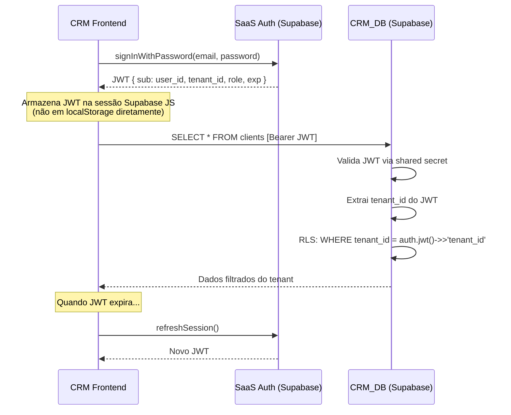
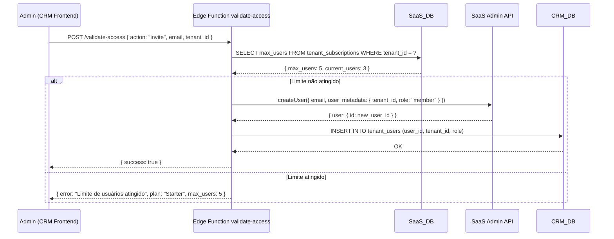
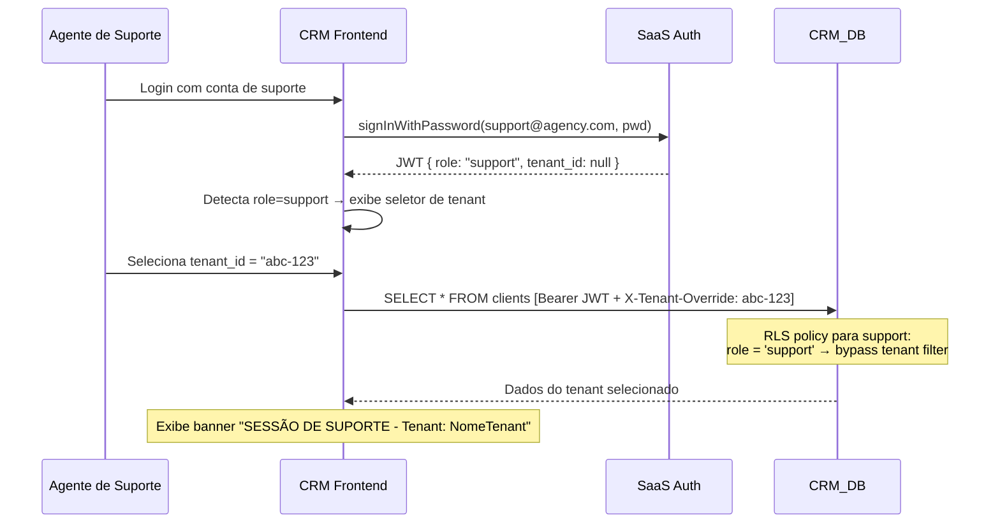

# Design Document: CRM Multi-Tenant

## Overview

Este documento descreve a arquitetura técnica para transformar o CRM atual de single-tenant em multi-tenant. A estratégia central é manter os dados no **CRM_DB** (Supabase existente) e delegar autenticação, planos e limites ao **SaaS_DB** (Supabase separado da agência).

O isolamento de dados é garantido por Row Level Security (RLS) no CRM_DB, alimentado por `tenant_id` extraído do JWT emitido pelo SaaS Auth. O CRM_DB valida o JWT diretamente via JWT secret compartilhado — sem chamadas extras ao SaaS em cada requisição.

**Decisões de arquitetura chave:**
- JWT do Supabase SaaS carrega `tenant_id` e `role` como custom claims
- CRM_DB usa `auth.jwt() -> 'tenant_id'` nas políticas RLS
- Planos e limites vivem exclusivamente no SaaS_DB (tabelas `plans` e `tenant_subscriptions`)
- Edge Function `validate-access` no CRM consulta SaaS_DB via service role key para verificar limites
- Convite de usuários: admin do tenant chama Admin API do Supabase SaaS via Edge Function do CRM

---

## Architecture

### Diagrama de Componentes e Fluxo de Dados

```mermaid
graph TB
    subgraph "Browser / CRM Frontend"
        FE[React + TypeScript<br/>Supabase JS Client]
    end

    subgraph "CRM_DB (Supabase existente)"
        CRM_AUTH[Supabase Auth<br/>JWT validation via shared secret]
        CRM_DB[(PostgreSQL<br/>clients, campaign_data,<br/>crm_leads, tenant_users, ...)]
        CRM_RLS[RLS Policies<br/>auth.jwt() ->> 'tenant_id']
        EF_VALIDATE[Edge Function<br/>validate-access]
        EF_META[Edge Function<br/>meta-ads-metrics]
        EF_GADS[Edge Function<br/>gads-metrics]
        EF_GA4[Edge Function<br/>ga4-metrics]
        EF_OAUTH[Edge Function<br/>oauth-exchange]
    end

    subgraph "SaaS_DB (Supabase da agência)"
        SAAS_AUTH[Supabase Auth<br/>auth.users]
        SAAS_DB[(PostgreSQL<br/>plans, tenant_subscriptions)]
        SAAS_ADMIN[Admin API<br/>createUser / inviteUser]
    end

    FE -->|"1. signInWithPassword(email, pwd)"| SAAS_AUTH
    SAAS_AUTH -->|"2. JWT com tenant_id + role"| FE
    FE -->|"3. Requisições com Bearer JWT"| CRM_DB
    CRM_AUTH -->|"4. Valida JWT via shared secret"| CRM_RLS
    CRM_RLS -->|"5. Filtra por tenant_id"| CRM_DB

    FE -->|"Verificar limite de usuários"| EF_VALIDATE
    EF_VALIDATE -->|"Consulta plano ativo"| SAAS_DB

    FE -->|"Convidar usuário"| EF_VALIDATE
    EF_VALIDATE -->|"createUser"| SAAS_ADMIN
    EF_VALIDATE -->|"INSERT tenant_users"| CRM_DB

    EF_META & EF_GADS & EF_GA4 -->|"tenant_id → oauth_tokens"| CRM_DB
    EF_OAUTH -->|"Associa token ao tenant_id"| CRM_DB
```

### Fluxo de Autenticação Detalhado



### Fluxo de Convite de Usuário



### Fluxo de Sessão de Suporte



---

## Components and Interfaces

### CRM Frontend

**Mudanças no cliente Supabase:**
- Substituir instância única `supabase` (anon key do CRM_DB) por duas instâncias:
  - `supabaseAuth`: aponta para SaaS_DB (para login/logout/refresh)
  - `supabaseCrm`: aponta para CRM_DB (para dados), usando o JWT do SaaS como token

```typescript
// lib/supabase-auth.ts — cliente do SaaS (autenticação)
export const supabaseAuth = createClient(SAAS_URL, SAAS_ANON_KEY)

// lib/supabase-crm.ts — cliente do CRM (dados)
export const supabaseCrm = createClient(CRM_URL, CRM_ANON_KEY, {
  global: {
    headers: {
      // JWT do SaaS injetado em cada requisição
      Authorization: `Bearer ${getSessionToken()}`
    }
  }
})
```

**Remoções:**
- `validate_client_dashboard_password` RPC → substituído por `supabaseAuth.signInWithPassword()`
- `validate_support_password` RPC → substituído por conta de suporte no SaaS Auth com `role=support`
- `localStorage.setItem("client_auth", ...)` → substituído por sessão gerenciada pelo Supabase JS

**Adições:**
- Hook `useAuth()`: gerencia sessão, extrai `tenant_id` e `role` do JWT
- Hook `useTenantUsers()`: lista usuários do tenant, chama `validate-access` para convites
- Componente `SupportBanner`: exibido quando `role=support`
- Componente `TenantSelector`: exibido para suporte ao selecionar tenant

### Edge Function: validate-access (nova)

Responsabilidades:
1. Verificar limite de usuários do plano (`action: "check-limit"`)
2. Convidar novo usuário (`action: "invite"`)
3. Remover usuário do tenant (`action: "remove"`)

```typescript
// Assinatura da interface
interface ValidateAccessRequest {
  action: "check-limit" | "invite" | "remove"
  tenant_id: string
  email?: string        // para invite
  user_id?: string      // para remove
}

interface ValidateAccessResponse {
  allowed: boolean
  current_users?: number
  max_users?: number
  plan_name?: string
  error?: string
}
```

### Edge Functions Existentes (meta-ads-metrics, gads-metrics, ga4-metrics, oauth-exchange)

**Mudança:** Substituir lookup por `client_id` (LIMIT 1) por lookup por `tenant_id` extraído do JWT da requisição.

```typescript
// Antes
const { data } = await supabaseCrm.from('oauth_tokens').select('*').limit(1)

// Depois
const tenantId = req.headers.get('x-tenant-id') // ou extraído do JWT
const { data } = await supabaseCrm
  .from('oauth_tokens')
  .select('*')
  .eq('tenant_id', tenantId)
  .single()
```

---

## Data Models

### SaaS_DB — Tabelas Novas

#### `plans`
```sql
CREATE TABLE plans (
  id          UUID PRIMARY KEY DEFAULT gen_random_uuid(),
  name        TEXT NOT NULL,           -- 'Starter', 'Pro', 'Enterprise'
  max_users   INTEGER NOT NULL,        -- limite de CRM_Users por tenant
  price_brl   NUMERIC(10,2),
  created_at  TIMESTAMPTZ NOT NULL DEFAULT now()
);
```

#### `tenant_subscriptions`
```sql
CREATE TABLE tenant_subscriptions (
  id          UUID PRIMARY KEY DEFAULT gen_random_uuid(),
  tenant_id   UUID NOT NULL UNIQUE,    -- referencia ao tenant (client) no CRM_DB
  plan_id     UUID NOT NULL REFERENCES plans(id),
  status      TEXT NOT NULL DEFAULT 'active' CHECK (status IN ('active', 'suspended', 'cancelled')),
  started_at  TIMESTAMPTZ NOT NULL DEFAULT now(),
  expires_at  TIMESTAMPTZ,
  created_at  TIMESTAMPTZ NOT NULL DEFAULT now(),
  updated_at  TIMESTAMPTZ NOT NULL DEFAULT now()
);

CREATE INDEX idx_tenant_subscriptions_tenant_id ON tenant_subscriptions (tenant_id);
```

**Nota:** O `tenant_id` em `tenant_subscriptions` é o mesmo UUID que identifica o tenant no CRM_DB. Não há FK cross-database — a consistência é garantida pela Edge Function `validate-access`.

### SaaS_DB — Custom Claims no JWT

O Supabase Auth permite adicionar custom claims via Database Hook (ou Auth Hook). Criar uma função que injeta `tenant_id` e `role` no JWT:

```sql
-- Hook: custom_access_token_hook no SaaS_DB
CREATE OR REPLACE FUNCTION custom_access_token_hook(event JSONB)
RETURNS JSONB
LANGUAGE plpgsql
AS $$
DECLARE
  v_tenant_id UUID;
  v_role      TEXT;
BEGIN
  -- Busca tenant_id e role do user_metadata (definido no momento do createUser)
  v_tenant_id := (event->'claims'->'user_metadata'->>'tenant_id')::UUID;
  v_role      := COALESCE(event->'claims'->'user_metadata'->>'role', 'member');

  -- Injeta no JWT
  RETURN jsonb_set(
    jsonb_set(event, '{claims,tenant_id}', to_jsonb(v_tenant_id)),
    '{claims,role}',
    to_jsonb(v_role)
  );
END;
$$;
```

### CRM_DB — Tabelas Novas

#### `tenant_users`
```sql
CREATE TABLE tenant_users (
  id          UUID PRIMARY KEY DEFAULT gen_random_uuid(),
  user_id     UUID NOT NULL,           -- auth.users.id do SaaS_DB
  tenant_id   UUID NOT NULL,           -- FK lógica para clients.id
  role        TEXT NOT NULL DEFAULT 'member' CHECK (role IN ('admin', 'member')),
  -- NOTA: role 'support' NÃO existe nesta tabela.
  -- Usuários de suporte são identificados exclusivamente pelo JWT claim role='support'
  -- e NUNCA são registrados em tenant_users de nenhum tenant.
  created_at  TIMESTAMPTZ NOT NULL DEFAULT now(),
  UNIQUE (user_id, tenant_id)
);

CREATE INDEX idx_tenant_users_tenant_id ON tenant_users (tenant_id);
CREATE INDEX idx_tenant_users_user_id   ON tenant_users (user_id);

ALTER TABLE tenant_users ENABLE ROW LEVEL SECURITY;

-- Apenas o próprio tenant pode ver seus usuários
-- Suporte acessa via bypass de RLS (role='support' no JWT)
CREATE POLICY "tenant_users_isolation" ON tenant_users
  FOR ALL USING (
    tenant_id = (auth.jwt() ->> 'tenant_id')::UUID
    OR (auth.jwt() ->> 'role') = 'support'
  );
```

**Regras do usuário de suporte:**
- O usuário de suporte é identificado **exclusivamente** pelo claim `role = 'support'` no JWT
- **Nunca** é inserido em `tenant_users` de nenhum tenant
- **Nunca** é contabilizado no limite de usuários de nenhum plano
- A contagem de `current_users` na Edge Function `validate-access` usa `COUNT(*) FROM tenant_users WHERE tenant_id = ?` — o suporte não aparece nessa contagem por não ter registro na tabela
- O acesso do suporte a qualquer tenant é garantido pela política RLS (`role = 'support'` bypassa o filtro de `tenant_id`)
- O seletor de tenant exibido para o suporte lista todos os tenants via query sem filtro de `tenant_id` (permitida pelo bypass RLS)

### CRM_DB — Mudanças nas Tabelas Existentes

#### Adição de `tenant_id` em todas as tabelas

As seguintes tabelas recebem a coluna `tenant_id UUID NOT NULL`:
- `clients`
- `campaign_data`
- `daily_metrics`
- `client_kpis`
- `client_kpi_history`
- `crm_leads`
- `ad_click_sessions`
- `client_conversation_kpis`
- `oauth_tokens` (renomear `client_id` para `tenant_id` ou adicionar coluna)
- `contracts`
- `lead_interactions` (via `crm_leads.tenant_id`)
- `lead_tags` (via `crm_leads.tenant_id`)
- `lead_followups` (via `crm_leads.tenant_id`)

#### `crm_leads` — adição de `client_id`

Conforme Requirement 8.3, `crm_leads` não possui `client_id`. A migração adiciona:
```sql
ALTER TABLE crm_leads ADD COLUMN IF NOT EXISTS client_id UUID REFERENCES clients(id) ON DELETE CASCADE;
ALTER TABLE crm_leads ADD COLUMN IF NOT EXISTS tenant_id UUID NOT NULL DEFAULT '00000000-0000-0000-0000-000000000000';
```

### CRM_DB — Estratégia de RLS

**Padrão de política para todas as tabelas:**

```sql
-- Habilitar RLS
ALTER TABLE <tabela> ENABLE ROW LEVEL SECURITY;

-- Remover políticas antigas (anon_all_*)
DROP POLICY IF EXISTS "anon_all_<tabela>" ON <tabela>;

-- Política multi-tenant
CREATE POLICY "<tabela>_tenant_isolation" ON <tabela>
  FOR ALL USING (
    tenant_id = (auth.jwt() ->> 'tenant_id')::UUID
    OR (auth.jwt() ->> 'role') = 'support'
  )
  WITH CHECK (
    tenant_id = (auth.jwt() ->> 'tenant_id')::UUID
    OR (auth.jwt() ->> 'role') = 'support'
  );
```

**Configuração do JWT secret compartilhado no CRM_DB:**

```sql
-- No CRM_DB: configurar o JWT secret do SaaS para validação
ALTER DATABASE postgres SET "app.jwt_secret" TO '<SAAS_JWT_SECRET>';
```

O Supabase usa a variável `app.settings.jwt_secret` para validar JWTs. Ao configurar o secret do SaaS, o CRM_DB aceita tokens emitidos pelo SaaS Auth sem chamadas extras.

### CRM_DB — Configuração JWT

No `supabase/config.toml` do CRM_DB (ou via dashboard):
```toml
[auth]
# JWT secret compartilhado com o SaaS_DB
jwt_secret = "env(SAAS_JWT_SECRET)"
```

---

## Migration Strategy

### Fase 1: Preparação (sem downtime)

```sql
-- Migration: 20260501000000_add_tenant_id_columns.sql
-- Adiciona tenant_id com DEFAULT temporário (UUID do tenant existente)
-- O UUID real do tenant único será preenchido na Fase 2

ALTER TABLE clients              ADD COLUMN IF NOT EXISTS tenant_id UUID;
ALTER TABLE campaign_data        ADD COLUMN IF NOT EXISTS tenant_id UUID;
ALTER TABLE daily_metrics        ADD COLUMN IF NOT EXISTS tenant_id UUID;
ALTER TABLE client_kpis          ADD COLUMN IF NOT EXISTS tenant_id UUID;
ALTER TABLE client_kpi_history   ADD COLUMN IF NOT EXISTS tenant_id UUID;
ALTER TABLE crm_leads            ADD COLUMN IF NOT EXISTS tenant_id UUID;
ALTER TABLE crm_leads            ADD COLUMN IF NOT EXISTS client_id UUID;
ALTER TABLE ad_click_sessions    ADD COLUMN IF NOT EXISTS tenant_id UUID;
ALTER TABLE client_conversation_kpis ADD COLUMN IF NOT EXISTS tenant_id UUID;
ALTER TABLE oauth_tokens         ADD COLUMN IF NOT EXISTS tenant_id UUID;
ALTER TABLE contracts            ADD COLUMN IF NOT EXISTS tenant_id UUID;
```

### Fase 2: Backfill (idempotente)

```sql
-- Migration: 20260501000001_backfill_tenant_id.sql
-- Popula tenant_id com o id do único cliente existente (single-tenant atual)
DO $$
DECLARE
  v_tenant_id UUID;
BEGIN
  SELECT id INTO v_tenant_id FROM clients LIMIT 1;

  UPDATE clients              SET tenant_id = v_tenant_id WHERE tenant_id IS NULL;
  UPDATE campaign_data        SET tenant_id = v_tenant_id WHERE tenant_id IS NULL;
  UPDATE daily_metrics        SET tenant_id = v_tenant_id WHERE tenant_id IS NULL;
  UPDATE client_kpis          SET tenant_id = v_tenant_id WHERE tenant_id IS NULL;
  UPDATE client_kpi_history   SET tenant_id = v_tenant_id WHERE tenant_id IS NULL;
  UPDATE crm_leads            SET tenant_id = v_tenant_id, client_id = v_tenant_id WHERE tenant_id IS NULL;
  UPDATE ad_click_sessions    SET tenant_id = v_tenant_id WHERE tenant_id IS NULL;
  UPDATE client_conversation_kpis SET tenant_id = v_tenant_id WHERE tenant_id IS NULL;
  UPDATE oauth_tokens         SET tenant_id = v_tenant_id WHERE tenant_id IS NULL;
  UPDATE contracts            SET tenant_id = v_tenant_id WHERE tenant_id IS NULL;
END $$;
```

### Fase 3: Constraints e NOT NULL

```sql
-- Migration: 20260501000002_tenant_id_not_null.sql
ALTER TABLE clients              ALTER COLUMN tenant_id SET NOT NULL;
ALTER TABLE campaign_data        ALTER COLUMN tenant_id SET NOT NULL;
ALTER TABLE daily_metrics        ALTER COLUMN tenant_id SET NOT NULL;
ALTER TABLE client_kpis          ALTER COLUMN tenant_id SET NOT NULL;
ALTER TABLE client_kpi_history   ALTER COLUMN tenant_id SET NOT NULL;
ALTER TABLE crm_leads            ALTER COLUMN tenant_id SET NOT NULL;
ALTER TABLE ad_click_sessions    ALTER COLUMN tenant_id SET NOT NULL;
ALTER TABLE client_conversation_kpis ALTER COLUMN tenant_id SET NOT NULL;
ALTER TABLE oauth_tokens         ALTER COLUMN tenant_id SET NOT NULL;
ALTER TABLE contracts            ALTER COLUMN tenant_id SET NOT NULL;

-- Índices
CREATE INDEX IF NOT EXISTS idx_clients_tenant_id              ON clients (tenant_id);
CREATE INDEX IF NOT EXISTS idx_campaign_data_tenant_id        ON campaign_data (tenant_id);
CREATE INDEX IF NOT EXISTS idx_daily_metrics_tenant_id        ON daily_metrics (tenant_id);
CREATE INDEX IF NOT EXISTS idx_client_kpis_tenant_id          ON client_kpis (tenant_id);
CREATE INDEX IF NOT EXISTS idx_client_kpi_history_tenant_id   ON client_kpi_history (tenant_id);
CREATE INDEX IF NOT EXISTS idx_crm_leads_tenant_id            ON crm_leads (tenant_id);
CREATE INDEX IF NOT EXISTS idx_ad_click_sessions_tenant_id    ON ad_click_sessions (tenant_id);
CREATE INDEX IF NOT EXISTS idx_conv_kpis_tenant_id            ON client_conversation_kpis (tenant_id);
CREATE INDEX IF NOT EXISTS idx_oauth_tokens_tenant_id         ON oauth_tokens (tenant_id);
CREATE INDEX IF NOT EXISTS idx_contracts_tenant_id            ON contracts (tenant_id);
```

### Fase 4: RLS Multi-Tenant

```sql
-- Migration: 20260501000003_rls_multi_tenant.sql
-- Remove políticas anon_all_* e aplica isolamento por tenant_id

-- clients
ALTER TABLE clients ENABLE ROW LEVEL SECURITY;
DROP POLICY IF EXISTS "anon_all_clients" ON clients;
CREATE POLICY "clients_tenant_isolation" ON clients
  FOR ALL USING (
    tenant_id = (auth.jwt() ->> 'tenant_id')::UUID
    OR (auth.jwt() ->> 'role') = 'support'
  )
  WITH CHECK (
    tenant_id = (auth.jwt() ->> 'tenant_id')::UUID
    OR (auth.jwt() ->> 'role') = 'support'
  );

-- (repetir para campaign_data, daily_metrics, client_kpis,
--  client_kpi_history, crm_leads, ad_click_sessions,
--  client_conversation_kpis, oauth_tokens, contracts)
```

### Fase 5: Criar tenant_users e registrar usuário inicial

```sql
-- Migration: 20260501000004_tenant_users.sql
CREATE TABLE IF NOT EXISTS tenant_users ( ... ); -- conforme modelo acima

-- Registrar o usuário admin inicial (após criar conta no SaaS Auth)
-- INSERT INTO tenant_users (user_id, tenant_id, role)
-- VALUES ('<saas_user_id>', '<tenant_id>', 'admin');
```

### Fase 6: Remover RPCs legados

```sql
-- Migration: 20260501000005_drop_legacy_rpcs.sql
DROP FUNCTION IF EXISTS validate_client_dashboard_password(TEXT, TEXT);
DROP FUNCTION IF EXISTS validate_support_password(TEXT);
DROP FUNCTION IF EXISTS get_client_data();
-- Manter: update_client_dashboard_password (pode ser útil para admin)
-- Manter: recover_client_password (substituir por reset de senha do SaaS)
```

---

## Error Handling

| Cenário | Comportamento |
|---|---|
| JWT ausente na requisição ao CRM_DB | RLS retorna 0 registros (não erro 401) |
| JWT expirado | Supabase JS faz refresh automático; se falhar, redireciona para login |
| `tenant_id` inválido no JWT | RLS retorna 0 registros |
| Limite de usuários atingido | `validate-access` retorna `{ allowed: false, error: "..." }` |
| SaaS_DB indisponível durante convite | Edge Function retorna 503 com mensagem descritiva |
| Email já cadastrado no SaaS | Admin API retorna erro; Edge Function repassa ao frontend |
| Token OAuth não encontrado para tenant | Edge Function retorna 404 descritivo sem expor outros tokens |
| Usuário tenta acessar tenant diferente | RLS bloqueia silenciosamente (retorna 0 registros) |

---

## Testing Strategy

### Abordagem Dual

**Testes unitários** cobrem exemplos específicos, casos de borda e integrações:
- Login com credenciais válidas retorna JWT com `tenant_id` e `role`
- Login com credenciais inválidas retorna mensagem genérica
- Sessão de suporte exibe banner visual
- Convite com limite atingido exibe mensagem correta
- Edge Function retorna 404 quando token OAuth não existe para o tenant

**Testes de propriedade** cobrem invariantes universais (ver seção Correctness Properties):
- Isolamento de dados entre tenants
- Consistência do JWT com dados do tenant
- Idempotência da migração
- Limites de plano respeitados

### Biblioteca de Property-Based Testing

- **Backend (SQL/migrations):** `pgTAP` para testes de banco de dados
- **Frontend (TypeScript):** `fast-check` para property-based testing
- **Edge Functions (Deno/TypeScript):** `fast-check` com mocks do Supabase client

**Configuração mínima:** 100 iterações por propriedade.

**Tag format:** `// Feature: crm-multi-tenant, Property N: <texto da propriedade>`

Cada propriedade de corretude DEVE ser implementada por um único teste de propriedade.

---

## Correctness Properties

*A property is a characteristic or behavior that should hold true across all valid executions of a system — essentially, a formal statement about what the system should do. Properties serve as the bridge between human-readable specifications and machine-verifiable correctness guarantees.*

### Property 1: Isolamento de dados entre tenants

*Para qualquer* par de tenants distintos (A e B) e qualquer tabela protegida por RLS, uma query executada com o JWT do tenant A não deve retornar nenhum registro cujo `tenant_id` seja do tenant B.

**Validates: Requirements 1.2, 1.4**

### Property 2: Query sem tenant_id retorna zero registros

*Para qualquer* tabela protegida por RLS, uma query executada sem JWT válido (ou com JWT sem `tenant_id`) deve retornar exatamente zero registros.

**Validates: Requirements 1.3, 3.4**

### Property 3: JWT contém tenant_id e role válidos após login

*Para qualquer* usuário cadastrado no SaaS Auth com `user_metadata.tenant_id` e `user_metadata.role`, o JWT emitido após login bem-sucedido deve conter os mesmos valores de `tenant_id` e `role` nos custom claims.

**Validates: Requirements 2.2, 3.1**

### Property 4: Limite de usuários é respeitado e suporte não é contabilizado

*Para qualquer* tenant com plano de limite N, após N usuários ativos em `tenant_users` (excluindo usuários com `role = 'support'` no JWT, que nunca são registrados nessa tabela), qualquer tentativa de convite adicional deve ser rejeitada pela Edge Function `validate-access` com `allowed: false`. A contagem de usuários ativos de um tenant deve ser sempre `COUNT(*) FROM tenant_users WHERE tenant_id = ?`, sem incluir o usuário de suporte.

**Validates: Requirements 5.2, 5.3**

### Property 5: Idempotência da migração

*Para qualquer* estado do banco CRM_DB com dados existentes, executar o script de migração duas vezes deve produzir exatamente o mesmo resultado que executá-lo uma vez — sem erros, sem duplicação de registros, sem alteração de valores de negócio.

**Validates: Requirements 8.4, 8.5**

### Property 6: Backfill preserva todos os registros existentes

*Para qualquer* conjunto de registros existentes no banco single-tenant antes da migração, após o backfill de `tenant_id`, o número total de registros em cada tabela deve ser igual ao número anterior à migração.

**Validates: Requirements 8.2, 8.4**

### Property 7: Edge Functions isolam tokens OAuth por tenant

*Para qualquer* invocação de Edge Function (meta-ads-metrics, gads-metrics, ga4-metrics) com um `tenant_id` válido, a função deve retornar apenas o token OAuth associado a esse `tenant_id` — nunca tokens de outros tenants.

**Validates: Requirements 9.2, 9.3**

### Property 8: Sessão de suporte acessa qualquer tenant sem restrição de RLS

*Para qualquer* JWT com `role = support` e qualquer `tenant_id` arbitrário passado como parâmetro, as queries ao CRM_DB devem retornar os dados do tenant especificado sem bloqueio por RLS.

**Validates: Requirements 7.3, 7.4**

### Property 9: Remoção de usuário do tenant é consistente entre SaaS e CRM

*Para qualquer* usuário removido de um tenant, após a operação de remoção: (a) o registro em `tenant_users` não deve existir no CRM_DB, e (b) o acesso do usuário deve ser revogado no SaaS Auth — ambas as condições devem ser verdadeiras simultaneamente.

**Validates: Requirements 6.5**

### Property 10: Atualização de plano reflete novo limite imediatamente

*Para qualquer* tenant cujo plano é atualizado no SaaS_DB para um limite maior N', a próxima chamada a `validate-access` deve retornar `max_users = N'` sem necessidade de ação manual.

**Validates: Requirements 5.4**
