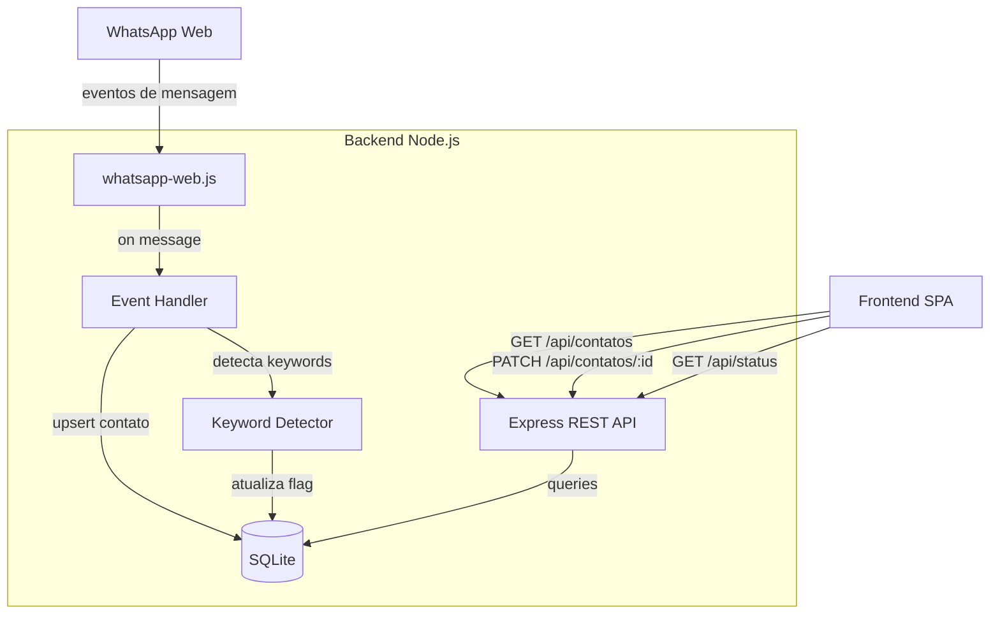

# Design Document — crm-whatsapp

## Overview

Mini CRM standalone para captura e classificação de contatos via WhatsApp Web. O sistema é composto por um backend Node.js que integra com o WhatsApp via `whatsapp-web.js`, persiste dados em SQLite e expõe uma API REST. O frontend é uma SPA leve em HTML + CSS + JS vanilla que consome essa API.

O fluxo principal é: WhatsApp recebe mensagem → backend captura e persiste o contato → frontend exibe e permite classificação manual em até 3 cliques.

### Decisões de Design

- **whatsapp-web.js + LocalAuth**: biblioteca madura para automação do WhatsApp Web com persistência de sessão via sistema de arquivos, evitando re-autenticação a cada restart.
- **SQLite via better-sqlite3**: banco embutido, zero configuração, operações síncronas que simplificam o código do backend.
- **Frontend vanilla**: sem framework, sem build step — HTML/CSS/JS servidos diretamente pelo Express. Reduz complexidade operacional.
- **Projeto separado**: completamente independente do projeto React/Supabase existente. Roda em porta diferente (3001).

---

## Architecture



### Estrutura de Diretórios

```
crm-whatsapp/
├── backend/
│   ├── index.js          # entry point: Express + whatsapp-web.js init
│   ├── db.js             # inicialização e helpers do SQLite
│   ├── whatsapp.js       # cliente WhatsApp, handlers de eventos
│   ├── keywords.js       # detecção de palavras-chave
│   └── routes/
│       └── contatos.js   # rotas REST /api/contatos e /api/status
├── frontend/
│   ├── index.html        # SPA principal
│   ├── style.css
│   └── app.js            # lógica de UI, fetch, filtros, dashboard
└── database/
    └── crm.db            # arquivo SQLite (criado automaticamente)
```

---

## Components and Interfaces

### Backend

#### `db.js` — Camada de Dados

```js
// Inicializa o banco e cria tabela se não existir
function initDb(): Database

// Upsert de contato: cria novo ou atualiza ultima_mensagem/data_ultima_interacao
function upsertContato(contato: ContatoInput): void

// Retorna lista de contatos, opcionalmente filtrada por status
function getContatos(status?: string): Contato[]

// Atualiza status e/ou observacao de um contato pelo id
function updateContato(id: number, fields: Partial<{status, observacao}>): Contato | null
```

#### `keywords.js` — Detecção de Palavras-chave

```js
const KEYWORDS = ['preço', 'valor', 'orçamento', 'quanto custa']

// Retorna true se a mensagem contém ao menos uma keyword (case-insensitive)
function hasBusinessKeyword(message: string): boolean
```

#### `whatsapp.js` — Integração WhatsApp

```js
// Inicializa o cliente com LocalAuth, registra handlers
function initWhatsApp(db): WhatsAppClient

// Handler interno: filtra grupos e mensagens próprias, faz upsert, detecta keywords
async function handleMessage(msg, db): void
```

#### `routes/contatos.js` — API REST

| Método | Rota | Descrição |
|--------|------|-----------|
| GET | `/api/contatos` | Lista todos os contatos (aceita `?status=`) |
| PATCH | `/api/contatos/:id` | Atualiza `status` e/ou `observacao` |
| GET | `/api/status` | Estado da conexão WhatsApp |

Validações:
- `status` deve ser um de: `pendente`, `negocio`, `nao_negocio` → 400 caso contrário
- `:id` deve existir no banco → 404 caso contrário
- Todos os responses com `Content-Type: application/json`

### Frontend

#### `app.js` — Lógica da SPA

```
Estado global:
  contatos: Contato[]       — lista completa carregada da API
  filtroAtivo: string       — 'todos' | 'pendente' | 'negocio' | 'nao_negocio'
  statusWA: string          — estado da conexão WhatsApp

Funções principais:
  loadContatos()            — GET /api/contatos, atualiza estado e re-renderiza
  renderContatos()          — filtra e renderiza cards na DOM
  renderDashboard()         — calcula e exibe métricas a partir do estado local
  setFiltro(status)         — atualiza filtroAtivo e re-renderiza (sem fetch)
  classificar(id, status)   — PATCH /api/contatos/:id, atualiza estado local
  salvarObservacao(id, obs) — PATCH /api/contatos/:id com observacao
  pollStatus()              — GET /api/status a cada 5s, atualiza indicador de conexão
```

#### Fluxo de Classificação (≤ 3 interações)

1. Clique no botão "Negócio" ou "Não é" → classificação imediata (1 clique)
2. Clique em "Obs." → abre campo de texto inline (1 clique) → clique em "Salvar" (1 clique)

---

## Data Models

### Tabela `contatos` (SQLite)

```sql
CREATE TABLE IF NOT EXISTS contatos (
  id                    INTEGER PRIMARY KEY AUTOINCREMENT,
  nome                  TEXT NOT NULL,
  telefone              TEXT NOT NULL UNIQUE,
  origem                TEXT NOT NULL DEFAULT 'whatsapp',
  ultima_mensagem       TEXT,
  data_ultima_interacao TEXT,           -- ISO 8601
  status                TEXT NOT NULL DEFAULT 'pendente'
                          CHECK(status IN ('pendente','negocio','nao_negocio')),
  observacao            TEXT,
  valor_potencial       REAL,
  tem_keyword           INTEGER NOT NULL DEFAULT 0  -- boolean: 1 = tem keyword
);
```

> `tem_keyword` é um campo adicional não listado explicitamente nos requisitos mas necessário para persistir o indicador de palavra-chave entre sessões.

### Tipos TypeScript (referência para o frontend)

```ts
interface Contato {
  id: number
  nome: string
  telefone: string
  origem: string
  ultima_mensagem: string | null
  data_ultima_interacao: string | null
  status: 'pendente' | 'negocio' | 'nao_negocio'
  observacao: string | null
  valor_potencial: number | null
  tem_keyword: boolean
}

interface ContatoInput {
  nome: string
  telefone: string
  ultima_mensagem: string
  data_ultima_interacao: string
  tem_keyword: boolean
}

interface StatusResponse {
  status: 'conectado' | 'aguardando_qr' | 'desconectado'
}
```

### Payload PATCH `/api/contatos/:id`

```json
{
  "status": "negocio",       // opcional
  "observacao": "texto..."   // opcional
}
```

---

## Correctness Properties

*A property is a characteristic or behavior that should hold true across all valid executions of a system — essentially, a formal statement about what the system should do. Properties serve as the bridge between human-readable specifications and machine-verifiable correctness guarantees.*

### Property 1: Extração completa de dados da mensagem

*For any* mensagem recebida do WhatsApp com campos nome, telefone, conteúdo e timestamp, o contato persistido no banco deve conter exatamente esses valores nos campos correspondentes.

**Validates: Requirements 2.1**

---

### Property 2: Novo contato sempre inicia com status "pendente"

*For any* telefone que ainda não existe no banco, após o upsert de uma mensagem recebida, o contato criado deve ter `status = "pendente"` e `origem = "whatsapp"`.

**Validates: Requirements 2.2, 2.5, 8.4**

---

### Property 3: Unicidade de contato por telefone

*For any* sequência de mensagens recebidas do mesmo número de telefone, o banco deve conter exatamente um registro com aquele telefone, com `ultima_mensagem` e `data_ultima_interacao` refletindo a mensagem mais recente.

**Validates: Requirements 2.3, 2.4, 8.2**

---

### Property 4: Detecção de keywords é case-insensitive

*For any* mensagem que contenha ao menos uma das palavras-chave em qualquer combinação de maiúsculas e minúsculas (ex: "PREÇO", "Valor", "ORÇAMENTO", "Quanto Custa"), `hasBusinessKeyword` deve retornar `true`. *For any* mensagem que não contenha nenhuma keyword, deve retornar `false`.

**Validates: Requirements 3.1, 3.2**

---

### Property 5: Keyword não altera status já classificado

*For any* contato com `status = "negocio"` ou `status = "nao_negocio"`, receber uma nova mensagem contendo palavras-chave não deve alterar o `status` existente.

**Validates: Requirements 3.4**

---

### Property 6: Atualização de status é persistida corretamente

*For any* contato existente e qualquer valor de status válido (`pendente`, `negocio`, `nao_negocio`), após PATCH `/api/contatos/:id`, o banco deve refletir o novo status e a resposta deve conter o contato atualizado.

**Validates: Requirements 4.3**

---

### Property 7: Round-trip de observação

*For any* texto de observação, após salvar via PATCH `/api/contatos/:id`, consultar o contato deve retornar exatamente o mesmo texto no campo `observacao`.

**Validates: Requirements 4.6**

---

### Property 8: Ordenação da listagem por data decrescente

*For any* conjunto de contatos no banco, `GET /api/contatos` deve retornar a lista ordenada por `data_ultima_interacao` em ordem decrescente.

**Validates: Requirements 5.1**

---

### Property 9: Filtragem por status na API

*For any* valor de status válido passado como query param (`?status=pendente`, `?status=negocio`, `?status=nao_negocio`), todos os contatos retornados por `GET /api/contatos?status=` devem ter exatamente aquele status.

**Validates: Requirements 5.3, 7.2**

---

### Property 10: Renderização completa do card de contato

*For any* objeto `Contato`, o HTML renderizado pelo frontend deve conter: nome, telefone, última mensagem, data da última interação, status atual e — quando `tem_keyword = true` — o indicador visual de keyword.

**Validates: Requirements 5.4**

---

### Property 11: Consistência das métricas do dashboard

*For any* lista de contatos, os valores exibidos no dashboard devem satisfazer: `total = pendentes + negocios + nao_negocios`, e a taxa de conversão deve ser `negocios / (negocios + nao_negocios) * 100` arredondada para 1 casa decimal (retornando 0 quando o denominador é zero).

**Validates: Requirements 6.1, 6.2, 6.3, 6.4, 6.5**

---

### Property 12: Validação de status inválido retorna HTTP 400

*For any* valor de `status` diferente de `pendente`, `negocio` ou `nao_negocio` enviado no PATCH, a API deve retornar HTTP 400 com `Content-Type: application/json` e uma mensagem descritiva no corpo.

**Validates: Requirements 7.5, 7.7**

---

### Property 13: ID inexistente retorna HTTP 404

*For any* `id` que não existe no banco, PATCH `/api/contatos/:id` deve retornar HTTP 404 com `Content-Type: application/json` e mensagem descritiva.

**Validates: Requirements 7.6, 7.7**

---

### Property 14: Mensagens ignoradas não geram upsert

*For any* mensagem com `fromMe = true` (enviada pelo próprio usuário) ou proveniente de um grupo (`isGroupMsg = true`), o handler não deve chamar `upsertContato` nem modificar o banco de dados.

**Validates: Requirements 9.1, 9.2, 9.3**

---

## Error Handling

### Backend

| Situação | Comportamento |
|----------|---------------|
| Erro de escrita no SQLite | `console.error` com stack trace; processo continua |
| Status inválido no PATCH | HTTP 400 `{ error: "Status inválido. Use: pendente, negocio, nao_negocio" }` |
| ID não encontrado no PATCH | HTTP 404 `{ error: "Contato não encontrado" }` |
| Sessão WhatsApp expirada | `whatsapp-web.js` emite evento `disconnected`; cliente reinicia e gera novo QR |
| Erro ao inicializar SQLite | `console.error` + `process.exit(1)` (banco é requisito crítico) |
| Campo `nome` ausente na mensagem | Usa `telefone` como fallback para `nome` |

### Frontend

| Situação | Comportamento |
|----------|---------------|
| Falha no fetch de contatos | Exibe mensagem de erro na área de listagem |
| Falha no PATCH de classificação | Exibe toast/alerta de erro; reverte estado visual otimista |
| API retorna 400/404 | Exibe mensagem descritiva retornada pelo backend |
| Backend offline | Indicador de status WhatsApp mostra "desconectado" |

---

## Testing Strategy

### Abordagem Dual

O projeto usa dois tipos complementares de teste:

- **Testes unitários**: verificam exemplos específicos, casos de borda e condições de erro
- **Testes de propriedade (PBT)**: verificam propriedades universais com inputs gerados aleatoriamente

### Biblioteca de PBT

**fast-check** (JavaScript/Node.js) — biblioteca madura, sem dependências externas, compatível com Jest/Vitest.

```bash
npm install --save-dev fast-check vitest
```

### Testes Unitários

Focados em:
- Inicialização do banco (schema criado corretamente) — Req 8.1, 8.3
- Fallback de nome para telefone quando nome ausente — Req 2.6
- Lista vazia retorna mensagem informativa — Req 5.5
- Endpoints GET /api/contatos, PATCH /api/contatos/:id, GET /api/status existem e respondem — Req 7.1, 7.3, 7.4
- Erro de banco não encerra o processo — Req 8.5

### Testes de Propriedade

Cada propriedade do design deve ser implementada por **um único teste de propriedade** com mínimo de **100 iterações**.

Tag format: `// Feature: crm-whatsapp, Property {N}: {texto da propriedade}`

```js
// Feature: crm-whatsapp, Property 4: Detecção de keywords é case-insensitive
test('keywords detectadas independente de capitalização', () => {
  fc.assert(fc.property(
    fc.constantFrom('preço','valor','orçamento','quanto custa'),
    fc.string(),
    fc.string(),
    (keyword, prefix, suffix) => {
      const variants = [
        keyword.toUpperCase(),
        keyword.toLowerCase(),
        keyword[0].toUpperCase() + keyword.slice(1)
      ]
      variants.forEach(v => {
        expect(hasBusinessKeyword(`${prefix}${v}${suffix}`)).toBe(true)
      })
    }
  ), { numRuns: 100 })
})
```

### Mapeamento Propriedade → Teste

| Propriedade | Tipo | Módulo testado |
|-------------|------|----------------|
| P1: Extração de dados | property | `whatsapp.js` handler |
| P2: Novo contato status pendente | property | `db.js` upsertContato |
| P3: Unicidade por telefone | property | `db.js` upsertContato |
| P4: Keywords case-insensitive | property | `keywords.js` |
| P5: Keyword não altera status classificado | property | `db.js` upsertContato |
| P6: Atualização de status persistida | property | `db.js` updateContato |
| P7: Round-trip de observação | property | `db.js` updateContato |
| P8: Ordenação decrescente | property | `db.js` getContatos |
| P9: Filtragem por status na API | property | `routes/contatos.js` |
| P10: Renderização completa do card | property | `frontend/app.js` |
| P11: Consistência do dashboard | property | `frontend/app.js` |
| P12: Status inválido → 400 | property | `routes/contatos.js` |
| P13: ID inexistente → 404 | property | `routes/contatos.js` |
| P14: Mensagens ignoradas sem upsert | property | `whatsapp.js` handler |
