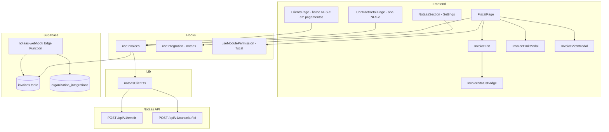
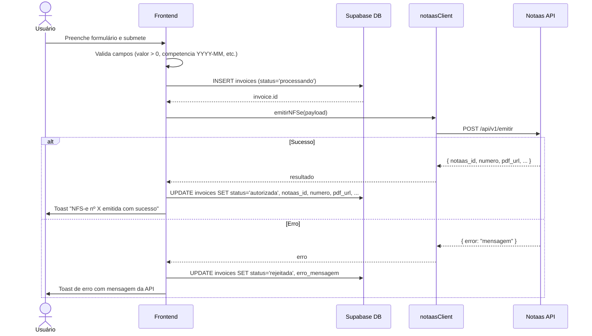
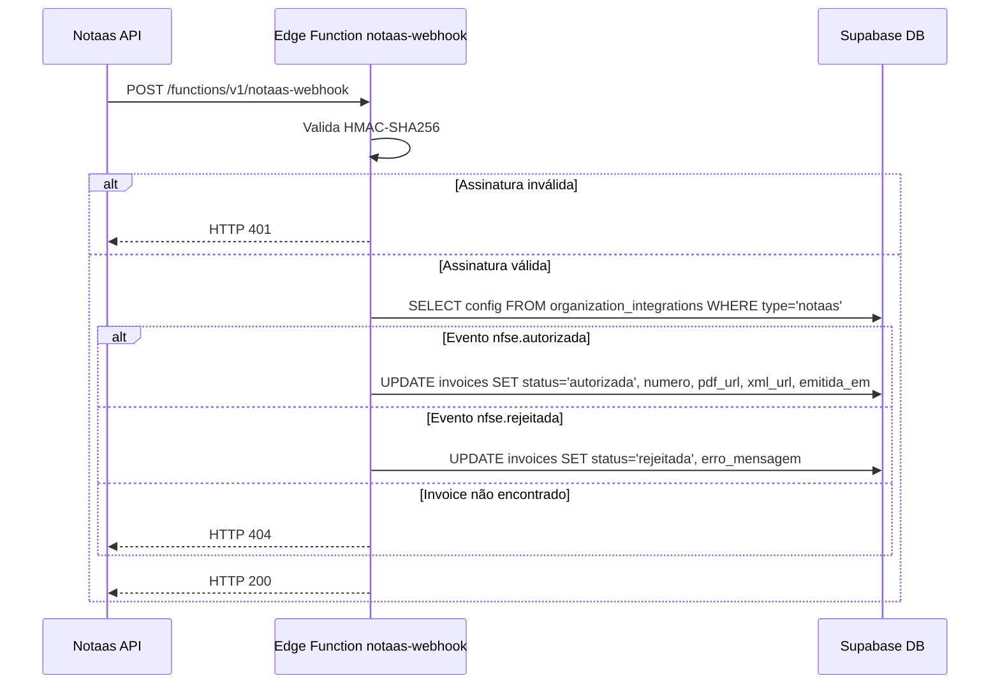
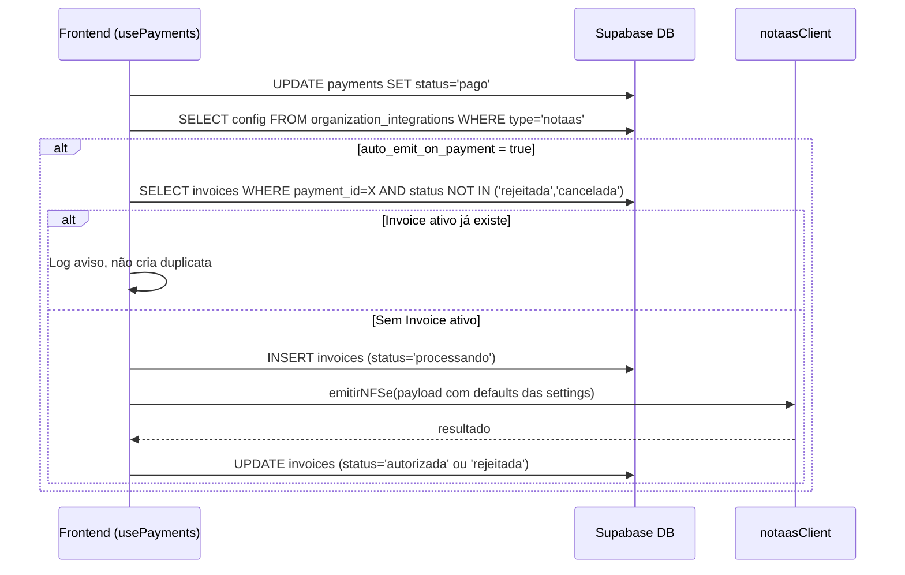

# Design Técnico — Módulo Fiscal NFS-e

## Visão Geral

O Módulo Fiscal NFS-e é uma nova seção independente do Maestr.IA que permite às agências emitir, gerenciar e cancelar Notas Fiscais de Serviços Eletrônicas (NFS-e) diretamente no CRM, integrado à API REST da plataforma Notaas. O módulo segue os padrões arquiteturais já estabelecidos no projeto: hooks TanStack Query por entidade, permissões via `useModulePermission`, configurações em `organization_integrations`, e Edge Functions Deno para operações server-side.

### Objetivos de Design

- **Isolamento**: O módulo fiscal é independente dos demais módulos, com sua própria rota, permissões e configurações.
- **Consistência**: Segue os padrões existentes de hooks, componentes shadcn/ui, RLS multi-tenant e fire-and-forget para APIs externas.
- **Segurança**: Validação HMAC-SHA256 de webhooks server-side, snapshot de dados do tomador, RLS na tabela `invoices`.
- **Resiliência**: Falhas na emissão não revertem operações de pagamento; emissão automática é best-effort.

---

## Arquitetura

### Diagrama de Componentes



### Fluxo de Emissão Manual



### Fluxo de Webhook (Notaas → Supabase)



### Fluxo de Emissão Automática



---

## Componentes e Interfaces

### Estrutura de Arquivos

```
src/
  types/
    fiscal.ts                          # Tipos TypeScript do módulo fiscal
  hooks/
    useInvoices.ts                     # Hook principal: useQuery + useMutation para invoices
  lib/
    notaasClient.ts                    # Cliente HTTP para a API Notaas
  pages/
    FiscalPage.tsx                     # Página principal /fiscal
  components/
    fiscal/
      InvoiceList.tsx                  # Tabela paginada de invoices
      InvoiceEmitModal.tsx             # Modal de emissão manual
      InvoiceViewModal.tsx             # Modal de visualização de invoice
      InvoiceStatusBadge.tsx           # Badge de status colorido
    settings/
      NotaasSection.tsx                # Seção de configurações Notaas em SettingsPage
supabase/
  functions/
    notaas-webhook/
      index.ts                         # Edge Function para receber webhooks da Notaas
migrations/
  015_create_invoices_table.sql        # Já existe — tabela invoices com RLS
```

### Interfaces TypeScript (`src/types/fiscal.ts`)

```typescript
export type InvoiceStatus = 'pendente' | 'processando' | 'autorizada' | 'rejeitada' | 'cancelada';
export type InvoiceType = 'nfse' | 'nfe' | 'nfce';

export interface Invoice {
  id: string;
  organization_id: string;
  client_id: string;
  contract_id: string | null;
  payment_id: string | null;
  type: InvoiceType;
  status: InvoiceStatus;
  notaas_id: string | null;
  notaas_protocol: string | null;
  numero: string | null;
  serie: string | null;
  valor_servico: number;
  aliquota_iss: number | null;
  valor_iss: number | null;
  valor_liquido: number | null;
  codigo_servico: string | null;
  descricao_servico: string | null;
  competencia: string | null;           // YYYY-MM
  tomador_nome: string | null;
  tomador_cnpj_cpf: string | null;
  tomador_email: string | null;
  tomador_endereco: Record<string, unknown>;
  pdf_url: string | null;
  xml_url: string | null;
  emitida_em: string | null;
  cancelada_em: string | null;
  motivo_cancelamento: string | null;
  erro_mensagem: string | null;
  metadata: Record<string, unknown>;
  created_at: string;
  updated_at: string;
}

export interface NotaasConfig {
  api_key?: string;
  cnpj_emissor?: string;
  codigo_servico_padrao?: string;
  aliquota_iss_padrao?: number;
  regime_tributario?: 'simples_nacional' | 'lucro_presumido' | 'lucro_real';
  descricao_servico_padrao?: string;
  codigos_servico_por_tipo_contrato?: Record<string, string>;
  sandbox_mode?: boolean;
  auto_emit_on_payment?: boolean;
  webhook_secret?: string;
}

export interface EmitirNFSePayload {
  tomador: {
    cnpj_cpf: string;
    nome: string;
    email?: string;
    endereco?: Record<string, unknown>;
  };
  servico: {
    codigo: string;
    descricao: string;
  };
  valores: {
    total: number;
    aliquotaIss: number;
  };
  competencia: string;  // YYYY-MM
}

export interface NotaasEmissaoResponse {
  id: string;
  protocol?: string;
  numero?: string;
  pdf_url?: string;
  xml_url?: string;
  emitida_em?: string;
}

export interface InvoiceEmitFormData {
  client_id: string;
  contract_id?: string;
  payment_id?: string;
  valor_servico: number;
  codigo_servico: string;
  descricao_servico: string;
  competencia: string;
  aliquota_iss: number;
}
```

### Hook `useInvoices` (`src/hooks/useInvoices.ts`)

```typescript
// Interface pública do hook
export function useInvoices(organizationId: string | undefined) {
  // query: lista paginada com filtros
  // emit: useMutation — cria Invoice + chama Notaas API
  // cancel: useMutation — chama endpoint de cancelamento + atualiza Invoice
  // autoEmit: função auxiliar para emissão automática ao confirmar pagamento
  return { data, isLoading, error, emit, cancel, autoEmit };
}
```

**Responsabilidades:**
- `query`: busca invoices com filtros opcionais (`status`, `competencia`, `client_id`)
- `emit`: cria registro com `status='processando'`, chama `notaasClient.emitir()`, atualiza com resultado
- `cancel`: chama `notaasClient.cancelar()`, atualiza `status='cancelada'`, `cancelada_em`, `motivo_cancelamento`
- `autoEmit`: verifica duplicata, usa defaults das settings, chama `emit` internamente

### Cliente Notaas (`src/lib/notaasClient.ts`)

```typescript
// Resolve URL base conforme sandbox_mode
function getBaseUrl(sandboxMode: boolean): string;

// POST /api/v1/emitir
export async function emitirNFSe(
  config: NotaasConfig,
  payload: EmitirNFSePayload
): Promise<NotaasEmissaoResponse>;

// POST /api/v1/cancelar/:notaas_id
export async function cancelarNFSe(
  config: NotaasConfig,
  notaasId: string,
  motivo: string
): Promise<void>;
```

**Decisão de design**: O `notaasClient` é uma lib pura (sem React), análoga ao padrão `n8nWebhook.ts`. Recebe a config como parâmetro para facilitar testes e evitar acoplamento com o contexto React.

### Edge Function `notaas-webhook` (`supabase/functions/notaas-webhook/index.ts`)

Segue o padrão de `dispatch-webhook/index.ts`:
- Lê `organization_id` do payload ou do header customizado da Notaas
- Busca `webhook_secret` em `organization_integrations` com `integration_type='notaas'`
- Valida HMAC-SHA256 do payload
- Processa eventos `nfse.autorizada` e `nfse.rejeitada`
- Retorna HTTP 200 (sucesso), 401 (assinatura inválida), 404 (invoice não encontrado)

---

## Modelos de Dados

### Tabela `invoices`

Já definida em `migrations/015_create_invoices_table.sql`. Campos principais:

| Coluna | Tipo | Descrição |
|--------|------|-----------|
| `id` | UUID PK | Identificador interno |
| `organization_id` | UUID FK | Tenant (RLS) |
| `client_id` | UUID FK | Cliente destinatário |
| `contract_id` | UUID FK nullable | Contrato vinculado |
| `payment_id` | UUID FK nullable | Pagamento vinculado |
| `status` | VARCHAR(30) | pendente / processando / autorizada / rejeitada / cancelada |
| `notaas_id` | VARCHAR(100) | ID externo na Notaas |
| `valor_servico` | DECIMAL(15,2) | Valor bruto do serviço |
| `competencia` | VARCHAR(7) | Mês/ano YYYY-MM |
| `tomador_*` | Vários | Snapshot do tomador no momento da emissão |
| `pdf_url` / `xml_url` | TEXT | Links para documentos |
| `emitida_em` / `cancelada_em` | TIMESTAMPTZ | Timestamps de controle |
| `erro_mensagem` | TEXT | Mensagem de erro da Notaas |

### Configurações Fiscais em `organization_integrations`

```json
{
  "integration_type": "notaas",
  "config": {
    "api_key": "sk_live_...",
    "cnpj_emissor": "12345678000195",
    "codigo_servico_padrao": "17.06",
    "aliquota_iss_padrao": 5.0,
    "regime_tributario": "simples_nacional",
    "descricao_servico_padrao": "Serviços de marketing digital",
    "codigos_servico_por_tipo_contrato": {
      "servico": "17.06",
      "trimestral": "17.06",
      "semestral": "17.06",
      "anual": "17.06"
    },
    "sandbox_mode": false,
    "auto_emit_on_payment": false,
    "webhook_secret": "whsec_..."
  }
}
```

### Adições ao `src/types/settings.ts`

```typescript
// Adicionar ao IntegrationType:
export type IntegrationType = ... | "notaas";

// Adicionar NotaasConfig ao IntegrationConfig union
```

### Adições ao `src/hooks/usePermissions.ts`

```typescript
// Adicionar ao MODULES array:
{ id: "fiscal", label: "Fiscal / NFS-e" }

// Adicionar ao ROUTE_TO_MODULE:
"/fiscal": "fiscal"

// Adicionar ao baselineFor():
if (module === "fiscal") {
  if (role === "manager") return { canView: true, canCreate: true, canEdit: true, canDelete: false };
  return { canView: false, canCreate: false, canEdit: false, canDelete: false };
}
```

---

## Propriedades de Corretude

*Uma propriedade é uma característica ou comportamento que deve ser verdadeiro em todas as execuções válidas de um sistema — essencialmente, uma declaração formal sobre o que o sistema deve fazer. As propriedades servem como ponte entre especificações legíveis por humanos e garantias de corretude verificáveis por máquinas.*

### Propriedade 1: Validação de CNPJ aceita apenas 14 dígitos numéricos

*Para qualquer* string fornecida como `cnpj_emissor`, a função de validação SHALL aceitar a string se e somente se ela contiver exatamente 14 caracteres numéricos (após remoção de formatação).

**Validates: Requirements 1.2**

### Propriedade 2: Validação de alíquota ISS aceita apenas valores no intervalo [0, 100]

*Para qualquer* número fornecido como `aliquota_iss_padrao`, a função de validação SHALL aceitar o valor se e somente se ele for maior ou igual a 0,00 e menor ou igual a 100,00.

**Validates: Requirements 1.3**

### Propriedade 3: Mascaramento de api_key preserva apenas os últimos caracteres

*Para qualquer* string de `api_key` com comprimento maior que 4, a função de mascaramento SHALL retornar uma string que contém `****` e expõe no máximo os últimos 4 caracteres, sem revelar o restante do valor.

**Validates: Requirements 1.5**

### Propriedade 4: Resolução de URL base respeita sandbox_mode

*Para qualquer* configuração `NotaasConfig`, a função `getBaseUrl` SHALL retornar a URL de sandbox (`sandbox.notaas.com.br`) quando `sandbox_mode=true` e a URL de produção (`platform.notaas.com.br`) quando `sandbox_mode=false`.

**Validates: Requirements 1.6**

### Propriedade 5: Validação de valor_servico rejeita valores não-positivos

*Para qualquer* número fornecido como `valor_servico`, a função de validação SHALL rejeitar o valor se ele for menor ou igual a 0,00 e aceitar se for estritamente maior que 0,00.

**Validates: Requirements 2.8**

### Propriedade 6: Validação de competência aceita apenas formato YYYY-MM com mês válido

*Para qualquer* string fornecida como `competencia`, a função de validação SHALL aceitar a string se e somente se ela corresponder ao padrão `YYYY-MM` onde MM está entre `01` e `12` inclusive.

**Validates: Requirements 2.9**

### Propriedade 7: Pré-preenchimento de código de serviço segue hierarquia de mapeamento

*Para qualquer* par `(contract_type, NotaasConfig)`, a função de resolução de código de serviço SHALL retornar o código mapeado em `codigos_servico_por_tipo_contrato[contract_type]` se existir, ou `codigo_servico_padrao` caso contrário.

**Validates: Requirements 2.3, 2.2**

### Propriedade 8: Emissão automática é idempotente para pagamentos com Invoice ativo

*Para qualquer* pagamento com `payment_id` que já possui um Invoice com `status` diferente de `'rejeitada'` ou `'cancelada'`, a função `autoEmit` SHALL não criar um novo Invoice, resultando no mesmo estado final independentemente de quantas vezes for chamada.

**Validates: Requirements 3.3, 3.4**

### Propriedade 9: Competência derivada de paid_at preserva mês e ano

*Para qualquer* data `paid_at` válida, a função de derivação de competência SHALL retornar uma string no formato `YYYY-MM` onde YYYY é o ano e MM é o mês da data `paid_at`.

**Validates: Requirements 3.7**

### Propriedade 10: Filtro de listagem retorna apenas Invoices correspondentes ao critério

*Para qualquer* conjunto de Invoices e qualquer filtro de `status`, a função de filtragem SHALL retornar apenas Invoices cujo `status` seja igual ao filtro aplicado, sem incluir Invoices com outros status.

**Validates: Requirements 4.2**

### Propriedade 11: Badge de status mapeia corretamente cada status para sua variante visual

*Para qualquer* `InvoiceStatus`, o componente `InvoiceStatusBadge` SHALL renderizar com a variante/cor correta: cinza (pendente), amarelo (processando), verde (autorizada), vermelho (rejeitada), cinza-escuro (cancelada).

**Validates: Requirements 4.8**

### Propriedade 12: Validação HMAC-SHA256 do webhook aceita apenas assinaturas corretas

*Para qualquer* payload de webhook e qualquer `webhook_secret`, a função de validação SHALL aceitar a requisição se e somente se o header de assinatura corresponder ao HMAC-SHA256 do payload calculado com o secret correto. Qualquer outra assinatura (incluindo assinaturas de outros secrets ou payloads modificados) SHALL ser rejeitada com HTTP 401.

**Validates: Requirements 7.2, 7.3**

### Propriedade 13: Processamento de webhook é idempotente

*Para qualquer* evento `nfse.autorizada` com um `notaas_id` válido, processar o mesmo evento duas vezes SHALL resultar no mesmo estado final do Invoice que processar uma vez — sem criar duplicatas ou inconsistências.

**Validates: Requirements 7.8**

### Propriedade 14: Permissões padrão do módulo fiscal seguem a hierarquia de roles

*Para qualquer* role de usuário, a função `baselineFor(role, 'fiscal')` SHALL retornar: acesso total para `owner` e `admin`; `{canView: true, canCreate: true, canEdit: true, canDelete: false}` para `manager`; `{canView: false, canCreate: false, canEdit: false, canDelete: false}` para `member` e `viewer`.

**Validates: Requirements 8.2**

### Propriedade 15: Snapshot do tomador é imutável após criação do Invoice

*Para qualquer* Invoice criado, alterar os dados do cliente referenciado em `client_id` SHALL não alterar os campos `tomador_nome`, `tomador_cnpj_cpf`, `tomador_email` e `tomador_endereco` do Invoice existente.

**Validates: Requirements 9.2**

### Propriedade 16: Consistência de organization_id entre Invoice e cliente

*Para qualquer* Invoice criado com sucesso, o campo `organization_id` do Invoice SHALL ser igual ao `organization_id` do cliente referenciado em `client_id`.

**Validates: Requirements 9.4, 9.6**

---

## Tratamento de Erros

### Erros de Validação (Frontend)

| Cenário | Comportamento |
|---------|---------------|
| `valor_servico <= 0` | Exibe erro inline no campo, bloqueia submissão |
| `competencia` formato inválido | Exibe erro inline no campo, bloqueia submissão |
| `cnpj_emissor` inválido nas settings | Exibe erro inline, bloqueia salvamento |
| `api_key` vazia nas settings | Exibe erro inline, bloqueia salvamento |
| `aliquota_iss` fora do intervalo | Exibe erro inline, bloqueia salvamento |

### Erros de API Notaas (Runtime)

| Cenário | Comportamento |
|---------|---------------|
| Notaas retorna erro na emissão | Invoice atualizado para `status='rejeitada'` + `erro_mensagem`; toast de erro exibido |
| Notaas retorna erro no cancelamento | Status do Invoice não alterado; toast de erro com mensagem da API |
| Timeout na chamada à Notaas | Invoice atualizado para `status='rejeitada'` + mensagem de timeout |
| Notaas indisponível (network error) | Mesmo tratamento de timeout |

### Erros de Webhook

| Cenário | Comportamento |
|---------|---------------|
| Assinatura HMAC inválida | HTTP 401, sem processamento |
| `notaas_id` não encontrado | HTTP 404, log do evento não processado |
| Erro de banco de dados | HTTP 500, log do erro |
| Evento desconhecido | HTTP 200 (ignorado silenciosamente) |

### Emissão Automática

- Falha na emissão automática **não reverte** a confirmação do pagamento
- Invoice criado com `status='rejeitada'` e `erro_mensagem` para diagnóstico
- Log de aviso quando Invoice duplicado é detectado (sem interromper o fluxo)
- Se `NotaasConfig` não estiver configurada, a emissão automática é silenciosamente ignorada

### Banner de Configuração Ausente

Quando `api_key` não está configurada nas `Fiscal_Settings`, a `FiscalPage` exibe um banner de aviso persistente orientando o administrador a configurar a integração. Todas as ações de emissão ficam desabilitadas enquanto o banner estiver visível.

---

## Estratégia de Testes

### Testes Unitários (Vitest)

Focados em funções puras e lógica de negócio isolada:

- `validateCnpj(input: string): boolean` — validação de CNPJ
- `validateAliquota(value: number): boolean` — validação de alíquota ISS
- `validateCompetencia(value: string): boolean` — validação de formato YYYY-MM
- `maskApiKey(value: string): string` — mascaramento de api_key
- `getBaseUrl(sandboxMode: boolean): string` — resolução de URL base
- `resolveCodigoServico(contractType, config): string` — hierarquia de mapeamento
- `deriveCompetencia(paidAt: string): string` — derivação de competência de paid_at
- `baselineFor(role, 'fiscal')` — permissões padrão do módulo fiscal

### Testes de Propriedade (Vitest + fast-check)

Biblioteca: **fast-check** (já compatível com Vitest, padrão para TypeScript).

Cada teste de propriedade deve rodar com mínimo de **100 iterações**.

Tag format: `// Feature: fiscal-nfse-module, Property {N}: {texto}`

**Propriedades a implementar:**

- **P1** — `validateCnpj`: para qualquer string, aceita ↔ exatamente 14 dígitos numéricos
- **P2** — `validateAliquota`: para qualquer número, aceita ↔ valor ∈ [0, 100]
- **P3** — `maskApiKey`: para qualquer string com len > 4, resultado contém `****` e não expõe mais que os últimos 4 chars
- **P4** — `getBaseUrl`: para qualquer `NotaasConfig`, sandbox_mode=true → URL sandbox; false → URL produção
- **P5** — `validateValorServico`: para qualquer número, aceita ↔ valor > 0
- **P6** — `validateCompetencia`: para qualquer string, aceita ↔ padrão YYYY-MM com MM ∈ [01..12]
- **P7** — `resolveCodigoServico`: para qualquer (contract_type, config), retorna mapeado ou padrão
- **P8** — `autoEmit idempotência`: para qualquer pagamento com Invoice ativo, não cria duplicata
- **P9** — `deriveCompetencia`: para qualquer data válida, retorna YYYY-MM correto
- **P10** — `filterInvoices`: para qualquer lista e filtro de status, retorna apenas matching
- **P11** — `InvoiceStatusBadge`: para qualquer InvoiceStatus, renderiza variante correta
- **P12** — `validateHmac`: para qualquer payload e secret, aceita ↔ assinatura HMAC-SHA256 correta
- **P13** — `processWebhookEvent idempotência`: processar mesmo evento duas vezes = mesmo estado final
- **P14** — `baselineFor fiscal`: para qualquer role, retorna permissões conforme especificado
- **P15** — `snapshot imutabilidade`: alterar cliente não altera tomador_* do Invoice
- **P16** — `organization_id consistência`: organization_id do Invoice = organization_id do cliente

### Testes de Integração

- Emissão manual end-to-end com mock da Notaas API
- Cancelamento end-to-end com mock da Notaas API
- Webhook handler com payload real e assinatura válida/inválida
- RLS: usuário de organização A não acessa invoices da organização B
- Emissão automática ao confirmar pagamento (com `auto_emit_on_payment=true`)

### Testes de Smoke

- Tabela `invoices` existe com todas as colunas especificadas
- RLS habilitado na tabela `invoices`
- Índices criados nas colunas especificadas
- Módulo `fiscal` no enum `permission_module` do banco
- Rota `/fiscal` mapeada para módulo `fiscal` em `ROUTE_TO_MODULE`
- Edge Function `notaas-webhook` responde a requisições POST
