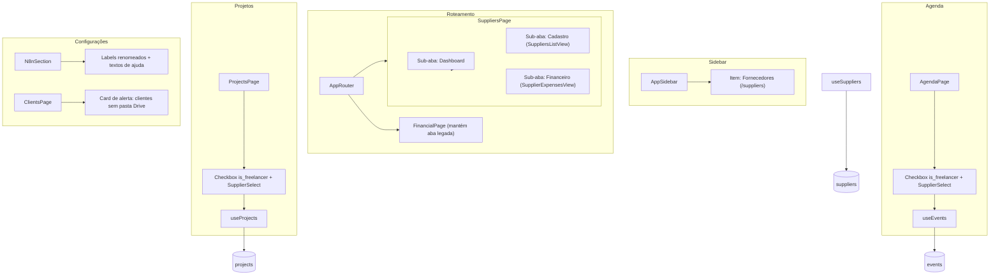

# Design Document — fornecedores-module-improvements

## Overview

Este documento descreve o design técnico para três melhorias no sistema Maestr.IA CRM:

1. **Módulo de Fornecedores independente no Sidebar** — promover a aba de Fornecedores para um módulo de primeiro nível com rota `/suppliers` e sub-abas Dashboard, Cadastro e Financeiro.
2. **Vinculação de Fornecedor em Projetos e Eventos** — quando `is_freelancer = true`, exibir um seletor de fornecedor e persistir `supplier_id` nas tabelas `projects` e `events`.
3. **Clareza nos labels de webhook de Drive + alerta visual** — renomear campos ambíguos na `N8nSection` e exibir um card de alerta para clientes sem pasta Drive criada.

---

## Architecture

### Visão geral dos componentes afetados



### Decisões de design

- **Rota `/suppliers` como módulo independente**: A rota atual `/suppliers` já existe em `App.tsx` como redirect para `/financial?tab=suppliers`. Ela será substituída por uma página própria (`SuppliersModulePage`). A aba legada em `FinancialPage` é mantida com aviso de deprecação para não quebrar bookmarks existentes.
- **Permissão `suppliers` como alias de `clients`**: O enum `permission_module` no banco não será alterado nesta iteração. A rota `/suppliers` continuará mapeada para o módulo `clients` em `ROUTE_TO_MODULE` (já existente em `usePermissions.ts`). Um item dedicado no sidebar será controlado por `useModulePermission("clients")` com um alias visual. Isso evita uma migração de banco para adicionar o enum `suppliers`.
- **`supplier_id` via coluna dedicada**: Adicionar colunas `supplier_id UUID REFERENCES suppliers(id)` nas tabelas `projects` e `events` via migração SQL. Isso é mais limpo do que armazenar em `metadata` e permite queries e índices eficientes.
- **Alerta de Drive na `ClientsPage`**: O alerta segue o padrão do `C8SupportTab` — um card amarelo derivado de uma query que filtra clientes sem `drive_folder_id` em `metadata`. Não requer nova tabela.

---

## Components and Interfaces

### 1. Módulo de Fornecedores no Sidebar

#### `AppSidebar` (modificação)

Adicionar item `{ title: "Fornecedores", url: "/suppliers", icon: Truck, module: "clients" }` imediatamente antes do item `"Financeiro"` na lista `navItems`. O módulo `"clients"` é usado como proxy de permissão (já mapeado para `/suppliers` em `ROUTE_TO_MODULE`).

#### `SuppliersModulePage` (novo componente em `src/pages/SuppliersModulePage.tsx`)

Página principal do módulo. Lê o query param `?tab=` e renderiza a sub-aba correspondente. Redireciona para `?tab=cadastro` quando nenhum tab é especificado.

```typescript
// Interface de props (sem props externas — usa hooks internamente)
// Query params: tab = "dashboard" | "cadastro" | "financeiro"
```

#### `SuppliersDashboardTab` (novo em `src/components/suppliers/SuppliersDashboardTab.tsx`)

Exibe métricas consolidadas:
- Total de fornecedores ativos
- Total de despesas do mês atual
- Top 5 fornecedores por valor de despesa no mês
- Distribuição de despesas por categoria de serviço (gráfico de pizza)

Reutiliza dados de `useSuppliers` e `useSupplierExpenses` já existentes.

#### `SupplierExpensesView` (novo em `src/components/suppliers/SupplierExpensesView.tsx`)

Extrai a visão de despesas de fornecedores atualmente embutida em `FinancialPage` para um componente reutilizável. Usado tanto na sub-aba "Financeiro" do módulo de Fornecedores quanto mantido em `FinancialPage`.

#### `FinancialPage` (modificação mínima)

A aba `suppliers` existente exibirá um `Alert` informando que o módulo foi movido para o menu lateral, com link para `/suppliers`. O conteúdo atual (`SuppliersPage`) é mantido para compatibilidade retroativa.

#### `App.tsx` (modificação)

Substituir o redirect `/suppliers → /financial?tab=suppliers` pela rota real:
```tsx
<Route path="/suppliers" element={<SuppliersModulePage />} />
```

---

### 2. Vinculação de Fornecedor em Projetos e Eventos

#### `SupplierSelect` (novo componente em `src/components/shared/SupplierSelect.tsx`)

Componente de seleção de fornecedor reutilizável. Recebe `organizationId`, `value` e `onChange`. Lista apenas fornecedores com `is_active = true`, ordenados por nome. Inclui opção "Nenhum / Não especificado" (valor `null`).

```typescript
interface SupplierSelectProps {
  organizationId: string;
  value: string | null;
  onChange: (supplierId: string | null) => void;
  disabled?: boolean;
}
```

#### `ProjectsPage` (modificação)

No formulário de criação/edição de projeto, imediatamente após o checkbox `is_freelancer`, renderizar condicionalmente `<SupplierSelect>` quando `form.is_freelancer === true`. Ao desmarcar `is_freelancer`, limpar `form.supplier_id`.

#### `Agenda.tsx` (modificação)

Mesma lógica do `ProjectsPage` aplicada ao formulário de evento.

#### `useProjects` (modificação)

Adicionar `supplier_id?: string | null` à interface `Project` e `Task`. O hook já passa campos extras via spread — nenhuma mudança na lógica de persistência é necessária além de incluir o campo no payload.

#### `useEvents` (modificação)

Adicionar `supplier_id?: string | null` à interface `CalendarEvent` em `useEvents.ts`.

#### `FreelancerBadge` (modificação)

Aceitar prop opcional `supplierName?: string`. Quando fornecida, exibir o nome do fornecedor ao lado do badge.

```typescript
interface FreelancerBadgeProps {
  className?: string;
  supplierName?: string; // novo
}
```

---

### 3. Clareza nos Webhooks de Drive + Alerta

#### `N8nSection` (modificação)

Renomear labels e adicionar textos de ajuda:

| Campo atual | Novo label |
|---|---|
| `Webhook URL: Novos Clientes` | `Webhook URL: Notificação de Novo Cliente (CRM → n8n)` |
| `Webhook URL: Pasta de Clientes` | `Webhook URL: Criação de Pasta no Drive (Clientes)` |

Adicionar parágrafo de ajuda abaixo de cada seção explicando a diferença funcional.

#### `DriveFolderAlert` (novo componente em `src/components/clients/DriveFolderAlert.tsx`)

Card de alerta amarelo (padrão `C8SupportTab`) exibido na `ClientsPage` quando há clientes sem pasta Drive. Visível apenas para `owner`, `admin` e `manager`.

```typescript
interface DriveFolderAlertProps {
  organizationId: string;
  canEdit: boolean; // true para owner/admin/manager
}
```

Internamente faz query em `clients` filtrando por `metadata->>'drive_folder_id' IS NULL` (ou equivalente via JS após fetch). Exibe botão por cliente para acionar `useDriveFolder().triggerFolder({ action: "create", module: "client", record })`.

#### `ClientsPage` (modificação)

Renderizar `<DriveFolderAlert>` no topo da página, condicionado a `isAdminOrOwner || profile?.role === "manager"` e a `driveFolderClientWebhookUrl` estar configurado.

---

## Data Models

### Migração SQL — `supplier_id` em `projects` e `events`

```sql
-- Migração: 00140_supplier_link_projects_events.sql

ALTER TABLE public.projects
  ADD COLUMN IF NOT EXISTS supplier_id UUID REFERENCES public.suppliers(id) ON DELETE SET NULL;

ALTER TABLE public.tasks
  ADD COLUMN IF NOT EXISTS supplier_id UUID REFERENCES public.suppliers(id) ON DELETE SET NULL;

ALTER TABLE public.events
  ADD COLUMN IF NOT EXISTS supplier_id UUID REFERENCES public.suppliers(id) ON DELETE SET NULL;

CREATE INDEX IF NOT EXISTS idx_projects_supplier_id
  ON public.projects (organization_id, supplier_id)
  WHERE supplier_id IS NOT NULL;

CREATE INDEX IF NOT EXISTS idx_events_supplier_id
  ON public.events (organization_id, supplier_id)
  WHERE supplier_id IS NOT NULL;
```

### Tipos TypeScript atualizados

```typescript
// useProjects.ts — Project interface
interface Project {
  // ... campos existentes ...
  is_freelancer?: boolean;
  supplier_id?: string | null; // NOVO
}

// useProjects.ts — Task interface
interface Task {
  // ... campos existentes ...
  is_freelancer?: boolean;
  supplier_id?: string | null; // NOVO
}

// useEvents.ts — CalendarEvent interface
interface CalendarEvent {
  // ... campos existentes ...
  is_freelancer?: boolean;
  supplier_id?: string | null; // NOVO
}
```

### Dados do Dashboard de Fornecedores

O `SuppliersDashboardTab` deriva todas as métricas de queries já existentes:
- `useSuppliers(orgId)` → total de ativos
- `useSupplierExpenses(orgId)` → despesas do mês, top 5, distribuição por categoria

Nenhuma nova tabela ou view é necessária.

### Detecção de clientes sem pasta Drive

A detecção é feita no frontend via filtro sobre os dados já carregados de `useClients`:

```typescript
const clientsWithoutDrive = clients.filter(c => {
  const meta = (c.metadata ?? {}) as Record<string, unknown>;
  const folderId = meta.drive_folder_id ?? meta.drive_folder ?? null;
  return !folderId;
});
```

---

## Correctness Properties

*A property is a characteristic or behavior that should hold true across all valid executions of a system — essentially, a formal statement about what the system should do. Properties serve as the bridge between human-readable specifications and machine-verifiable correctness guarantees.*

### Property 1: Visibilidade do item de Fornecedores segue permissão

*Para qualquer* usuário, o item "Fornecedores" no `AppSidebar` deve ser visível se e somente se o usuário possui permissão `canView` para o módulo `clients` (proxy de permissão para `suppliers`).

**Validates: Requirements 1.7**

---

### Property 2: Query param controla a sub-aba ativa

*Para qualquer* valor válido de `?tab=` (`dashboard`, `cadastro`, `financeiro`), a sub-aba correspondente deve estar ativa e seu conteúdo renderizado. Para qualquer valor inválido ou ausente, a sub-aba `cadastro` deve ser a padrão.

**Validates: Requirements 1.3, 1.10**

---

### Property 3: Dashboard exibe todas as métricas obrigatórias

*Para qualquer* organização com dados de fornecedores, a sub-aba Dashboard deve renderizar os quatro elementos de métrica: total de fornecedores ativos, total de despesas do mês, top 5 fornecedores por valor, e distribuição por categoria.

**Validates: Requirements 1.6**

---

### Property 4: Toggle is_freelancer controla visibilidade do seletor de fornecedor

*Para qualquer* formulário de projeto ou evento, quando `is_freelancer` é marcado como `true`, o campo `SupplierSelect` deve aparecer; quando desmarcado (`false`), o campo deve desaparecer e o valor de `supplier_id` deve ser limpo para `null`.

**Validates: Requirements 2.1, 2.2, 2.3**

---

### Property 5: Seletor lista apenas fornecedores ativos em ordem alfabética

*Para qualquer* organização, o `SupplierSelect` deve listar apenas fornecedores com `is_active = true`, ordenados alfabeticamente por nome, e sempre incluir a opção "Nenhum / Não especificado".

**Validates: Requirements 2.4, 2.5**

---

### Property 6: Persistência de supplier_id em projetos e eventos (round-trip)

*Para qualquer* projeto ou evento salvo com `is_freelancer = true` e um `supplier_id` selecionado, ao recarregar o registro do banco, o `supplier_id` retornado deve ser igual ao que foi salvo.

**Validates: Requirements 2.6, 2.7**

---

### Property 7: Nome do fornecedor exibido junto ao FreelancerBadge

*Para qualquer* projeto ou evento com `supplier_id` preenchido e correspondente a um fornecedor ativo, a renderização do item deve incluir o nome do fornecedor junto ao `FreelancerBadge`.

**Validates: Requirements 2.8**

---

### Property 8: Formulário com is_freelancer=true é válido sem supplier_id

*Para qualquer* projeto ou evento com `is_freelancer = true` e `supplier_id = null`, a operação de salvar deve ser bem-sucedida (sem erro de validação).

**Validates: Requirements 2.10**

---

### Property 9: Clientes sem drive_folder_id são identificados corretamente

*Para qualquer* lista de clientes, um cliente é considerado "sem pasta Drive" se e somente se `metadata.drive_folder_id` e `metadata.drive_folder` estiverem ambos ausentes ou nulos.

**Validates: Requirements 3.4**

---

### Property 10: Alerta exibido quando há clientes sem pasta Drive, com contagem correta

*Para qualquer* conjunto de clientes onde pelo menos um não possui pasta Drive, o card de alerta deve ser exibido com o título contendo a contagem exata de clientes sem pasta, e cada cliente deve aparecer listado com um botão de ação.

**Validates: Requirements 3.5, 3.7, 3.10**

---

### Property 11: Visibilidade do alerta segue o papel do usuário

*Para qualquer* usuário, o alerta de clientes sem pasta Drive deve ser visível se e somente se o papel do usuário for `owner`, `admin` ou `manager`.

**Validates: Requirements 3.6**

---

### Property 12: Após criação de pasta, cliente removido do alerta

*Para qualquer* cliente listado no alerta de "sem pasta Drive", após acionar com sucesso a criação da pasta (webhook retorna sucesso e `metadata.drive_folder_id` é atualizado), o cliente deve ser removido da lista de alertas.

**Validates: Requirements 3.8**

---

## Error Handling

### Módulo de Fornecedores

- Acesso a `/suppliers` sem permissão: `ModuleGuard` redireciona para `/` (comportamento padrão do sistema).
- Falha ao carregar dados do Dashboard: exibir estado de erro com botão de retry via `isError` do React Query.
- Tab inválido na URL: fallback silencioso para `cadastro`.

### Vinculação de Fornecedor

- `supplier_id` referenciando fornecedor inexistente ou inativo: `FreelancerBadge` exibido sem nome (sem erro de interface). A query de fornecedores filtra por `is_active = true`, então o nome simplesmente não será encontrado no mapa local.
- Falha ao salvar projeto/evento com `supplier_id`: o erro já é tratado pelo `useMutation` existente com `toast.error`.
- Fornecedor deletado após vinculação: a FK usa `ON DELETE SET NULL`, então `supplier_id` se torna `null` automaticamente no banco.

### Alerta de Drive

- `driveFolderClientWebhookUrl` não configurado: alerta não é exibido (Requirement 3.9).
- Falha ao acionar webhook de criação de pasta: `toast.error` com mensagem descritiva. O cliente permanece na lista de alertas.
- Falha ao atualizar `metadata` do cliente após criação de pasta: `toast.error`. O alerta pode mostrar o cliente novamente no próximo carregamento.

---

## Testing Strategy

### Abordagem dual: testes unitários + testes de propriedade

**Testes unitários** cobrem exemplos específicos, casos de borda e integrações entre componentes:
- Renderização do item "Fornecedores" no sidebar
- Navegação para `/suppliers` ao clicar no item
- Presença das três sub-abas na `SuppliersModulePage`
- Aviso de deprecação na aba legada do `FinancialPage`
- Labels renomeados na `N8nSection`
- Textos de ajuda presentes na `N8nSection`
- Opção "Nenhum / Não especificado" no `SupplierSelect`
- Alerta oculto quando `driveFolderClientWebhookUrl` não está configurado
- Redirecionamento para `/` quando acesso sem permissão

**Testes de propriedade** verificam propriedades universais com múltiplas entradas geradas:
- Biblioteca: **fast-check** (já utilizada no projeto)
- Mínimo de 100 iterações por teste de propriedade
- Cada teste referencia a propriedade do design com o formato: `Feature: fornecedores-module-improvements, Property N: <texto>`

### Mapeamento de propriedades para testes

| Propriedade | Tipo de teste | Arquivo sugerido |
|---|---|---|
| P1: Visibilidade sidebar segue permissão | property | `AppSidebar.property.test.tsx` |
| P2: Query param controla sub-aba | property | `SuppliersModulePage.property.test.tsx` |
| P3: Dashboard exibe métricas obrigatórias | property | `SuppliersDashboardTab.property.test.tsx` |
| P4: Toggle is_freelancer controla seletor | property | `SupplierSelect.property.test.tsx` |
| P5: Seletor lista apenas ativos em ordem | property | `SupplierSelect.property.test.tsx` |
| P6: Persistência supplier_id round-trip | property | `suppliers.property.test.ts` |
| P7: Nome fornecedor com FreelancerBadge | property | `FreelancerBadge.property.test.tsx` |
| P8: Formulário válido sem supplier_id | property | `suppliers.property.test.ts` |
| P9: Detecção de clientes sem pasta Drive | property | `DriveFolderAlert.property.test.tsx` |
| P10: Alerta com contagem correta | property | `DriveFolderAlert.property.test.tsx` |
| P11: Visibilidade alerta segue papel | property | `DriveFolderAlert.property.test.tsx` |
| P12: Remoção do alerta após criação | property | `DriveFolderAlert.property.test.tsx` |

### Exemplo de estrutura de teste de propriedade

```typescript
// Feature: fornecedores-module-improvements, Property 4: Toggle is_freelancer controla visibilidade do seletor
it("quando is_freelancer é desmarcado, supplier_id é limpo", () => {
  fc.assert(
    fc.property(
      fc.record({ supplierId: fc.uuid(), isFreelancer: fc.constant(true) }),
      ({ supplierId }) => {
        const { result } = renderHook(() => useFreelancerForm());
        act(() => result.current.setIsFreelancer(true));
        act(() => result.current.setSupplierId(supplierId));
        act(() => result.current.setIsFreelancer(false));
        expect(result.current.supplierId).toBeNull();
        expect(result.current.showSupplierSelect).toBe(false);
      }
    ),
    { numRuns: 100 }
  );
});
```
