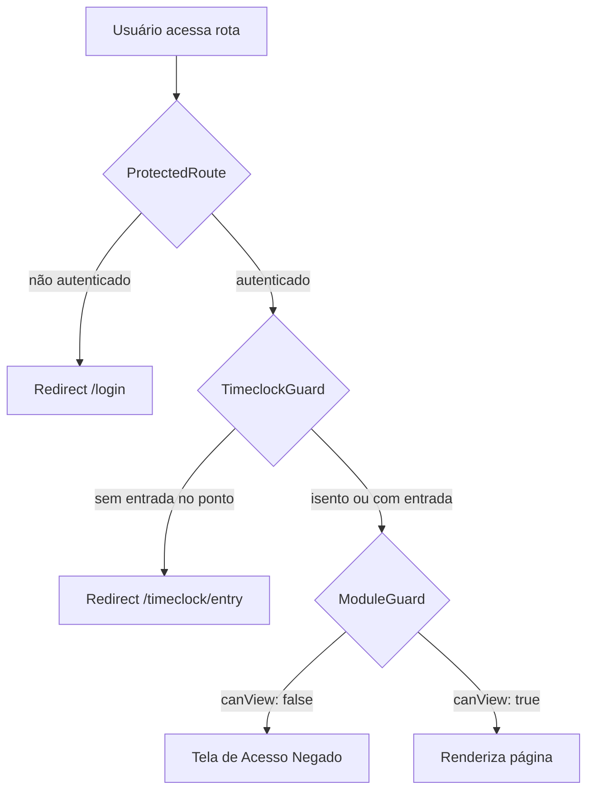
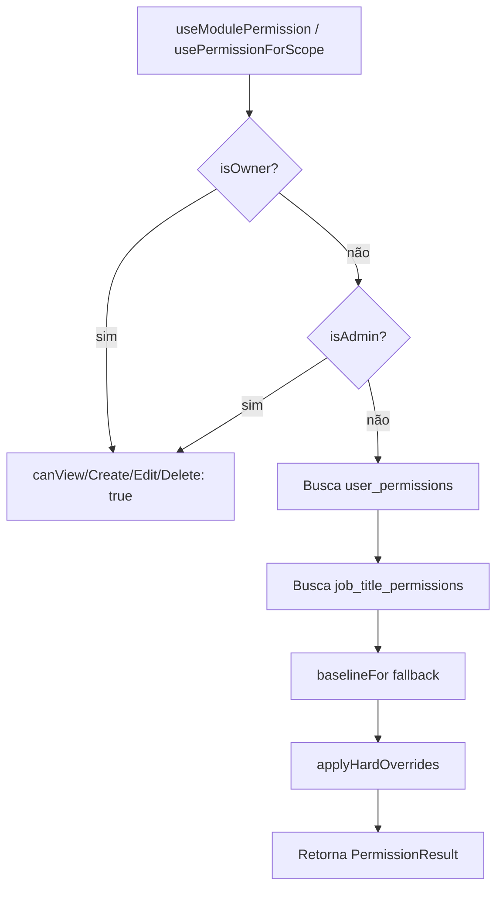

# Design Document — Permission System Migration

## Overview

Este documento descreve o design técnico para migrar todas as verificações de acesso hardcoded baseadas em `user_role` para o sistema de permissões dinâmicas já existente no projeto.

A infraestrutura dinâmica está completa: tabelas `user_permissions`, `job_title_permissions`, `user_permission_scopes`, `job_title_permission_scopes`, hook `usePermissions.ts` com `useModulePermission` e `usePermissionForScope`, e UI em `PermissionsSection.tsx`. O trabalho é cirúrgico: substituir verificações hardcoded pelos hooks corretos, sem alterar a infraestrutura existente.

### Escopo da Migração

Pontos identificados na auditoria do código:

| Arquivo | Tipo | Verificação Atual | Migração |
|---|---|---|---|
| `App.tsx` | route-guard | `requireRole="admin"` em `/team`, `/team/edit/:id`, `/settings` | `ModuleGuard` + `useModulePermission` |
| `App.tsx` | route-guard | `requireRole="manager"` em `/audit` | `ModuleGuard` + `useModulePermission` |
| `TimeclockGuard.tsx` | route-guard | `profile?.role === "owner" \|\| "admin"` | `usePermissionForScope("team", "timeclock")` |
| `TimeclockEntryPage.tsx` | ui-conditional | `profile?.role === "owner" \|\| "admin"` | `usePermissionForScope("team", "timeclock")` |
| `AppSidebar.tsx` | ui-conditional | `isAdmin` para settings e /team | `useModulePermission("settings")`, `useModulePermission("team")` |
| `TeamPage.tsx` | ui-conditional | `isAdmin \|\| profile?.role === "manager"` para payroll | `usePermissionForScope("team", "payroll")` |
| `TeamPage.tsx` | ui-conditional | `isAdmin` para ações de convite | `usePermissionForScope("team", "employees")` |
| `ReportsPage.tsx` | data-fetch-gate + ui-conditional | `isAdmin` para filtros e queries | `usePermissionForScope("financial", "reports")` + `usePermissionForScope("team", "timeclock_edit")` |
| `SettingsPage.tsx` | ui-conditional | `isOwner` para seção de branding | `usePermissionForScope("settings", "general")` |
| `MyProfilePage.tsx` | ui-conditional | `isExempt` para ocultar botão de ponto | `usePermissionForScope("team", "timeclock")` |
| `TimeClockControl.tsx` | ui-conditional + data-fetch-gate | `isAdmin` para filtros e ações | `usePermissionForScope("team", "timeclock_edit")` |
| `TeamProfilesList.tsx` | ui-conditional | `isAdmin` para ações de ponto e edição | `usePermissionForScope("team", "timeclock_edit")`, `usePermissionForScope("team", "employees")` |

---

## Architecture

### Princípio Central

O sistema segue uma hierarquia de resolução de permissões:

```
Owner/Admin → acesso total (hardcoded via applyHardOverrides)
     ↓
user_permissions (override individual)
     ↓
job_title_permissions (permissão do cargo)
     ↓
baselineFor(role, module) (fallback por role)
```

Essa hierarquia já está implementada em `useModulePermission` e `usePermissionForScope`. A migração apenas garante que todos os pontos de verificação usem esses hooks em vez de acessar `profile.role` diretamente.

### Fluxo de Verificação de Rota



### Fluxo de Resolução de Permissão



---

## Components and Interfaces

### Hooks Existentes (sem alteração)

```typescript
// Verifica permissão de módulo completo
useModulePermission(module: PermissionModule | null): PermissionResult & { isAdminOrOwner: boolean }

// Verifica permissão de scope específico dentro de um módulo
usePermissionForScope(module: PermissionModule | null, scope: string | null): PermissionResult & { isAdminOrOwner: boolean }

// Retorna permissão padrão por role (fallback)
baselineFor(role: UserRole, module: PermissionModule | null, scope?: string | null): PermissionResult

// Aplica overrides obrigatórios (ex: settings bloqueado para não-admin)
applyHardOverrides(role, module, scope, perms): PermissionResult
```

### Alterações em App.tsx

Remover `requireRole` das rotas `/team`, `/team/edit/:id`, `/settings` e `/audit`. O `ModuleGuard` já envolve todas essas rotas e usa `useModulePermission` internamente. As rotas ficam apenas com `<ProtectedRoute>` (autenticação básica).

```tsx
// ANTES
<ProtectedRoute requireRole="admin">
  <TeamPage />
</ProtectedRoute>

// DEPOIS — ModuleGuard já cobre via getModuleForRoute("/team") → "team"
<TeamPage />
```

### Alterações em TimeclockGuard.tsx

```tsx
// ANTES
const isExempt = profile?.role === "owner" || profile?.role === "admin";

// DEPOIS
const { canView: isExempt, isLoading: permLoading } = usePermissionForScope("team", "timeclock");
// aguardar permLoading antes de redirecionar
```

### Alterações em AppSidebar.tsx

```tsx
// ANTES
const isAdmin = profile?.role === "admin" || profile?.role === "owner";
if (item.module === "settings") return isAdmin;
if (item.url === "/team") return isAdmin;

// DEPOIS
const { canView: canViewSettings } = useModulePermission("settings");
const { canView: canViewTeam } = useModulePermission("team");
if (item.module === "settings") return canViewSettings;
if (item.url === "/team") return canViewTeam;
```

### Alterações em TeamPage.tsx

```tsx
// ANTES
const isAdmin = profile?.role === "admin" || profile?.role === "owner";
{payrollPermission.canView && (isAdmin || profile?.role === "manager") && ...}

// DEPOIS — payrollPermission já encapsula a lógica de role
{payrollPermission.canView && ...}
```

### Alterações em ReportsPage.tsx

```tsx
// ANTES
const isAdmin = me?.role === "owner" || me?.role === "admin";
if (!isAdmin && me?.id) q = q.eq("user_id", me.id);

// DEPOIS
const { canView: canViewReports, isAdminOrOwner } = usePermissionForScope("financial", "reports");
const { canView: canEditTimeclock } = usePermissionForScope("team", "timeclock_edit");
if (!isAdminOrOwner && me?.id) q = q.eq("user_id", me.id);
// enabled: canViewReports nas queries financeiras
```

### Alterações em TimeclockEntryPage.tsx e MyProfilePage.tsx

```tsx
// ANTES
const isExempt = profile?.role === "owner" || profile?.role === "admin";

// DEPOIS
const { canView: isExempt } = usePermissionForScope("team", "timeclock");
```

### Alterações em TimeClockControl.tsx e TeamProfilesList.tsx

```tsx
// ANTES
const isAdmin = me?.role === "owner" || me?.role === "admin";

// DEPOIS
const { canView: canEditTimeclock, isAdminOrOwner: isAdmin } = usePermissionForScope("team", "timeclock_edit");
```

---

## Data Models

### Tabelas Existentes (sem alteração de schema)

```sql
-- Permissões individuais por usuário
user_permissions (
  id uuid PK,
  user_id uuid FK profiles,
  organization_id uuid FK organizations,
  module permission_module,
  can_view boolean,
  can_create boolean,
  can_edit boolean,
  can_delete boolean
)

-- Permissões por cargo
job_title_permissions (
  id uuid PK,
  organization_id uuid FK organizations,
  job_title text,
  module permission_module,
  can_view boolean,
  can_create boolean,
  can_edit boolean,
  can_delete boolean
)

-- Permissões de scope por usuário
user_permission_scopes (
  id uuid PK,
  user_id uuid FK profiles,
  organization_id uuid FK organizations,
  module permission_module,
  scope text,
  can_view boolean,
  can_create boolean,
  can_edit boolean,
  can_delete boolean
)

-- Permissões de scope por cargo
job_title_permission_scopes (
  id uuid PK,
  organization_id uuid FK organizations,
  job_title text,
  module permission_module,
  scope text,
  can_view boolean,
  can_create boolean,
  can_edit boolean,
  can_delete boolean
)
```

### Enum permission_module

O enum já inclui todos os módulos necessários: `dashboard`, `kanban`, `crm`, `clients`, `financial`, `projects`, `agenda`, `goals`, `whatsapp`, `meetings`, `team`, `settings`, `reports`, `campaigns`, `audit`, `timeclock`, `sales_analytics`.

### Mapeamento de Scopes Relevantes

| Módulo | Scope | Uso |
|---|---|---|
| `team` | `timeclock` | Isenção do controle de ponto |
| `team` | `timeclock_edit` | Editar/excluir registros de ponto |
| `team` | `payroll` | Acesso à folha de pagamento |
| `team` | `employees` | Gerenciar colaboradores |
| `financial` | `reports` | Relatórios financeiros |
| `settings` | `permissions` | Gerenciar cargos e permissões |
| `settings` | `general` | Configurações gerais e branding |

---

## Correctness Properties

*A property is a characteristic or behavior that should hold true across all valid executions of a system — essentially, a formal statement about what the system should do. Properties serve as the bridge between human-readable specifications and machine-verifiable correctness guarantees.*

### Property 1: Owner e Admin têm acesso total irrestrito

*Para qualquer* módulo e qualquer scope, `baselineFor("owner", module, scope)` e `baselineFor("admin", module, scope)` devem retornar `{ canView: true, canCreate: true, canEdit: true, canDelete: true }`.

**Validates: Requirements 2.4, 3.2, 6.3, 8.1**

### Property 2: Route guard usa permissão dinâmica

*Para qualquer* rota mapeada em `ROUTE_TO_MODULE`, um usuário cujo `useModulePermission(module).canView` retorna `false` deve receber a tela de acesso negado, e um usuário com `canView: true` deve ver o conteúdo da rota.

**Validates: Requirements 2.1, 2.2, 2.3**

### Property 3: Isenção do TimeclockGuard via permissão dinâmica

*Para qualquer* usuário com `usePermissionForScope("team", "timeclock").canView === true`, o `TimeclockGuard` não deve redirecionar para `/timeclock/entry`, independente do estado do ponto.

**Validates: Requirements 3.1, 3.3**

### Property 4: UI gate corresponde exatamente ao valor de canView

*Para qualquer* componente migrado e qualquer usuário, um elemento de UI controlado por `canView` deve estar visível se e somente se `canView === true` para aquele usuário naquele módulo/scope.

**Validates: Requirements 4.1, 4.2, 4.3, 4.4, 4.5, 4.6**

### Property 5: Data-fetch gate desabilita queries quando canView é false

*Para qualquer* hook de busca de dados protegido por permissão, quando `canView === false`, o parâmetro `enabled` da query deve ser `false`, impedindo que a requisição seja disparada.

**Validates: Requirements 5.1, 5.2, 5.3**

### Property 6: Fallback para Baseline_Function quando não há permissão explícita

*Para qualquer* usuário sem entrada em `user_permissions` nem em `job_title_permissions` para um módulo, o resultado de `useModulePermission(module)` deve ser igual ao resultado de `baselineFor(profile.role, module)`.

**Validates: Requirements 8.2, 8.5**

### Property 7: RLS bloqueia acesso direto sem permissão

*Para qualquer* usuário sem permissão de leitura em um módulo, uma query direta ao Supabase nas tabelas protegidas por RLS deve retornar erro de autorização ou conjunto vazio.

**Validates: Requirements 7.1, 7.2**

---

## Error Handling

### Loading States

Todos os guards e gates devem aguardar a resolução das queries de permissão antes de tomar decisões de acesso. O padrão é:

```tsx
const { canView, isLoading } = usePermissionForScope("team", "timeclock");

// Aguardar loading antes de redirecionar
if (isLoading) return <LoadingSpinner />;
if (!canView) return <Navigate to="/timeclock/entry" />;
```

Isso evita redirecionamentos incorretos durante o carregamento inicial (Requirement 2.6, 3.4, 5.4).

### Fallback de Segurança

Se `useModulePermission` ou `usePermissionForScope` retornar erro (ex: falha de rede), o comportamento padrão deve ser negar acesso (`canView: false`). Isso garante que falhas de rede não concedam acesso indevido.

### Owner/Admin Exemption

A `applyHardOverrides` garante que mesmo que haja uma entrada incorreta em `user_permissions` negando acesso a um owner, o sistema sempre concede acesso total. Essa lógica está no hook e não deve ser removida.

---

## Testing Strategy

### Abordagem Dual

A estratégia combina testes unitários para casos específicos e testes de propriedade para validação universal.

**Testes unitários** cobrem:
- Redirecionamento de usuário não autenticado para `/login`
- Exibição de loading state durante resolução de permissão
- Comportamento de RLS com políticas existentes (não-regressão)
- Casos de borda: usuário sem cargo, cargo sem permissão configurada

**Testes de propriedade** cobrem:
- Invariantes da `baselineFor` para owner/admin
- Correspondência entre `canView` e visibilidade de UI
- Desabilitação de queries quando `canView === false`
- Fallback correto para `baselineFor` quando não há permissão explícita

### Biblioteca de Property-Based Testing

Usar **fast-check** (já disponível no ecossistema TypeScript/Vitest):

```bash
npm install --save-dev fast-check
```

### Configuração dos Testes de Propriedade

Cada teste de propriedade deve rodar mínimo **100 iterações** e referenciar a propriedade do design:

```typescript
// Feature: permission-system-migration, Property 1: Owner e Admin têm acesso total irrestrito
it("baselineFor owner/admin sempre retorna acesso total", () => {
  fc.assert(
    fc.property(
      fc.constantFrom(...MODULES.map(m => m.id)),
      fc.constantFrom(null, "timeclock", "payroll", "reports", "permissions"),
      (module, scope) => {
        const ownerResult = baselineFor("owner", module, scope);
        const adminResult = baselineFor("admin", module, scope);
        return (
          ownerResult.canView && ownerResult.canCreate && ownerResult.canEdit && ownerResult.canDelete &&
          adminResult.canView && adminResult.canCreate && adminResult.canEdit && adminResult.canDelete
        );
      }
    ),
    { numRuns: 100 }
  );
});
```

```typescript
// Feature: permission-system-migration, Property 6: Fallback para Baseline_Function
it("sem permissão explícita, resultado é igual ao baselineFor", () => {
  fc.assert(
    fc.property(
      fc.constantFrom("member", "manager", "viewer"),
      fc.constantFrom(...MODULES.map(m => m.id)),
      (role, module) => {
        const baseline = baselineFor(role as UserRole, module);
        // Simular hook sem dados em user_permissions nem job_title_permissions
        const result = resolvePermission(role as UserRole, module, [], []);
        return (
          result.canView === baseline.canView &&
          result.canCreate === baseline.canCreate &&
          result.canEdit === baseline.canEdit &&
          result.canDelete === baseline.canDelete
        );
      }
    ),
    { numRuns: 100 }
  );
});
```

```typescript
// Feature: permission-system-migration, Property 5: Data-fetch gate desabilita queries
it("enabled é false quando canView é false", () => {
  fc.assert(
    fc.property(
      fc.boolean(),
      (canView) => {
        const enabled = resolveQueryEnabled(canView);
        return canView ? enabled === true : enabled === false;
      }
    ),
    { numRuns: 100 }
  );
});
```

### Testes Unitários Específicos

```typescript
// Requirement 2.5 — usuário não autenticado redireciona para /login
it("ProtectedRoute redireciona para /login quando não autenticado", () => {
  // render ProtectedRoute sem user no AuthContext
  // expect Navigate to="/login"
});

// Requirement 2.6 / 3.4 — loading state não redireciona prematuramente
it("TimeclockGuard não redireciona enquanto permissão está carregando", () => {
  // mock usePermissionForScope retornando isLoading: true
  // expect nenhum navigate chamado
});

// Requirement 7.3 — não-regressão de RLS existente
it("RLS de supplier_expenses bloqueia acesso de usuário de outra organização", async () => {
  // query direta com usuário de org diferente
  // expect data vazio ou erro de autorização
});
```
