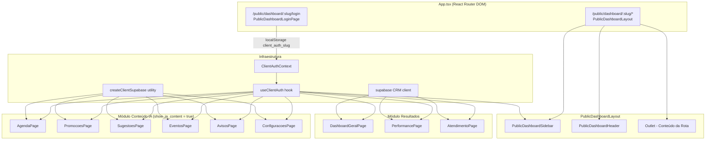
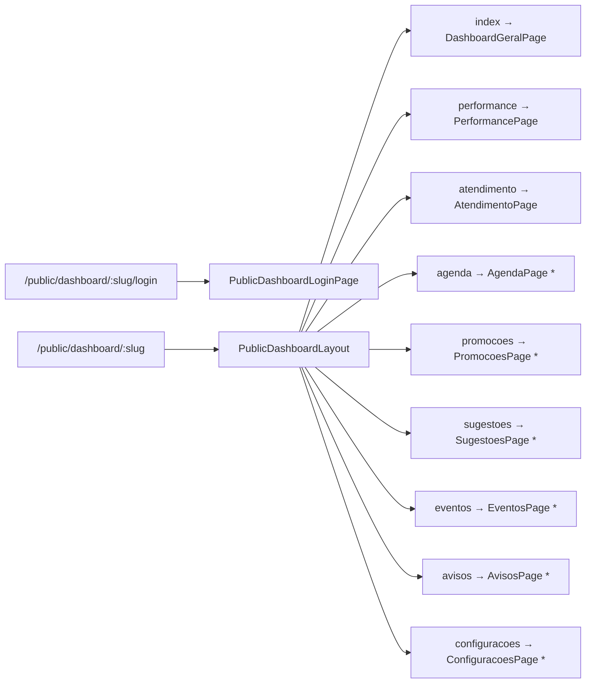
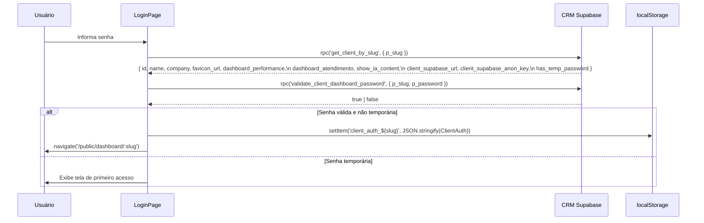
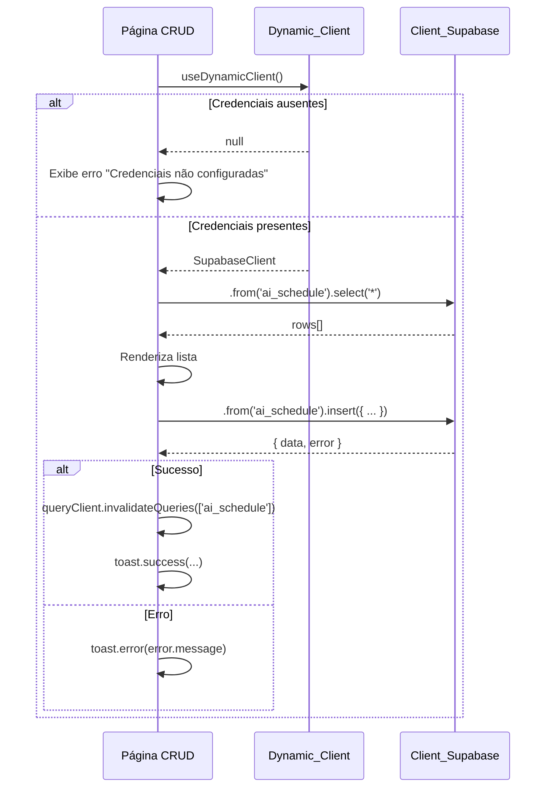
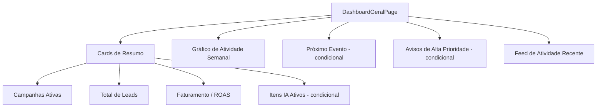

# Documento de Design: public-dashboard-ia-content

## Visão Geral

O Dashboard Público (`/public/dashboard/:slug`) evolui de uma página monolítica com abas para um sistema multi-rota com layout de sidebar colapsável. A mudança central é a adição do **Módulo Conteúdo IA**: clientes com `show_ia_content = true` passam a gerenciar agenda musical, promoções, sugestões, eventos especiais, avisos e configurações do agente de IA — tudo armazenado no Supabase próprio do cliente (Dynamic_Client), isolado do banco do CRM.

A implementação reutiliza o stack existente (React 18 + TypeScript, React Router DOM v6, Tailwind CSS, shadcn/ui, @tanstack/react-query, @supabase/supabase-js, Sonner, Lucide React) e adapta os padrões visuais do projeto de referência `Novo Public Dashboard/` para o contexto do CRM, descartando o projeto de referência após a implementação.


## Arquitetura Geral

### Diagrama de Componentes




### Princípios de Arquitetura

- **Isolamento de dados**: O Dynamic_Client (Supabase do cliente) é criado em runtime e nunca substitui o `supabase` singleton do CRM.
- **Auth sem Supabase Auth**: O mecanismo de autenticação permanece baseado em `localStorage` com a chave `client_auth_${slug}`. Nenhuma sessão Supabase é criada para o cliente do dashboard.
- **Guard de rota no layout**: O `PublicDashboardLayout` é o único ponto de verificação de autenticação e de permissão `show_ia_content`. Não há guards duplicados nas páginas filhas.
- **Context sobre prop drilling**: O `ClientAuthContext` distribui os dados do cliente autenticado para toda a árvore de rotas, evitando leitura repetida do `localStorage`.
- **React Query para dados remotos**: Todas as chamadas ao CRM Supabase e ao Dynamic_Client usam `useQuery` / `useMutation` do `@tanstack/react-query` para cache, loading states e invalidação.

---

## Nova Estrutura de Rotas

### Registro em App.tsx

As rotas do Dashboard Público são reorganizadas para usar um componente de layout compartilhado. A rota de login permanece fora do layout.



`* Requer show_ia_content = true`

### Trecho de App.tsx (modificado)

```typescript
// Rotas do Dashboard Público — ANTES (monolítico):
<Route path="/public/dashboard/:slug" element={<PublicDashboardPage />} />
<Route path="/public/dashboard/:slug/login" element={<PublicDashboardLoginPage />} />

// Rotas do Dashboard Público — DEPOIS (multi-rota com layout):
<Route path="/public/dashboard/:slug/login" element={<PublicDashboardLoginPage />} />
<Route path="/public/dashboard/:slug" element={<PublicDashboardLayout />}>
  <Route index element={<DashboardGeralPage />} />
  <Route path="performance" element={<PerformancePage />} />
  <Route path="atendimento" element={<AtendimentoPage />} />
  <Route path="agenda" element={<AgendaPage />} />
  <Route path="promocoes" element={<PromocoesPage />} />
  <Route path="sugestoes" element={<SugestoesPage />} />
  <Route path="eventos" element={<EventosPage />} />
  <Route path="avisos" element={<AvisosPage />} />
  <Route path="configuracoes" element={<ConfiguracoesPage />} />
</Route>
```


---

## ClientAuthContext e Hook

### Interface ClientAuth

```typescript
// src/contexts/ClientAuthContext.tsx

export interface ClientAuth {
  id: string;
  organization_id: string;
  name: string;
  company: string | null;
  favicon_url: string | null;
  authenticated: true;
  show_ia_content: boolean;
  client_supabase_url: string | null;
  client_supabase_anon_key: string | null;
  metadata: {
    dashboard_performance: boolean;
    dashboard_atendimento: boolean;
  };
}
```

### ClientAuthContext

```typescript
interface ClientAuthContextValue {
  auth: ClientAuth | null;
  slug: string;
  setAuth: (auth: ClientAuth) => void;
  logout: () => void;
}

export const ClientAuthContext = createContext<ClientAuthContextValue | null>(null);

export function ClientAuthProvider({ children, slug }: { children: ReactNode; slug: string }) {
  const navigate = useNavigate();
  const [auth, setAuthState] = useState<ClientAuth | null>(() => {
    const raw = localStorage.getItem(`client_auth_${slug}`);
    return raw ? JSON.parse(raw) : null;
  });

  const setAuth = (newAuth: ClientAuth) => {
    localStorage.setItem(`client_auth_${slug}`, JSON.stringify(newAuth));
    setAuthState(newAuth);
  };

  const logout = () => {
    localStorage.removeItem(`client_auth_${slug}`);
    setAuthState(null);
    navigate(`/public/dashboard/${slug}/login`);
  };

  return (
    <ClientAuthContext.Provider value={{ auth, slug, setAuth, logout }}>
      {children}
    </ClientAuthContext.Provider>
  );
}
```

### Hook useClientAuth

```typescript
// src/hooks/useClientAuth.ts
export function useClientAuth() {
  const ctx = useContext(ClientAuthContext);
  if (!ctx) throw new Error("useClientAuth deve ser usado dentro de ClientAuthProvider");
  return ctx;
}
```

O `ClientAuthProvider` é instanciado dentro do `PublicDashboardLayout`, recebendo o `slug` do `useParams`. Isso garante que o contexto só existe nas rotas do dashboard público.


---

## PublicDashboardLayout

### Responsabilidades

1. Instanciar o `ClientAuthProvider` com o `slug` da URL.
2. Verificar autenticação: se `auth === null`, redirecionar para `/public/dashboard/:slug/login`.
3. Re-buscar dados frescos via RPC `get_client_by_slug` ao montar, atualizando o `ClientAuth` no contexto e no `localStorage` com os campos mais recentes (`show_ia_content`, `client_supabase_url`, `client_supabase_anon_key`).
4. Gerenciar o timer de auto-logout (30 minutos de inatividade).
5. Renderizar o layout: `SidebarProvider > PublicDashboardSidebar + SidebarInset > PublicDashboardHeader + main > Outlet`.
6. Verificar guard de rota IA: se a rota atual é uma rota de Conteúdo IA e `show_ia_content = false`, redirecionar para `/public/dashboard/:slug`.

### Estrutura do Componente

```typescript
// src/pages/public-dashboard/PublicDashboardLayout.tsx

export function PublicDashboardLayout() {
  const { slug } = useParams<{ slug: string }>();
  const navigate = useNavigate();
  const location = useLocation();

  // Lê auth do localStorage para verificação inicial (antes do contexto)
  const rawAuth = localStorage.getItem(`client_auth_${slug}`);
  if (!rawAuth) {
    return <Navigate to={`/public/dashboard/${slug}/login`} replace />;
  }

  return (
    <ClientAuthProvider slug={slug!}>
      <PublicDashboardLayoutInner slug={slug!} />
    </ClientAuthProvider>
  );
}

function PublicDashboardLayoutInner({ slug }: { slug: string }) {
  const { auth, setAuth, logout } = useClientAuth();
  const navigate = useNavigate();
  const location = useLocation();

  // Guard: rota IA sem permissão
  const IA_ROUTES = ["/agenda", "/promocoes", "/sugestoes", "/eventos", "/avisos", "/configuracoes"];
  const isIaRoute = IA_ROUTES.some(r => location.pathname.endsWith(r));
  if (isIaRoute && !auth?.show_ia_content) {
    return <Navigate to={`/public/dashboard/${slug}`} replace />;
  }

  // Re-fetch dados frescos do cliente
  useEffect(() => {
    if (!auth) return;
    supabase.rpc('get_client_by_slug', { p_slug: slug }).then(({ data }) => {
      if (data && data.length > 0) {
        const fresh = data[0];
        setAuth({
          ...auth,
          show_ia_content: fresh.show_ia_content ?? false,
          client_supabase_url: fresh.client_supabase_url ?? null,
          client_supabase_anon_key: fresh.client_supabase_anon_key ?? null,
          favicon_url: fresh.favicon_url ?? auth.favicon_url,
          metadata: {
            dashboard_performance: fresh.dashboard_performance ?? true,
            dashboard_atendimento: fresh.dashboard_atendimento ?? false,
          },
        });
      }
    });
  }, [slug]);

  // Auto-logout por inatividade (30 min)
  useEffect(() => {
    const TIMEOUT = 30 * 60 * 1000;
    let timer: ReturnType<typeof setTimeout>;
    const reset = () => { clearTimeout(timer); timer = setTimeout(logout, TIMEOUT); };
    const events = ["mousedown", "mousemove", "keypress", "scroll", "touchstart"];
    events.forEach(e => window.addEventListener(e, reset));
    reset();
    return () => { clearTimeout(timer); events.forEach(e => window.removeEventListener(e, reset)); };
  }, [logout]);

  return (
    <SidebarProvider>
      <div className="flex min-h-screen w-full bg-[#0F172A]">
        <PublicDashboardSidebar />
        <SidebarInset className="flex min-w-0 flex-1 flex-col">
          <PublicDashboardHeader />
          <main className="flex-1 px-4 py-6 md:px-8 md:py-8">
            <Outlet />
          </main>
        </SidebarInset>
      </div>
    </SidebarProvider>
  );
}
```


---

## PublicDashboardSidebar

### Grupos de Navegação

```typescript
// src/pages/public-dashboard/PublicDashboardSidebar.tsx

const RESULTADOS_NAV = [
  { title: "Dashboard Geral", url: "",           icon: LayoutDashboard },
  { title: "Performance",     url: "performance", icon: BarChart3 },
  { title: "Atendimento",     url: "atendimento", icon: MessageCircle },
];

const IA_NAV = [
  { title: "Agenda Musical",     url: "agenda",        icon: Music2 },
  { title: "Promoções",          url: "promocoes",     icon: Tag },
  { title: "Sugestões da Semana",url: "sugestoes",     icon: UtensilsCrossed },
  { title: "Eventos Especiais",  url: "eventos",       icon: CalendarDays },
  { title: "Avisos",             url: "avisos",        icon: Megaphone },
  { title: "Configurações",      url: "configuracoes", icon: Settings },
];
```

### Estrutura do Componente

```typescript
export function PublicDashboardSidebar() {
  const { auth, slug } = useClientAuth();
  const { state } = useSidebar();
  const collapsed = state === "collapsed";
  const location = useLocation();

  const isActive = (url: string) => {
    const full = `/public/dashboard/${slug}${url ? `/${url}` : ""}`;
    return url === "" ? location.pathname === full : location.pathname === full;
  };

  return (
    <Sidebar collapsible="icon" className="border-r border-slate-800 bg-[#0F172A]">
      <SidebarHeader className="border-b border-slate-800">
        {/* Logo / favicon do cliente */}
        <div className="flex items-center gap-3 px-2 py-3">
          
          {!collapsed && (
            <div className="min-w-0">
              <p className="text-sm font-semibold text-white truncate">{auth?.company || auth?.name}</p>
              <p className="text-xs text-slate-500">Dashboard</p>
            </div>
          )}
        </div>
      </SidebarHeader>

      <SidebarContent>
        {/* Grupo Resultados */}
        <SidebarGroup>
          {!collapsed && <SidebarGroupLabel className="text-slate-500">Resultados</SidebarGroupLabel>}
          <SidebarGroupContent>
            <SidebarMenu>
              {RESULTADOS_NAV.map(item => (
                <SidebarMenuItem key={item.title}>
                  <SidebarMenuButton asChild isActive={isActive(item.url)} tooltip={item.title}>
                    <Link to={`/public/dashboard/${slug}${item.url ? `/${item.url}` : ""}`}>
                      <item.icon className="h-4 w-4" />
                      <span>{item.title}</span>
                    </Link>
                  </SidebarMenuButton>
                </SidebarMenuItem>
              ))}
            </SidebarMenu>
          </SidebarGroupContent>
        </SidebarGroup>

        {/* Grupo Conteúdo IA — condicional */}
        {auth?.show_ia_content && (
          <SidebarGroup>
            {!collapsed && <SidebarGroupLabel className="text-slate-500">Conteúdo IA</SidebarGroupLabel>}
            <SidebarGroupContent>
              <SidebarMenu>
                {IA_NAV.map(item => (
                  <SidebarMenuItem key={item.title}>
                    <SidebarMenuButton asChild isActive={isActive(item.url)} tooltip={item.title}>
                      <Link to={`/public/dashboard/${slug}/${item.url}`}>
                        <item.icon className="h-4 w-4" />
                        <span>{item.title}</span>
                      </Link>
                    </SidebarMenuButton>
                  </SidebarMenuItem>
                ))}
              </SidebarMenu>
            </SidebarGroupContent>
          </SidebarGroup>
        )}
      </SidebarContent>

      <SidebarFooter className="border-t border-slate-800">
        {/* Nome do cliente + indicador de sessão */}
        {!collapsed ? (
          <div className="flex items-center gap-2 px-2 py-2">
            <span className="relative flex h-2 w-2">
              <span className="absolute inline-flex h-full w-full animate-ping rounded-full bg-emerald-400 opacity-75" />
              <span className="relative inline-flex h-2 w-2 rounded-full bg-emerald-400" />
            </span>
            <span className="text-xs text-slate-400 truncate">{auth?.name}</span>
          </div>
        ) : (
          <div className="flex justify-center py-2">
            <span className="h-2 w-2 rounded-full bg-emerald-400" />
          </div>
        )}
      </SidebarFooter>
    </Sidebar>
  );
}
```


---

## PublicDashboardHeader

O header é extraído do `PublicDashboardPage.tsx` atual e adaptado para o novo layout. Ele contém o `PeriodDropdown` (para as páginas de Resultados) e o menu de perfil (alterar senha, encerrar sessão).

```typescript
// src/pages/public-dashboard/PublicDashboardHeader.tsx

export function PublicDashboardHeader() {
  const { auth, slug, logout } = useClientAuth();
  const location = useLocation();
  const [showPasswordDialog, setShowPasswordDialog] = useState(false);

  // PeriodDropdown só aparece nas rotas de Resultados
  const isResultadosRoute = [
    `/public/dashboard/${slug}`,
    `/public/dashboard/${slug}/performance`,
    `/public/dashboard/${slug}/atendimento`,
  ].includes(location.pathname);

  return (
    <header className="flex items-center justify-between gap-4 border-b border-slate-800 px-4 py-3 md:px-8">
      <SidebarTrigger className="text-slate-400 hover:text-white" />
      <div className="flex items-center gap-3 ml-auto">
        {isResultadosRoute && <PeriodDropdown />}
        <ProfileMenu onChangePassword={() => setShowPasswordDialog(true)} onLogout={logout} auth={auth} />
      </div>
      <ChangePasswordDialog open={showPasswordDialog} onOpenChange={setShowPasswordDialog} slug={slug} />
    </header>
  );
}
```

O `PeriodDropdown` e seu estado (`dateRange`) precisam ser acessíveis pelas páginas de Resultados. A solução é elevar o estado para o `PublicDashboardLayout` e passá-lo via contexto ou props. Uma alternativa mais simples é usar `useSearchParams` para persistir o período na URL, tornando-o compartilhável.

**Decisão de design**: usar `useSearchParams` com parâmetros `from` e `to` na URL. As páginas de Resultados leem esses parâmetros diretamente. O `PeriodDropdown` atualiza os search params ao mudar o período.

---

## Dynamic Supabase Client

### Função createClientSupabase

```typescript
// src/lib/createClientSupabase.ts
import { createClient, SupabaseClient } from "@supabase/supabase-js";

// Cache em memória para evitar recriar o cliente a cada render
const clientCache = new Map<string, SupabaseClient>();

export function createClientSupabase(url: string, key: string): SupabaseClient {
  const cacheKey = `${url}::${key}`;
  if (clientCache.has(cacheKey)) {
    return clientCache.get(cacheKey)!;
  }
  const client = createClient(url, key, {
    auth: { persistSession: false, autoRefreshToken: false },
  });
  clientCache.set(cacheKey, client);
  return client;
}
```

**Notas de implementação**:
- `persistSession: false` — o Dynamic_Client não deve criar sessões de auth no Supabase do cliente.
- O cache por `url::key` evita instâncias duplicadas entre re-renders.
- O Dynamic_Client usa a `anon key` do cliente, portanto as políticas RLS do Client_Supabase devem permitir acesso público (ver Migration SQL).

### Hook useDynamicClient

```typescript
// src/hooks/useDynamicClient.ts
export function useDynamicClient(): SupabaseClient | null {
  const { auth } = useClientAuth();
  if (!auth?.client_supabase_url || !auth?.client_supabase_anon_key) return null;
  return createClientSupabase(auth.client_supabase_url, auth.client_supabase_anon_key);
}
```

As páginas de Conteúdo IA chamam `useDynamicClient()`. Se retornar `null`, exibem um estado de erro informando que as credenciais não estão configuradas.


---

## Fluxo de Login (Atualizado)



### Objeto ClientAuth salvo no localStorage (novo formato)

```typescript
{
  id: "uuid",
  organization_id: "uuid",
  name: "Nome do Cliente",
  company: "Empresa Ltda",
  favicon_url: "https://...",
  authenticated: true,
  show_ia_content: true,
  client_supabase_url: "https://xxx.supabase.co",
  client_supabase_anon_key: "eyJ...",
  metadata: {
    dashboard_performance: true,
    dashboard_atendimento: false,
  }
}
```

---

## Fluxo de Operação CRUD (Dynamic_Client)




---

## Dashboard Geral (DashboardGeralPage)

### Estrutura da Página



### Fontes de Dados

| Seção | Fonte | Condição |
|---|---|---|
| Campanhas Ativas | CRM Supabase — `campaign_data` | Sempre |
| Total de Leads | CRM Supabase — `campaign_data` | Sempre |
| Faturamento / ROAS | CRM Supabase — `client_kpis` | Sempre |
| Itens IA por categoria | Dynamic_Client — 5 tabelas (count) | `show_ia_content = true` |
| Gráfico semanal | CRM Supabase — `campaign_data` (últimos 7 dias) | Sempre |
| Próximo evento | Dynamic_Client — `ai_schedule` | `show_ia_content = true` |
| Avisos alta prioridade | Dynamic_Client — `ai_notices` | `show_ia_content = true` |
| Feed de atividade | Estático / últimas mutações em cache | Sempre |

### Contagem de Itens IA Ativos

Para os cards de contagem, são feitas 5 queries paralelas ao Dynamic_Client usando `useQueries` do React Query:

```typescript
const counts = useQueries({
  queries: [
    { queryKey: ['count', 'ai_schedule'],    queryFn: () => dc.from('ai_schedule').select('id', { count: 'exact', head: true }).eq('status', 'active') },
    { queryKey: ['count', 'ai_promotions'],  queryFn: () => dc.from('ai_promotions').select('id', { count: 'exact', head: true }).eq('status', 'active') },
    { queryKey: ['count', 'ai_suggestions'], queryFn: () => dc.from('ai_suggestions').select('id', { count: 'exact', head: true }).eq('status', 'active') },
    { queryKey: ['count', 'ai_events'],      queryFn: () => dc.from('ai_events').select('id', { count: 'exact', head: true }) },
    { queryKey: ['count', 'ai_notices'],     queryFn: () => dc.from('ai_notices').select('id', { count: 'exact', head: true }).eq('status', 'active') },
  ],
  enabled: !!dc,
});
```

---

## Padrão CRUD das Páginas de Conteúdo IA

Todas as 5 páginas CRUD (Agenda, Promoções, Sugestões, Eventos, Avisos) seguem o mesmo padrão estrutural:

### Estrutura Padrão

```typescript
// Exemplo: AgendaPage
export function AgendaPage() {
  const dc = useDynamicClient();
  const queryClient = useQueryClient();

  // 1. Guard de credenciais
  if (!dc) return <CredentialsErrorState />;

  // 2. Query de listagem
  const { data: items = [], isLoading } = useQuery({
    queryKey: ['ai_schedule'],
    queryFn: () => dc.from('ai_schedule').select('*').order('date', { ascending: true }).then(r => r.data ?? []),
  });

  // 3. Mutations
  const createMutation = useMutation({
    mutationFn: (values: CreateScheduleInput) => dc.from('ai_schedule').insert(values).throwOnError(),
    onSuccess: () => { queryClient.invalidateQueries({ queryKey: ['ai_schedule'] }); toast.success('Evento criado!'); },
    onError: (e) => toast.error(e.message),
  });

  const updateMutation = useMutation({ /* similar */ });
  const deleteMutation = useMutation({ /* similar */ });
  const toggleStatusMutation = useMutation({
    mutationFn: ({ id, status }: { id: string; status: 'active' | 'inactive' }) =>
      dc.from('ai_schedule').update({ status }).eq('id', id).throwOnError(),
    onSuccess: () => queryClient.invalidateQueries({ queryKey: ['ai_schedule'] }),
    onError: (e) => toast.error(e.message),
  });

  // 4. Estado do dialog
  const [dialogOpen, setDialogOpen] = useState(false);
  const [editingItem, setEditingItem] = useState<ScheduleItem | null>(null);

  return (
    <div className="mx-auto flex max-w-7xl flex-col gap-6">
      <PageHeader title="Agenda Musical" action={<Button onClick={() => { setEditingItem(null); setDialogOpen(true); }}>Adicionar Evento</Button>} />
      <DataTable items={items} isLoading={isLoading} onEdit={...} onDelete={...} onToggleStatus={...} />
      <ScheduleFormDialog open={dialogOpen} item={editingItem} onSubmit={...} onClose={...} />
      <DeleteConfirmDialog />
    </div>
  );
}
```

### Componentes Compartilhados entre CRUDs

- `PageHeader` — título + botão de ação primária
- `StatusBadge` — badge visual para status ativo/inativo
- `CredentialsErrorState` — estado de erro quando Dynamic_Client é null
- `DeleteConfirmDialog` — dialog de confirmação de exclusão reutilizável
- `DataTable` — tabela responsiva (desktop) + cards (mobile)


### Campos por Página CRUD

| Página | Tabela | Campos do Formulário | Campo de Status |
|---|---|---|---|
| Agenda Musical | `ai_schedule` | artista*, data*, horário*, descrição, status inicial | `status` (active/inactive) |
| Promoções | `ai_promotions` | título*, descrição, validade, tipo, status inicial | `status` (active/inactive) |
| Sugestões | `ai_suggestions` | nome*, descrição, preço (numérico), URL de imagem, status inicial | `status` (active/inactive) |
| Eventos Especiais | `ai_events` | título*, descrição, data*, horário, localização | — (sem toggle de status) |
| Avisos | `ai_notices` | mensagem*, prioridade* (alta/média/baixa), validade, status inicial | `status` (active/inactive) |

`* campo obrigatório`

### Diferenciação Visual de Prioridade (Avisos)

```typescript
const PRIORITY_STYLES = {
  alta:  "border-l-4 border-red-500    bg-red-500/10",
  média: "border-l-4 border-yellow-500 bg-yellow-500/10",
  baixa: "border-l-4 border-slate-500  bg-slate-500/10",
};
```

---

## ConfiguracoesPage

### Padrão Upsert

A página de configurações usa upsert porque a tabela `ai_settings` pode ter 0 ou 1 registro por cliente.

```typescript
export function ConfiguracoesPage() {
  const dc = useDynamicClient();
  const queryClient = useQueryClient();

  if (!dc) return <CredentialsErrorState />;

  const { data: settings, isLoading } = useQuery({
    queryKey: ['ai_settings'],
    queryFn: async () => {
      const { data } = await dc.from('ai_settings').select('*').limit(1).maybeSingle();
      return data;
    },
  });

  const saveMutation = useMutation({
    mutationFn: async (values: SettingsFormValues) => {
      const { error } = await dc.from('ai_settings').upsert({
        ...values,
        id: settings?.id ?? undefined, // se existir, atualiza; senão, insere
        updated_at: new Date().toISOString(),
      });
      if (error) throw error;
    },
    onSuccess: () => {
      queryClient.invalidateQueries({ queryKey: ['ai_settings'] });
      toast.success('Configurações salvas com sucesso!');
    },
    onError: (e) => toast.error(e.message),
  });

  // Formulário com react-hook-form + zod
  const form = useForm<SettingsFormValues>({
    defaultValues: settings ?? DEFAULT_SETTINGS,
  });

  // Sincroniza form quando dados chegam
  useEffect(() => { if (settings) form.reset(settings); }, [settings]);

  return (/* ... */);
}
```


---

## PerformancePage e AtendimentoPage

### Estratégia de Migração

O conteúdo atual do `PublicDashboardPage.tsx` é dividido em dois componentes:

- **PerformancePage** (`src/pages/public-dashboard/PerformancePage.tsx`): todo o JSX e lógica referente à aba `"performance"` — métricas de anúncios, evolução diária, funil de conversão, top campanhas, KPIs, impacto da parceria, tabela comparativa.
- **AtendimentoPage** (`src/pages/public-dashboard/AtendimentoPage.tsx`): todo o JSX e lógica referente à aba `"atendimento"` — componente `ConversationKpiDashboard`.

O `PublicDashboardPage.tsx` original é **mantido temporariamente** durante a migração e depois removido. As páginas novas recebem os dados via `useClientAuth()` (para `clientData`) e via `useSearchParams()` (para `dateRange`).

### Preservação do PeriodDropdown

O `PeriodDropdown` é movido para o `PublicDashboardHeader` e seu estado (`dateRange`) é gerenciado via `useSearchParams`:

```typescript
// No header:
const [searchParams, setSearchParams] = useSearchParams();
const dateRange = {
  from: searchParams.get('from') ?? format(subDays(new Date(), 30), 'yyyy-MM-dd'),
  to:   searchParams.get('to')   ?? format(new Date(), 'yyyy-MM-dd'),
};
const handlePeriodChange = (range: DateRange) => {
  setSearchParams({ from: range.from, to: range.to });
};
```

As páginas de Performance e Atendimento leem `useSearchParams()` diretamente para obter o período.

---

## Alterações no ClientIntegrationsTab

### Nova Seção "Conteúdo IA"

A seção é adicionada após a seção "Módulos do Dashboard" existente, dentro do mesmo bloco `p-6 border rounded-xl bg-slate-50/50`.

```typescript
// Novos estados locais
const [showIaContent, setShowIaContent] = useState(false);
const [clientSupabaseUrl, setClientSupabaseUrl] = useState("");
const [clientSupabaseKey, setClientSupabaseKey] = useState("");
const [testingConnection, setTestingConnection] = useState(false);
const [migrationSqlCopied, setMigrationSqlCopied] = useState(false);

// Carregamento dos novos campos no useEffect existente
// Adicionar ao fetchClient():
setShowIaContent(!!(data as any).show_ia_content);
setClientSupabaseUrl((data as any).client_supabase_url || "");
setClientSupabaseKey((data as any).client_supabase_anon_key || "");

// Validação no handleSaveDashboard():
if (showIaContent && (!clientSupabaseUrl.trim() || !clientSupabaseKey.trim())) {
  toast.error("URL e chave do Supabase são obrigatórias para habilitar o Conteúdo IA.");
  return;
}

// Persistência no handleSaveDashboard():
await supabase.from("clients").update({
  show_ia_content: showIaContent,
  client_supabase_url: clientSupabaseUrl.trim() || null,
  client_supabase_anon_key: clientSupabaseKey.trim() || null,
}).eq("id", clientId);
```

### Botão "Testar Conexão"

```typescript
const handleTestConnection = async () => {
  if (!clientSupabaseUrl.trim() || !clientSupabaseKey.trim()) {
    toast.error("Preencha a URL e a chave antes de testar.");
    return;
  }
  setTestingConnection(true);
  try {
    const testClient = createClientSupabase(clientSupabaseUrl.trim(), clientSupabaseKey.trim());
    const { error } = await testClient.from('ai_settings').select('id').limit(1);
    if (error) throw error;
    toast.success("Conexão estabelecida com sucesso!");
  } catch (err: any) {
    toast.error(`Falha na conexão: ${err.message}`);
  } finally {
    setTestingConnection(false);
  }
};
```

### Exibição do Migration SQL

O SQL de migration é exibido em um `<pre>` com botão de cópia, dentro de um `<details>` colapsável para não poluir a interface.


---

## Alterações no Banco de Dados

### Migration CRM (ALTER TABLE clients)

```sql
-- migrations/027_add_ia_content_fields_to_clients.sql

ALTER TABLE public.clients
  ADD COLUMN IF NOT EXISTS client_supabase_url      TEXT,
  ADD COLUMN IF NOT EXISTS client_supabase_anon_key TEXT,
  ADD COLUMN IF NOT EXISTS show_ia_content          BOOLEAN NOT NULL DEFAULT false;

COMMENT ON COLUMN public.clients.client_supabase_url      IS 'URL do projeto Supabase próprio do cliente para o módulo Conteúdo IA';
COMMENT ON COLUMN public.clients.client_supabase_anon_key IS 'Chave anon do projeto Supabase próprio do cliente';
COMMENT ON COLUMN public.clients.show_ia_content          IS 'Habilita o módulo Conteúdo IA no Dashboard Público';
```

### RPC get_client_by_slug (atualizada)

```sql
-- supabase/migrations/00068_get_client_by_slug_with_ia_fields.sql

DROP FUNCTION IF EXISTS public.get_client_by_slug(TEXT);

CREATE OR REPLACE FUNCTION public.get_client_by_slug(p_slug TEXT)
RETURNS TABLE (
    id                      UUID,
    name                    VARCHAR,
    company                 VARCHAR,
    dashboard_slug          TEXT,
    has_temp_password       BOOLEAN,
    organization_id         UUID,
    favicon_url             TEXT,
    dashboard_performance   BOOLEAN,
    dashboard_atendimento   BOOLEAN,
    show_ia_content         BOOLEAN,
    client_supabase_url     TEXT,
    client_supabase_anon_key TEXT
)
LANGUAGE plpgsql
SECURITY DEFINER
SET search_path = public, pg_temp
AS $$
BEGIN
    RETURN QUERY
    SELECT
        c.id,
        c.name,
        c.company,
        c.dashboard_slug,
        COALESCE((c.metadata->>'is_temp_password')::BOOLEAN, false)       AS has_temp_password,
        c.organization_id,
        COALESCE((o.settings->>'favicon_url')::TEXT, NULL)                AS favicon_url,
        COALESCE((c.metadata->>'dashboard_performance')::BOOLEAN, true)   AS dashboard_performance,
        COALESCE((c.metadata->>'dashboard_atendimento')::BOOLEAN, false)  AS dashboard_atendimento,
        COALESCE(c.show_ia_content, false)                                AS show_ia_content,
        c.client_supabase_url,
        c.client_supabase_anon_key
    FROM public.clients c
    LEFT JOIN public.organizations o ON o.id = c.organization_id
    WHERE LOWER(TRIM(c.dashboard_slug)) = LOWER(TRIM(p_slug))
    LIMIT 1;
END;
$$;
```


### Migration SQL para o Client_Supabase (6 tabelas)

Este SQL é exibido no `ClientIntegrationsTab` para o CRM_Admin executar no Supabase do cliente.

```sql
-- ============================================================
-- Migration: Tabelas do Módulo Conteúdo IA
-- Execute no Supabase do cliente (Client_Supabase)
-- ============================================================

-- 1. Agenda Musical
CREATE TABLE IF NOT EXISTS public.ai_schedule (
    id          UUID        PRIMARY KEY DEFAULT gen_random_uuid(),
    artist      TEXT        NOT NULL,
    date        DATE        NOT NULL,
    time        TIME        NOT NULL,
    description TEXT,
    status      TEXT        NOT NULL DEFAULT 'active' CHECK (status IN ('active', 'inactive')),
    created_at  TIMESTAMPTZ NOT NULL DEFAULT now()
);

-- 2. Promoções
CREATE TABLE IF NOT EXISTS public.ai_promotions (
    id          UUID        PRIMARY KEY DEFAULT gen_random_uuid(),
    title       TEXT        NOT NULL,
    description TEXT,
    validity    TEXT,
    type        TEXT,
    status      TEXT        NOT NULL DEFAULT 'active' CHECK (status IN ('active', 'inactive')),
    created_at  TIMESTAMPTZ NOT NULL DEFAULT now()
);

-- 3. Sugestões da Semana
CREATE TABLE IF NOT EXISTS public.ai_suggestions (
    id          UUID           PRIMARY KEY DEFAULT gen_random_uuid(),
    name        TEXT           NOT NULL,
    description TEXT,
    price       NUMERIC(10, 2),
    image_url   TEXT,
    status      TEXT           NOT NULL DEFAULT 'active' CHECK (status IN ('active', 'inactive')),
    created_at  TIMESTAMPTZ    NOT NULL DEFAULT now()
);

-- 4. Eventos Especiais
CREATE TABLE IF NOT EXISTS public.ai_events (
    id          UUID        PRIMARY KEY DEFAULT gen_random_uuid(),
    title       TEXT        NOT NULL,
    description TEXT,
    date        DATE        NOT NULL,
    time        TIME,
    location    TEXT,
    created_at  TIMESTAMPTZ NOT NULL DEFAULT now()
);

-- 5. Avisos
CREATE TABLE IF NOT EXISTS public.ai_notices (
    id          UUID        PRIMARY KEY DEFAULT gen_random_uuid(),
    message     TEXT        NOT NULL,
    priority    TEXT        NOT NULL CHECK (priority IN ('alta', 'média', 'baixa')),
    validity    TEXT,
    status      TEXT        NOT NULL DEFAULT 'active' CHECK (status IN ('active', 'inactive')),
    created_at  TIMESTAMPTZ NOT NULL DEFAULT now()
);

-- 6. Configurações do Agente IA
CREATE TABLE IF NOT EXISTS public.ai_settings (
    id                 UUID        PRIMARY KEY DEFAULT gen_random_uuid(),
    establishment_name TEXT,
    phone              TEXT,
    instagram          TEXT,
    address            TEXT,
    opening_hours      TEXT,
    welcome_message    TEXT,
    auto_reply_24h     BOOLEAN     NOT NULL DEFAULT true,
    forward_to_human   BOOLEAN     NOT NULL DEFAULT true,
    created_at         TIMESTAMPTZ NOT NULL DEFAULT now(),
    updated_at         TIMESTAMPTZ NOT NULL DEFAULT now()
);

-- ============================================================
-- Row Level Security — acesso público via anon key
-- ============================================================

ALTER TABLE public.ai_schedule    ENABLE ROW LEVEL SECURITY;
ALTER TABLE public.ai_promotions  ENABLE ROW LEVEL SECURITY;
ALTER TABLE public.ai_suggestions ENABLE ROW LEVEL SECURITY;
ALTER TABLE public.ai_events      ENABLE ROW LEVEL SECURITY;
ALTER TABLE public.ai_notices     ENABLE ROW LEVEL SECURITY;
ALTER TABLE public.ai_settings    ENABLE ROW LEVEL SECURITY;

-- Políticas: leitura e escrita pública via anon
DO $$ DECLARE t TEXT;
BEGIN
  FOREACH t IN ARRAY ARRAY['ai_schedule','ai_promotions','ai_suggestions','ai_events','ai_notices','ai_settings']
  LOOP
    EXECUTE format('DROP POLICY IF EXISTS "public_read"  ON public.%I', t);
    EXECUTE format('DROP POLICY IF EXISTS "public_write" ON public.%I', t);
    EXECUTE format('CREATE POLICY "public_read"  ON public.%I FOR SELECT USING (true)', t);
    EXECUTE format('CREATE POLICY "public_write" ON public.%I FOR ALL    USING (true) WITH CHECK (true)', t);
  END LOOP;
END $$;
```


---

## Estrutura de Arquivos

### Arquivos Novos a Criar

```
src/
├── contexts/
│   └── ClientAuthContext.tsx              # Context + Provider + interface ClientAuth
├── hooks/
│   ├── useClientAuth.ts                   # Hook que consome ClientAuthContext
│   └── useDynamicClient.ts                # Hook que retorna SupabaseClient | null
├── lib/
│   └── createClientSupabase.ts            # Função factory com cache em memória
└── pages/
    └── public-dashboard/
        ├── PublicDashboardLayout.tsx       # Layout com sidebar, auth guard, auto-logout
        ├── PublicDashboardSidebar.tsx      # Sidebar colapsável com grupos condicionais
        ├── PublicDashboardHeader.tsx       # Header com PeriodDropdown e menu de perfil
        ├── DashboardGeralPage.tsx          # Visão consolidada (KPIs + IA counts + feed)
        ├── PerformancePage.tsx             # Conteúdo migrado da aba "performance"
        ├── AtendimentoPage.tsx             # Conteúdo migrado da aba "atendimento"
        ├── AgendaPage.tsx                  # CRUD ai_schedule
        ├── PromocoesPage.tsx               # CRUD ai_promotions
        ├── SugestoesPage.tsx               # CRUD ai_suggestions
        ├── EventosPage.tsx                 # CRUD ai_events
        ├── AvisosPage.tsx                  # CRUD ai_notices
        ├── ConfiguracoesPage.tsx           # Upsert ai_settings
        └── components/
            ├── PageHeader.tsx              # Título + ação primária (reutilizável)
            ├── StatusBadge.tsx             # Badge ativo/inativo
            ├── CredentialsErrorState.tsx   # Estado de erro para Dynamic_Client null
            └── DeleteConfirmDialog.tsx     # Dialog de confirmação de exclusão
```

### Arquivos Existentes a Modificar

```
src/
├── App.tsx
│   └── Substituir rota monolítica por PublicDashboardLayout + rotas filhas
├── pages/
│   └── PublicDashboardLoginPage.tsx
│       └── Atualizar completeLogin() para incluir show_ia_content,
│           client_supabase_url, client_supabase_anon_key no ClientAuth
└── components/
    └── clients/
        └── ClientIntegrationsTab.tsx
            └── Adicionar seção "Conteúdo IA" com campos, toggle, teste e SQL

supabase/
└── migrations/
    └── 00068_get_client_by_slug_with_ia_fields.sql  # RPC atualizada

migrations/
└── 027_add_ia_content_fields_to_clients.sql         # ALTER TABLE clients
```

### Arquivos a Remover (após migração completa)

```
src/pages/PublicDashboardPage.tsx   # Substituído por PerformancePage + AtendimentoPage
Novo Public Dashboard/              # Projeto de referência descartado
```


---

## Modelos de Dados (TypeScript)

```typescript
// Tipos das tabelas do Client_Supabase

export interface AiScheduleItem {
  id: string;
  artist: string;
  date: string;       // "YYYY-MM-DD"
  time: string;       // "HH:MM"
  description: string | null;
  status: 'active' | 'inactive';
  created_at: string;
}

export interface AiPromotion {
  id: string;
  title: string;
  description: string | null;
  validity: string | null;
  type: string | null;
  status: 'active' | 'inactive';
  created_at: string;
}

export interface AiSuggestion {
  id: string;
  name: string;
  description: string | null;
  price: number | null;
  image_url: string | null;
  status: 'active' | 'inactive';
  created_at: string;
}

export interface AiEvent {
  id: string;
  title: string;
  description: string | null;
  date: string;       // "YYYY-MM-DD"
  time: string | null;
  location: string | null;
  created_at: string;
}

export interface AiNotice {
  id: string;
  message: string;
  priority: 'alta' | 'média' | 'baixa';
  validity: string | null;
  status: 'active' | 'inactive';
  created_at: string;
}

export interface AiSettings {
  id: string;
  establishment_name: string | null;
  phone: string | null;
  instagram: string | null;
  address: string | null;
  opening_hours: string | null;
  welcome_message: string | null;
  auto_reply_24h: boolean;
  forward_to_human: boolean;
  created_at: string;
  updated_at: string;
}
```

---

## Tratamento de Erros e Estados de UI

### Estados Padrão por Página CRUD

| Estado | Componente | Comportamento |
|---|---|---|
| `isLoading = true` | Skeleton / Spinner | Exibe placeholder animado na tabela |
| `items.length === 0` | EmptyState | Mensagem "Nenhum item cadastrado" + botão de criação |
| `dc === null` | CredentialsErrorState | Alerta informando que as credenciais não estão configuradas no CRM |
| Erro de mutation | Toast (Sonner) | `toast.error(error.message)` |
| Sucesso de mutation | Toast (Sonner) | `toast.success("...")` |

### CredentialsErrorState

```typescript
export function CredentialsErrorState() {
  return (
    <div className="flex flex-col items-center justify-center gap-4 py-16 text-center">
      <AlertCircle className="h-12 w-12 text-yellow-500" />
      <h3 className="text-lg font-semibold text-white">Credenciais não configuradas</h3>
      <p className="text-sm text-slate-400 max-w-sm">
        O administrador precisa configurar a URL e a chave do Supabase deste cliente
        na aba "Integrações" do CRM para habilitar o Conteúdo IA.
      </p>
    </div>
  );
}
```


---

## Considerações de Segurança

### Exposição da anon key no localStorage

A `client_supabase_anon_key` é armazenada no `localStorage` do navegador. Isso é aceitável porque:
1. A `anon key` do Supabase é projetada para ser pública — ela não concede acesso privilegiado.
2. O acesso real é controlado pelas políticas RLS no Client_Supabase.
3. O Dashboard Público já usa `localStorage` para toda a autenticação (sem Supabase Auth).

**Mitigação**: As políticas RLS do Client_Supabase devem ser configuradas para permitir apenas as operações necessárias (leitura e escrita nas 6 tabelas IA). O Migration SQL já inclui essas políticas.

### Isolamento entre clientes

Cada cliente tem seu próprio projeto Supabase. O Dynamic_Client é criado com as credenciais específicas do cliente autenticado, garantindo isolamento total de dados entre clientes diferentes.

### Validação no ClientIntegrationsTab

O campo `client_supabase_anon_key` é exibido como `type="password"` no formulário para evitar exposição acidental em telas compartilhadas. O botão "Testar Conexão" valida as credenciais antes de salvar.

---

## Considerações de Performance

### React Query Cache

- Todas as queries do Dynamic_Client usam `staleTime: 60_000` (1 minuto) para reduzir chamadas repetidas.
- As queries do CRM Supabase herdam o `staleTime: 30_000` configurado no `QueryClient` global.
- Após cada mutation bem-sucedida, apenas a query afetada é invalidada (`queryClient.invalidateQueries`).

### Cache do Dynamic_Client

A função `createClientSupabase` mantém um `Map` em memória com instâncias por `url::key`. Isso evita recriar o cliente Supabase a cada render, o que seria custoso.

### Lazy Loading das Páginas IA

As páginas de Conteúdo IA podem ser carregadas com `React.lazy` + `Suspense` para reduzir o bundle inicial, já que só são acessadas por clientes com `show_ia_content = true`.

```typescript
const AgendaPage       = lazy(() => import('./pages/public-dashboard/AgendaPage'));
const PromocoesPage    = lazy(() => import('./pages/public-dashboard/PromocoesPage'));
// ... etc
```


---

## Propriedades de Correção (Property-Based Testing)

### Análise de Testabilidade dos Critérios de Aceitação

As propriedades abaixo cobrem os invariantes mais críticos do sistema. A biblioteca recomendada é **fast-check** (já compatível com o stack TypeScript/Vitest do projeto).

---

### Propriedade 1: createClientSupabase — Determinismo e Cache

**Critério**: Requirement 6.1 — `createClientSupabase(url, key)` retorna um `SupabaseClient`.

**Invariante**: Para quaisquer `url` e `key` não-vazios, chamar `createClientSupabase` duas vezes com os mesmos argumentos deve retornar a **mesma instância** (referência idêntica).

```typescript
// src/lib/__tests__/createClientSupabase.property.test.ts
import fc from 'fast-check';
import { createClientSupabase } from '../createClientSupabase';

test('mesma url+key sempre retorna a mesma instância (cache)', () => {
  fc.assert(
    fc.property(
      fc.webUrl(),
      fc.string({ minLength: 10 }),
      (url, key) => {
        const client1 = createClientSupabase(url, key);
        const client2 = createClientSupabase(url, key);
        return client1 === client2; // mesma referência
      }
    )
  );
});

test('url+key diferentes retornam instâncias distintas', () => {
  fc.assert(
    fc.property(
      fc.webUrl(),
      fc.string({ minLength: 10 }),
      fc.string({ minLength: 10 }).filter(k2 => k2 !== 'fixed-key'),
      (url, key1, key2) => {
        fc.pre(key1 !== key2);
        const client1 = createClientSupabase(url, key1);
        const client2 = createClientSupabase(url, key2);
        return client1 !== client2;
      }
    )
  );
});
```

---

### Propriedade 2: ClientAuth — Serialização/Deserialização Roundtrip

**Critério**: Requirements 5.1, 5.3 — O objeto `ClientAuth` é salvo e lido do `localStorage` sem perda de dados.

**Invariante**: Para qualquer `ClientAuth` válido, `JSON.parse(JSON.stringify(auth))` deve ser profundamente igual ao original.

```typescript
// src/contexts/__tests__/ClientAuthContext.property.test.ts
import fc from 'fast-check';

const clientAuthArb = fc.record({
  id: fc.uuid(),
  organization_id: fc.uuid(),
  name: fc.string({ minLength: 1 }),
  company: fc.option(fc.string(), { nil: null }),
  favicon_url: fc.option(fc.webUrl(), { nil: null }),
  authenticated: fc.constant(true as const),
  show_ia_content: fc.boolean(),
  client_supabase_url: fc.option(fc.webUrl(), { nil: null }),
  client_supabase_anon_key: fc.option(fc.string({ minLength: 10 }), { nil: null }),
  metadata: fc.record({
    dashboard_performance: fc.boolean(),
    dashboard_atendimento: fc.boolean(),
  }),
});

test('ClientAuth sobrevive a roundtrip JSON (localStorage)', () => {
  fc.assert(
    fc.property(clientAuthArb, (auth) => {
      const serialized = JSON.stringify(auth);
      const deserialized = JSON.parse(serialized);
      return JSON.stringify(deserialized) === serialized;
    })
  );
});
```

---

### Propriedade 3: Guard de Rota IA — Consistência com show_ia_content

**Critério**: Requirement 2.3 — Rotas IA com `show_ia_content = false` redirecionam para o dashboard raiz.

**Invariante**: Para qualquer combinação de rota e valor de `show_ia_content`, o guard deve ser determinístico: rotas IA com `false` **sempre** redirecionam; rotas não-IA **nunca** redirecionam por esse guard.

```typescript
// src/pages/public-dashboard/__tests__/routeGuard.property.test.ts
import fc from 'fast-check';

const IA_ROUTES = ['/agenda', '/promocoes', '/sugestoes', '/eventos', '/avisos', '/configuracoes'];
const NON_IA_ROUTES = ['', '/performance', '/atendimento'];

function shouldRedirectIaGuard(pathname: string, showIaContent: boolean): boolean {
  const isIaRoute = IA_ROUTES.some(r => pathname.endsWith(r));
  return isIaRoute && !showIaContent;
}

test('rota IA com show_ia_content=false sempre redireciona', () => {
  fc.assert(
    fc.property(
      fc.constantFrom(...IA_ROUTES),
      (route) => shouldRedirectIaGuard(`/public/dashboard/test-slug${route}`, false) === true
    )
  );
});

test('rota IA com show_ia_content=true nunca redireciona pelo guard IA', () => {
  fc.assert(
    fc.property(
      fc.constantFrom(...IA_ROUTES),
      (route) => shouldRedirectIaGuard(`/public/dashboard/test-slug${route}`, true) === false
    )
  );
});

test('rota não-IA nunca redireciona pelo guard IA independente de show_ia_content', () => {
  fc.assert(
    fc.property(
      fc.constantFrom(...NON_IA_ROUTES),
      fc.boolean(),
      (route, showIaContent) =>
        shouldRedirectIaGuard(`/public/dashboard/test-slug${route === '' ? '' : `/${route}`}`, showIaContent) === false
    )
  );
});
```


---

### Propriedade 4: Operações CRUD — Idempotência e Consistência de Estado

**Critério**: Requirements 7–11 — Operações de escrita no Dynamic_Client atualizam a listagem corretamente.

**Invariante**: Após uma inserção bem-sucedida, o número de itens na lista aumenta em exatamente 1. Após uma exclusão bem-sucedida, o número diminui em exatamente 1. Após um toggle de status, o status do item é o oposto do anterior.

```typescript
// src/pages/public-dashboard/__tests__/crudInvariants.property.test.ts
import fc from 'fast-check';

// Modelo puro das operações CRUD (sem I/O)
function insertItem<T extends { id: string }>(list: T[], item: T): T[] {
  return [...list, item];
}

function deleteItem<T extends { id: string }>(list: T[], id: string): T[] {
  return list.filter(i => i.id !== id);
}

function toggleStatus<T extends { id: string; status: 'active' | 'inactive' }>(
  list: T[], id: string
): T[] {
  return list.map(i =>
    i.id === id ? { ...i, status: i.status === 'active' ? 'inactive' : 'active' } : i
  );
}

const itemArb = fc.record({
  id: fc.uuid(),
  status: fc.constantFrom('active' as const, 'inactive' as const),
});

test('inserção aumenta a lista em exatamente 1', () => {
  fc.assert(
    fc.property(
      fc.array(itemArb, { minLength: 0, maxLength: 20 }),
      itemArb,
      (list, newItem) => {
        fc.pre(!list.some(i => i.id === newItem.id));
        return insertItem(list, newItem).length === list.length + 1;
      }
    )
  );
});

test('exclusão diminui a lista em exatamente 1 quando o item existe', () => {
  fc.assert(
    fc.property(
      fc.array(itemArb, { minLength: 1, maxLength: 20 }),
      (list) => {
        const target = list[0];
        return deleteItem(list, target.id).length === list.length - 1;
      }
    )
  );
});

test('toggle de status inverte o status do item alvo sem afetar outros', () => {
  fc.assert(
    fc.property(
      fc.array(itemArb, { minLength: 1, maxLength: 20 }),
      (list) => {
        const target = list[Math.floor(Math.random() * list.length)];
        const result = toggleStatus(list, target.id);
        const toggled = result.find(i => i.id === target.id)!;
        const others = result.filter(i => i.id !== target.id);
        const originalOthers = list.filter(i => i.id !== target.id);
        return (
          toggled.status !== target.status &&
          JSON.stringify(others) === JSON.stringify(originalOthers)
        );
      }
    )
  );
});
```

---

### Propriedade 5: Validação de Formulário — Campos Obrigatórios

**Critério**: Requirements 7.3, 8.3, 9.3, 10.3, 11.4 — Formulários com campos obrigatórios vazios não devem ser submetidos.

**Invariante**: Para qualquer combinação de valores de formulário onde pelo menos um campo obrigatório está vazio, a validação deve retornar `false`.

```typescript
// src/pages/public-dashboard/__tests__/formValidation.property.test.ts
import fc from 'fast-check';

function validateScheduleForm(values: { artist: string; date: string; time: string }): boolean {
  return values.artist.trim().length > 0 &&
         values.date.trim().length > 0 &&
         values.time.trim().length > 0;
}

test('formulário de agenda inválido quando artista está vazio', () => {
  fc.assert(
    fc.property(
      fc.string({ minLength: 1 }), // date
      fc.string({ minLength: 1 }), // time
      (date, time) => {
        return validateScheduleForm({ artist: '', date, time }) === false;
      }
    )
  );
});

test('formulário de agenda válido quando todos os campos obrigatórios estão preenchidos', () => {
  fc.assert(
    fc.property(
      fc.string({ minLength: 1 }), // artist
      fc.string({ minLength: 1 }), // date
      fc.string({ minLength: 1 }), // time
      (artist, date, time) => {
        return validateScheduleForm({ artist, date, time }) === true;
      }
    )
  );
});
```

---

### Propriedade 6: Validação de Credenciais no ClientIntegrationsTab

**Critério**: Requirement 4.3 — `show_ia_content = true` com credenciais vazias deve bloquear o salvamento.

**Invariante**: A função de validação deve retornar `false` sempre que `showIaContent = true` e qualquer credencial estiver vazia, independentemente dos outros campos.

```typescript
function validateIaContentConfig(
  showIaContent: boolean,
  url: string,
  key: string
): boolean {
  if (!showIaContent) return true; // sem IA, não precisa de credenciais
  return url.trim().length > 0 && key.trim().length > 0;
}

test('show_ia_content=true com credenciais vazias sempre falha na validação', () => {
  fc.assert(
    fc.property(
      fc.oneof(fc.constant(''), fc.string({ maxLength: 0 })), // url vazia
      fc.string({ minLength: 0 }),
      (emptyUrl, key) => {
        return validateIaContentConfig(true, emptyUrl, key) === false;
      }
    )
  );
});

test('show_ia_content=false sempre passa na validação independente das credenciais', () => {
  fc.assert(
    fc.property(
      fc.string(),
      fc.string(),
      (url, key) => {
        return validateIaContentConfig(false, url, key) === true;
      }
    )
  );
});
```


---

## Dependências

### Dependências Existentes (já no projeto)

Todas as dependências necessárias já estão presentes no `package.json`:

| Pacote | Uso |
|---|---|
| `react-router-dom` v6 | Roteamento multi-rota com `<Outlet>` |
| `@supabase/supabase-js` | `createClient` para Dynamic_Client |
| `@tanstack/react-query` | `useQuery`, `useMutation`, `useQueries` |
| `sonner` | Toasts de sucesso/erro |
| `lucide-react` | Ícones (Music2, Tag, CalendarDays, etc.) |
| `@/components/ui/sidebar` | shadcn Sidebar com `collapsible="icon"` |
| `@/components/ui/dialog` | Dialogs de formulário e confirmação |
| `@/components/ui/switch` | Toggle de status |
| `@/components/ui/table` | Tabela de listagem |
| `date-fns` | Formatação de datas |

### Dependências Novas (a instalar)

Nenhuma dependência nova é necessária. O projeto já possui tudo que é preciso.

---

## Resumo das Decisões de Design

| Decisão | Alternativa Considerada | Justificativa |
|---|---|---|
| `ClientAuthContext` para compartilhar auth | Prop drilling ou `localStorage` direto em cada página | Evita leitura repetida do `localStorage` e centraliza a lógica de logout |
| `useSearchParams` para período | Estado no layout passado via context | Torna o período compartilhável via URL e elimina prop drilling |
| Cache em `Map` no `createClientSupabase` | Recriar cliente a cada render | Evita instâncias duplicadas do Supabase client, que são custosas |
| Guard de rota no `PublicDashboardLayout` | Guards individuais em cada página IA | Ponto único de controle, mais fácil de manter e testar |
| `React.lazy` para páginas IA | Bundle único | Reduz o bundle inicial para clientes sem `show_ia_content` |
| Upsert sem ID fixo em `ai_settings` | ID fixo "1" ou singleton por constraint | Mais flexível e compatível com o padrão `gen_random_uuid()` do Supabase |
| Políticas RLS públicas no Client_Supabase | Auth Supabase no cliente | O Dashboard Público não usa Supabase Auth; a `anon key` é o mecanismo de acesso |

