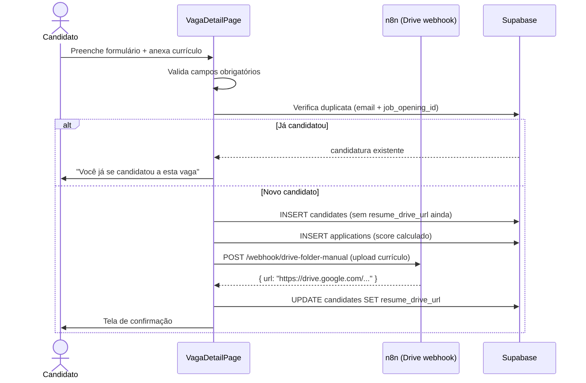
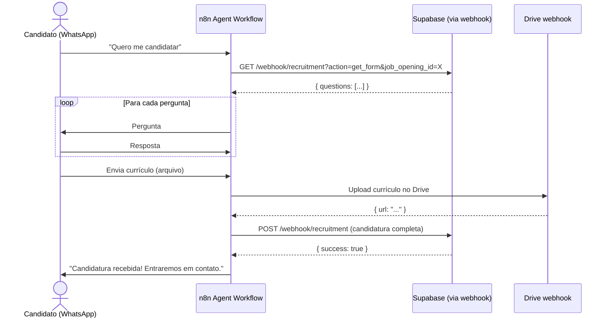

# Design Técnico — Módulo de Recrutamento e Seleção

## Visão Geral

O Módulo de Recrutamento é uma nova seção do Maestr.IA que combina uma interface interna (gestão de vagas, avaliação de candidatos, dashboard) com uma página pública em subdomínio separado (`vagas.agenciac8.com.br`) para candidaturas externas. O módulo segue os padrões arquiteturais do projeto (TanStack Query, shadcn/ui, RLS multi-tenant, hooks por entidade) e reutiliza a infraestrutura existente de Google Drive (upload via n8n) e notificações (webhook n8n).

### Objetivos de Design

- **Separação de contextos**: Página pública completamente isolada do app interno — sem sidebar, sem auth, com visual da marca C8.
- **Pontuação automática**: Score calculado no momento da submissão, com suporte a avaliação manual posterior para respostas abertas.
- **Reutilização de infraestrutura**: Upload de currículo via workflow n8n de Drive já existente; notificações via webhook n8n existente.
- **Consistência**: Segue padrões de hooks, RLS, permissões e componentes já estabelecidos no projeto.

---

## Arquitetura

### Detecção de Subdomínio e Roteamento

```tsx
// src/App.tsx — ponto de entrada
const hostname = window.location.hostname;
const isVagasSubdomain = hostname.startsWith("vagas.");

if (isVagasSubdomain) {
  return <PublicVagasRouter />;  // rotas públicas, sem auth, sem sidebar
}

return <AppRouter />;  // app atual, intacto
```

**`PublicVagasRouter`** define apenas:
- `/` → `VagasPage` (listagem pública de vagas)
- `/:jobOpeningId` → `VagaDetailPage` (detalhe + formulário)

### Diagrama de Componentes

```
src/
  layouts/
    PublicLayout.tsx              ← header C8 + rodapé, sem auth
  pages/
    recruitment/
      RecruitmentPage.tsx         ← dashboard interno (/recruitment)
      VagasPage.tsx               ← listagem pública (vagas.agenciac8.com.br/)
      VagaDetailPage.tsx          ← detalhe + formulário público
  components/
    recruitment/
      RecruitmentDashboard.tsx    ← cards + tabela + gráfico
      JobOpeningList.tsx          ← listagem interna de vagas
      JobOpeningForm.tsx          ← criar/editar vaga
      ApplicationFormBuilder.tsx  ← configurar perguntas da vaga
      CandidateList.tsx           ← lista de candidatos por vaga
      CandidateDetail.tsx         ← painel lateral com respostas + score
      ApplicationForm.tsx         ← formulário público de candidatura
      ScoreBadge.tsx              ← badge de pontuação percentual
      CandidateStatusBadge.tsx    ← badge de status da candidatura
      PublicJobCard.tsx           ← card de vaga na página pública
  hooks/
    useJobOpenings.ts             ← CRUD de vagas
    useCandidates.ts              ← CRUD de candidatos + candidaturas
    useApplicationForm.ts         ← perguntas + submissão pública
    useRecruitmentConfig.ts       ← configurações do módulo
  lib/
    recruitmentScoring.ts         ← funções puras de cálculo de score
```

### Fluxo de Candidatura Web



### Fluxo de Candidatura via Agente Virtual



### Cálculo de Pontuação

```typescript
// src/lib/recruitmentScoring.ts

// Score por pergunta
function scoreQuestion(question: FormQuestion, answer: string | string[]): number {
  switch (question.question_type) {
    case 'scale_1_5':
      return (Number(answer) / 5) * question.weight * 10;
    case 'yes_no':
    case 'single_choice':
      return answer === question.correct_answer ? question.weight * 10 : 0;
    case 'multiple_choice':
      const correct = question.correct_answer as string[];
      const selected = answer as string[];
      const hits = selected.filter(a => correct.includes(a)).length;
      return (hits / correct.length) * question.weight * 10;
    case 'text':
      return 0; // avaliação manual
  }
}

// Score total da candidatura
function calculateTotalScore(questions: FormQuestion[], answers: Answer[]): number;

// Score máximo possível da vaga
function calculateMaxScore(questions: FormQuestion[]): number;

// Score percentual (0-100)
function calculateScorePercent(score: number, maxScore: number): number;
```

---

## Modelos de Dados

### Tabela `job_openings`

```sql
CREATE TABLE job_openings (
  id               UUID PRIMARY KEY DEFAULT uuid_generate_v4(),
  organization_id  UUID NOT NULL REFERENCES organizations(id) ON DELETE CASCADE,
  title            TEXT NOT NULL,
  job_title        TEXT,                    -- referência ao job_title_catalog
  department       TEXT,
  description      TEXT,
  requirements     TEXT,
  location_type    TEXT CHECK (location_type IN ('presencial','remoto','hibrido')),
  salary_range     TEXT,                    -- ex: "R$ 3.000 - R$ 5.000"
  status           TEXT NOT NULL DEFAULT 'aberta'
                   CHECK (status IN ('aberta','pausada','encerrada')),
  published_at     TIMESTAMPTZ DEFAULT NOW(),
  closes_at        TIMESTAMPTZ,
  created_at       TIMESTAMPTZ DEFAULT NOW(),
  updated_at       TIMESTAMPTZ DEFAULT NOW()
);
```

### Tabela `job_form_questions`

```sql
CREATE TABLE job_form_questions (
  id               UUID PRIMARY KEY DEFAULT uuid_generate_v4(),
  job_opening_id   UUID NOT NULL REFERENCES job_openings(id) ON DELETE CASCADE,
  organization_id  UUID NOT NULL REFERENCES organizations(id) ON DELETE CASCADE,
  question_text    TEXT NOT NULL,
  question_type    TEXT NOT NULL
                   CHECK (question_type IN ('text','single_choice','multiple_choice','scale_1_5','yes_no')),
  options          JSONB,                   -- array de strings para choice types
  correct_answer   JSONB,                   -- string ou array de strings
  weight           INTEGER NOT NULL DEFAULT 5 CHECK (weight BETWEEN 1 AND 10),
  is_required      BOOLEAN NOT NULL DEFAULT true,
  sort_order       INTEGER NOT NULL DEFAULT 0,
  created_at       TIMESTAMPTZ DEFAULT NOW()
);
```

### Tabela `candidates`

```sql
CREATE TABLE candidates (
  id               UUID PRIMARY KEY DEFAULT uuid_generate_v4(),
  organization_id  UUID NOT NULL REFERENCES organizations(id) ON DELETE CASCADE,
  full_name        TEXT NOT NULL,
  email            TEXT NOT NULL,
  phone            TEXT,
  linkedin_url     TEXT,
  portfolio_url    TEXT,
  resume_drive_url TEXT,                    -- link do currículo no Google Drive
  created_at       TIMESTAMPTZ DEFAULT NOW(),
  updated_at       TIMESTAMPTZ DEFAULT NOW(),
  UNIQUE (organization_id, email)           -- um cadastro por e-mail por organização
);
```

### Tabela `applications`

```sql
CREATE TABLE applications (
  id               UUID PRIMARY KEY DEFAULT uuid_generate_v4(),
  organization_id  UUID NOT NULL REFERENCES organizations(id) ON DELETE CASCADE,
  job_opening_id   UUID NOT NULL REFERENCES job_openings(id) ON DELETE CASCADE,
  candidate_id     UUID NOT NULL REFERENCES candidates(id) ON DELETE CASCADE,
  cover_letter     TEXT,
  answers          JSONB NOT NULL DEFAULT '[]',  -- array de { question_id, answer, score }
  score_auto       NUMERIC(8,2) DEFAULT 0,       -- score calculado automaticamente
  score_manual     NUMERIC(8,2),                 -- ajuste manual do gestor
  score_total      NUMERIC(8,2) DEFAULT 0,       -- score_auto + score_manual
  score_max        NUMERIC(8,2) DEFAULT 0,       -- pontuação máxima possível
  score_percent    NUMERIC(5,2) DEFAULT 0,       -- percentual (0-100)
  status           TEXT NOT NULL DEFAULT 'novo'
                   CHECK (status IN ('novo','em_analise','aprovado','reprovado','contratado')),
  notes            TEXT,                          -- observações do gestor
  source           TEXT DEFAULT 'web'
                   CHECK (source IN ('web','agent','manual')),
  applied_at       TIMESTAMPTZ DEFAULT NOW(),
  reviewed_at      TIMESTAMPTZ,
  created_at       TIMESTAMPTZ DEFAULT NOW(),
  updated_at       TIMESTAMPTZ DEFAULT NOW(),
  UNIQUE (job_opening_id, candidate_id)          -- uma candidatura por vaga por candidato
);
```

### Configurações em `organization_integrations`

```json
{
  "integration_type": "recruitment",
  "config": {
    "drive_folder_id": "1abc...",
    "drive_folder_url": "https://drive.google.com/drive/folders/1abc...",
    "notification_email": "rh@agenciac8.com.br",
    "auto_notify": true
  }
}
```

---

## PublicLayout — Visual da Marca C8

O `PublicLayout` replica o estilo do site `agenciac8.com.br`:

```tsx
// Paleta de cores (extraída do site)
// Fundo: #0a0a0a (preto quase puro)
// Texto: #ffffff
// Destaque: #f97316 (laranja — botões CTA)
// Secundário: #6b7280 (cinza médio)
// Borda: #1f2937

// Header
<header className="bg-[#0a0a0a] border-b border-[#1f2937] px-6 py-4">
  
</header>

// Hero
<section className="bg-[#0a0a0a] text-white py-20 text-center">
  <h1 className="text-4xl font-bold">Faça parte do time C8</h1>
  <p className="text-[#6b7280] mt-4">...</p>
  <Button className="bg-[#f97316] hover:bg-[#ea6c0a] text-white mt-8">
    Ver vagas abertas
  </Button>
</section>

// Footer
<footer className="bg-[#0a0a0a] border-t border-[#1f2937] py-8 text-center text-[#6b7280]">
  
  <p>© 2026 Agência C8. Todos os direitos reservados.</p>
</footer>
```

---

## Nginx — Configuração do Subdomínio

Adicionar ao `nginx.conf` existente:

```nginx
server {
    listen 80;
    server_name vagas.agenciac8.com.br;

    root /usr/share/nginx/html;
    index index.html;

    location / {
        try_files $uri $uri/ /index.html;
    }

    # Cache de assets estáticos
    location ~* \.(js|css|png|jpg|webp|svg|ico|woff2)$ {
        expires 1y;
        add_header Cache-Control "public, immutable";
    }
}
```

**DNS**: Criar registro `CNAME vagas → app.agenciac8.com.br` (ou IP do servidor).

---

## Webhook Público de Candidatura (n8n)

O formulário público submete para um webhook n8n que:
1. Recebe os dados do candidato + respostas + arquivo de currículo
2. Faz upload do currículo no Drive via nó Google Drive
3. Salva o candidato e a candidatura no Supabase via REST API
4. Dispara notificação por e-mail/WhatsApp se `auto_notify = true`
5. Retorna `{ success: true, application_id: "..." }`

Alternativamente, o formulário pode submeter diretamente ao Supabase (anon key com RLS permissiva para INSERT em `candidates` e `applications`) e usar o n8n apenas para o upload do currículo e notificação.

**Decisão de design**: Submissão direta ao Supabase para candidatos e candidaturas (mais simples, sem dependência do n8n estar online), e webhook n8n apenas para upload do currículo (fire-and-forget).

---

## Estrutura de Arquivos Completa

```
src/
  layouts/
    PublicLayout.tsx
  pages/
    recruitment/
      RecruitmentPage.tsx          ← /recruitment (dashboard interno)
    VagasPage.tsx                  ← vagas.agenciac8.com.br/
    VagaDetailPage.tsx             ← vagas.agenciac8.com.br/:id
  components/
    recruitment/
      RecruitmentDashboard.tsx
      JobOpeningList.tsx
      JobOpeningForm.tsx
      ApplicationFormBuilder.tsx
      CandidateList.tsx
      CandidateDetail.tsx
      ApplicationForm.tsx
      ScoreBadge.tsx
      CandidateStatusBadge.tsx
      PublicJobCard.tsx
  hooks/
    useJobOpenings.ts
    useCandidates.ts
    useApplicationForm.ts
    useRecruitmentConfig.ts
  lib/
    recruitmentScoring.ts
  types/
    recruitment.ts
  router/
    PublicVagasRouter.tsx          ← router isolado para o subdomínio público
migrations/
  026_recruitment_tables.sql
```

---

## Tratamento de Erros

| Cenário | Comportamento |
|---------|---------------|
| Upload de currículo falha | Candidatura salva sem `resume_drive_url`; aviso exibido ao candidato |
| Candidato já candidatado | Mensagem "Você já se candidatou" sem criar duplicata |
| Vaga encerrada | Formulário bloqueado com mensagem "Vaga encerrada" |
| n8n indisponível | Candidatura salva no Supabase; upload do currículo tentado novamente pelo gestor |
| Campo obrigatório vazio | Erro inline no campo, submissão bloqueada |
| Arquivo > 10MB | Erro inline "Arquivo muito grande (máximo 10MB)" |
| Formato inválido | Erro inline "Formato não suportado. Use PDF, DOC ou DOCX" |
